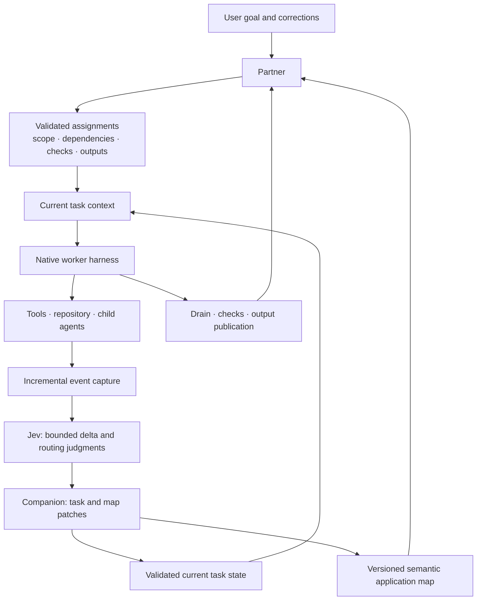

# hx — Game of Harnesses

hx runs a coordinated fleet of native coding-agent harnesses. A Partner turns a goal
into bounded assignments; workers execute in their own sessions; a companion maintains
the small current state needed to continue; and hx checks, publishes, and reports
completed work.

hx is designed to make each assignment start with the right context, use only the
tools it needs, avoid repeated repository searches, and finish with machine-checked
outputs. The current implementation includes application mapping, task planning,
required Jev calls for bounded observation and routing judgments, token controls,
incremental capture, context reset, tool-output reduction, and managed completion.

**→ [Getting started](docs/getting-started.md)** sets up a Partner. [Operating hx](docs/operating.md)
covers day-to-day use. [System design](docs/system-design.md) describes the runtime as
implemented and its remaining integration work.

Inside Claude Code, the plugin provides setup and Partner commands:

```text
/plugin marketplace add logan-robbins/hx
/plugin install hx
/hx:setup
```

For a local checkout, add its absolute path as the marketplace source and install
`hx@hx-marketplace`. Plugin installation and hx instance creation are separate; each
instance uses isolated Claude homes.

## How the runtime works



The application map records semantic responsibilities, behaviors, interfaces, source
anchors, and checks. Stable IDs survive stack changes when responsibilities remain the
same. Planning uses a bounded slice of that map to define assignments and avoid asking
workers to rediscover known paths, contracts, and checks.

The companion processes new captured events and submits structured changes to current
task state and the application map. Jev is required for its bounded judgments about
observation deltas, repeated tool observations, optional tool discovery, and surplus
output. Jev does not choose which facts survive, write facts, generate task plans, or
switch models. The companion handles factual changes; deterministic code validates
scope, versions, evidence references, and source applicability.

Workers receive a bounded packet for the active assignment: goal and corrections,
acceptance, next action, relevant findings and commands, required map records, and
unresolved events. Obsolete state can be compressed or deleted. Workers do not carry
personal episodic memory across independent assignments. Planned context boundaries
use incremental capture and hooks; the runtime restores the current packet after a
controlled reset. Token thresholds, native autocompaction settings, and model output
caps provide the enforcement layers.

Completion waits for managed work and capture to drain, runs the declared checks,
publishes the exact accepted outputs, and releases assignment ownership. A worker's
claim alone does not complete a task.

## Requirements and current limits

hx requires Python 3.14, `tmux`, `git`, and a supported Claude installation for the
Partner. Other native harnesses can be assigned as workers when configured. TypeSafe
API access is required for Jev; the runtime has no inference fallback for Jev decisions.
See [getting started](docs/getting-started.md) for credentials and installation.

The merged runtime is covered by Linux and macOS CI, focused integration tests, and
installed adapter checks. A live native engineering-to-QA fleet run has not yet been
completed. Coordinated migration of remaining legacy state consumers and retention for
cancelled assignments that may be resumed remain open. Provider-specific tool schema
reduction is available only where the native public interface supports it; advisory
adapters do not claim native schema savings. See [current implementation status](docs/continuity-build-status.md)
for verified behavior and boundaries.

## Documentation

- [Getting started](docs/getting-started.md) — setup and first Partner
- [Operating hx](docs/operating.md) — daily use
- [System design](docs/system-design.md) — current architecture and remaining integration
- [Application map](docs/application-map.md) — semantic records, validation, and updates
- [Continuity runtime](docs/continuity-runtime.md) — capture, state, checks, and reset contracts
- [Planning runtime](docs/planning-runtime.md) — assignments, ownership, and completion
- [Current implementation status](docs/continuity-build-status.md) — merged scope and verification
- [Native interface verification](docs/native-interface-verification.md) — adapter support boundaries
- [CONTRACTS.md](CONTRACTS.md) — shared machine-readable shapes
- [CHANGELOG.md](CHANGELOG.md)

## License

MIT. See [LICENSE](LICENSE).
