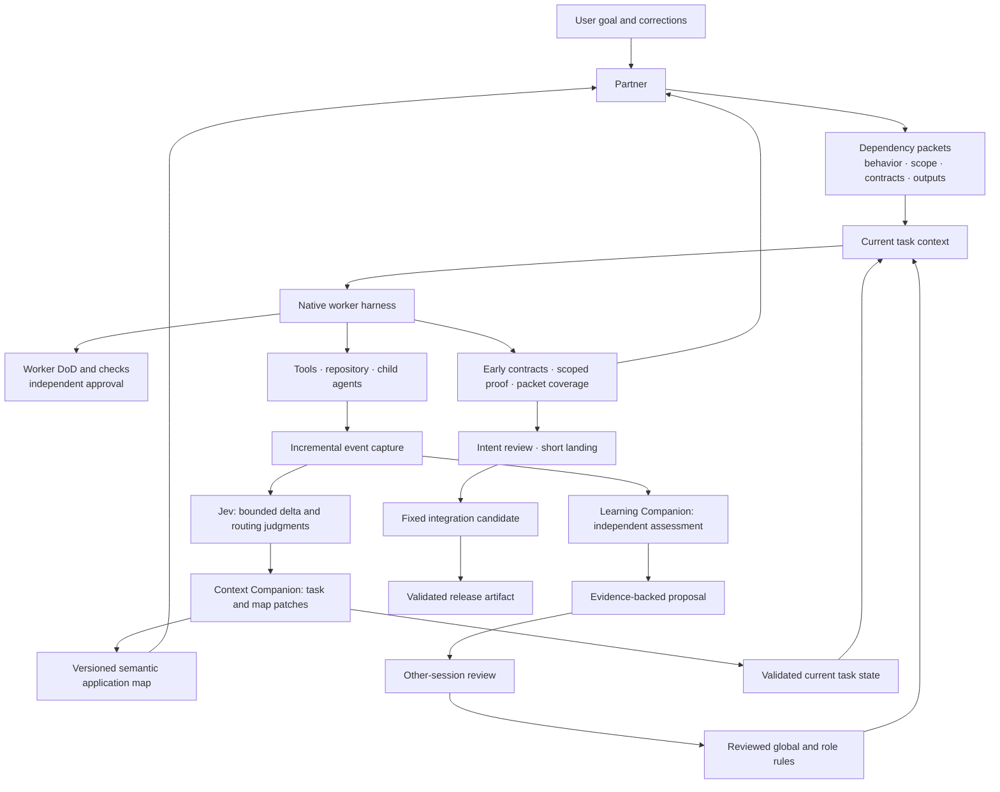

# hx — Game of Harnesses

hx runs a coordinated fleet of native coding-agent harnesses. A Partner turns a goal
into bounded assignments; workers execute in their own sessions; separate Context and Learning Companions
maintain current state and assess reusable lessons; and hx checks, publishes, and reports
completed work.

Use hx for new features, application maintenance, integrations, or codebase conversions.
Every directive follows current code/application dependencies: search for existing behavior
and contracts, reuse capabilities, and schedule maximum useful parallel work within source,
resource, and capacity constraints. Packet boundaries follow dependencies and outcomes;
apparent request size never selects packet count.
For a conversion, graph the existing codebase first. The Partner uses that source graph
to understand behavior and dependencies before assigning target work; source and target
graphs remain separately addressable so shared capabilities can be built once and reused.

hx is designed to make each assignment start with the right context, use only the
tools it needs, avoid repeated repository searches, and finish with machine-checked
outputs. The current implementation includes application mapping, task planning,
required Jev calls for bounded observation and routing judgments, token controls,
incremental capture, context reset, tool-output reduction, and managed completion.

**→ [Getting started](docs/getting-started.md)** sets up a Partner. [Operating hx](docs/operating.md)
covers day-to-day use. [System design](docs/system-design.md) describes the runtime and proof boundaries.

Inside Claude Code, the plugin provides setup and Partner commands:

```text
/plugin marketplace add logan-robbins/hx
/plugin install hx
/hx:setup
```

For a local checkout, add its absolute path as the marketplace source and install
`hx@hx-marketplace`. Plugin installation and hx instance creation are separate; each
instance uses isolated Claude homes.

## How the runtime works


```mermaid
flowchart TB
    U[User goal and corrections] --> P[Partner]
    M[Versioned semantic application map] --> P
    P --> A[Dependency packets<br/>behavior · scope · contracts · outputs]
    A --> C[Current task context]
    C --> W[Native worker harness]
    W --> B[Worker DoD and checks<br/>independent approval]
    W --> T[Tools · repository · child agents]
    T --> E[Incremental event capture]
    E --> J[Jev: bounded delta and routing judgments]
    J --> K[Context Companion: task and map patches]
    E --> L[Learning Companion: independent assessment]
    L --> LP[Evidence-backed proposal]
    LP --> LR[Other-session review]
    LR --> RULES[Reviewed global and role rules]
    RULES --> C
    K --> S[Validated current task state]
    K --> M
    S --> C
    W --> X[Early contracts · scoped proof · packet coverage]
    X --> P
    X --> D[Intent review · short landing]
    D --> I[Fixed integration candidate]
    I --> R[Validated release artifact]
```

The application map records semantic responsibilities, behaviors, interfaces, source
anchors, and checks. Stable IDs survive stack changes when responsibilities remain the
same. Planning uses a bounded slice of that map to define assignments and avoid asking
workers to rediscover known paths and contracts. The Partner focuses on dependency
understanding and parallel scheduling; the harness worker owns its definition of done,
implementation, and exact checks. An independent configured reviewer approves the
binding before edits. Published interfaces can unlock consumers using permitted
stand-ins, with real-provider verification retained as a deployment obligation.

A shared derived code graph provides bounded symbol, signature, caller, test, parity,
and precedent queries across repository namespaces. It supports Python, C#,
TypeScript/JavaScript, Go, Rust, and Software AG Natural without building the repository, with optional
external extractors and imported graphs. `hx code fresh PATH --expect fresh` and the
planning gate enforce current scope; `--owners` reads the existing ledger leases.
See [search and retrieval](docs/search-and-retrieval.md) for commands, provenance,
external formats, and measured coverage.

Immutable source snapshots support explicit `hx code … --at COMMIT` queries and share
content and extraction objects across checkouts. An optional host service behind the
CLI shares those caches across instances and supplies checkout-free metadata queries.
Scoped check execution artifacts can be reused across runs when complete input and
environment identities match, and an equal check running in another worktree is joined.
`hx build` adds evaluated .NET dependencies, builds and test shards joined across every root
and worktree on the box, immutable artifacts, and test shards that avoid repeated compilation.

The Companion processes frozen captured events and submits structured changes to current
task state and the application map. Native worker passes expose only bounded evidence reads
for non-file observations, complete verified source evidence, and structured patch submission;
the Companion cannot execute the worker's commands. Jev is required for its bounded judgments about
observation deltas, repeated tool observations, optional tool discovery, and surplus
output. Jev does not choose which facts survive, write facts, generate task plans, or
switch models. The companion handles factual changes; deterministic code validates
scope, versions, evidence references, and source applicability.

Native startup and managed reset deliver complete verified instructions and required task
context automatically. Reviewed global and role learnings are included for every flavor and
agent role. Linked immutable backing files stay within 40,000 UTF-8 bytes (10,000 estimated
tokens at four bytes per token), and the runtime resolves the entire chain without agent
pagination. Whole source reads return exact complete content or refuse; native transport
segments do not cost additional model tool calls. Scoped search and command-output reduction
remain available for their separate purposes. `hx code audit --repo PATH` reports every
existing size outlier; changed oversized text files cannot complete.

Every agent has an independent Learning Companion alongside its Context Companion. It observes
captured events, proposes evidence-backed shared or role-specific lessons, and retains its own
cursor and budget. A different authorized session reviews proposals with `hx learn`; assessment
never silently approves a rule or edits current task state.

Workers receive a bounded packet for the active assignment: goal and corrections,
acceptance, next action, relevant findings and commands, required map records, and
unresolved events. Obsolete state can be compressed or deleted. Workers do not carry
personal episodic memory across independent assignments. Native context boundaries
use incremental capture and hooks; the runtime restores the current packet after a
controlled reset. Token thresholds, native autocompaction settings, and model output
caps provide the enforcement layers.

Completion waits for managed work and capture to drain, runs the declared checks,
publishes the exact accepted outputs, and releases assignment ownership. A worker's
claim alone does not complete a task.

Intent review, landing, integration, and deployment eligibility are separate states.
Local landing publishes with an expected-head check; broad validation runs against
fixed post-merge and pre-deploy candidates while main advances. Deployment evidence
names the tested artifact. See [agent-scale runtime](docs/agent-scale-runtime.md) for
configuration, commands, and the boundaries of reusable proof.

## Requirements and current limits

hx requires Python 3.14, `tmux`, `git`, and a supported Claude installation for the
Partner. Other native harnesses can be assigned as workers when configured. TypeSafe
API access is required for Jev; the runtime has no inference fallback for Jev decisions.
See [getting started](docs/getting-started.md) for credentials and installation.

Worker tasks use one dependency packet lifecycle. A configured source workdir precedes admission; optional provisioning is needed only when no
suitable prepared directory exists; `hx plan assign` reserves ownership and explicit `hx launch ID
--run RUN --request REQUEST` advances native startup. Workers bind executable checks before
edits and obtain approval from the configured independent reviewer. Empty write scopes still
require a current repository graph. The ledger is authoritative for task state and views.

Tests exercise named lifecycle, concurrency, recovery, graph, and proof boundaries. They do
not establish general model extraction accuracy or a live engineering-to-QA fleet result.
Deployment eligibility retains exact integration and tested-artifact obligations; the product's
configured external release mechanism performs authorized deployment. Obsolete unreleased
store/plan formats are replaced, with no compatibility workflow.

## Documentation

- [Getting started](docs/getting-started.md) — setup and first Partner
- [Operating hx](docs/operating.md) — daily use
- [Several instances on one host](docs/multi-instance.md) — a fleet of Partners: private tmux servers, credentials, go-gate, clean product repository, bound evidence, concurrent preparation and short landing
- [System design](docs/system-design.md) — current architecture and remaining integration
- [Search and retrieval](docs/search-and-retrieval.md) — code/graph/content search, isolated execution, Jev sifting
- [Provider model registry](docs/models.md) — latest model IDs per provider, pinned defaults
- [Application map](docs/application-map.md) — semantic records, validation, and updates
- [Prompt runtime](docs/prompt-runtime.md) — capture, state, checks, and native context boundaries
- [Planning runtime](docs/planning-runtime.md) — assignments, ownership, and completion
- [Agent-scale runtime](docs/agent-scale-runtime.md) — immutable snapshots, shared computation, dependency packets, review, and fixed CI candidates
- [docs/learnings.md](docs/learnings.md) — the central LEARNINGS file: propose, other-session review, numbered append; the signal index every agent carries
- [Codex search guard](docs/codex-search-guard.md) — Codex web search as a Foundry toolbox MCP tool, queries and results inspected by hooks with Prompt Shields; off until `config/codex.json` names it
- [CONTRACTS.md](CONTRACTS.md) — shared machine-readable shapes
- [CHANGELOG.md](CHANGELOG.md)

## License

MIT. See [LICENSE](LICENSE).
