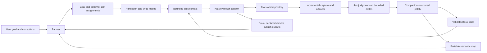

# hx system design

Current system behavior and remaining integration work.

## Runtime path

The Partner owns goal decomposition and assignment. A plan describes behavior units,
acceptance, repository scope, map inputs, prerequisites, checks, and versioned outputs.
Admission validates current inputs and acquires write leases before work starts. The
runtime starts the native worker and root service, captures tool and lifecycle events,
and schedules bounded companion passes. Completion drains managed work, validates
receipts and outputs, publishes results, releases leases, and notifies the Partner.

## State and application learning

The portable map is checked into the product repository under `.hx/map/`. Records
represent responsibilities, observable behaviors, interfaces, files, resources, and
checks. Their stable semantic IDs are independent of language, framework, directory,
and worker. Records include evidence anchors and source fingerprints; a changed source
invalidates affected records and consumers. Task planning compiles a bounded map slice
into assignment paths, invariants, outputs, and checks.

Workers do not write a shared map file directly. Runtime discoveries enter scoped
proposals and worktree overlays. Record versions are compared when patches are applied:
identical proposals coalesce, while conflicting writes are rejected. Completion and
integration can publish source-bound findings and bounded retrieval vocabulary into
the portable map. Publication uses a recoverable journal. Fresh clones can reuse the
committed baseline and vocabulary without importing another worker's private state.

The active assignment state contains only information that can help finish that goal:
current constraints, cursor and next action, relevant findings and exact commands,
blockers, unresolved events, checks, and references to useful artifacts. Independent
assignments start from their own goal, current repository/map/configuration, and declared
prerequisites. The runtime can compress or delete obsolete facts and event payloads;
it does not automatically retrieve worker episodes across goals. Raw event streams are
for bounded recovery and evidence retrieval, not routine Partner context.

The SQLite continuity ledger is authoritative for its explicit planned-run path. It
tracks assignments, runs, captured events, companion passes, map overlays, checkpoints,
receipts, leases, and durable publication work. Legacy work-item and projection
consumers have not all migrated together yet; the coordinated authority cutover remains
open. Do not treat the existence of a ledger command as proof that every installed
instance uses the ledger for all task state.

## Companion, Jev, and context control

The companion reads frozen event ranges and scoped evidence, then proposes typed
changes. Deterministic validation checks event identity, task revision, record
versions, evidence references, scope, and source applicability before committing task
state, map updates, and cursors together. Routine passes use deltas rather than loading
whole logs or rewriting complete memory files. Larger current-task reads are reserved
for explicit compaction work.

Jev is a required TypeSafe API dependency. It judges bounded deltas, repeated
observations, optional tool candidates, and surplus command output. It does not select
retained facts, compose prompts, generate memory, plan tasks, or switch models. A Jev
failure does not trigger an alternate inference path. Deterministic checks and the
companion's native model remain responsible for factual changes and task decisions.

Task packets are compiled from current goal state, required records, selected findings,
checks, and unresolved events. Hooks and the root service coordinate token thresholds,
idle boundaries, capture drain, and reset acknowledgement. Native output caps and
autocompaction settings are configured where each adapter exposes them. The companion
prepares state for the reset; it does not write a second narrative summary. Partner
restoration carries current goals and assignments without replaying worker chatter.

Tool catalogs allow targeted discovery and loading. Exact known tool IDs bypass
semantic discovery. Required tools stay available. Pi's supported extension API can
update active schemas; launch-only adapters apply expanded selection after checkpointed
restart; advisory adapters provide recipes without claiming to shrink their native
schemas. Tool execution records request identity and bounded output so an uncertain
operation is not silently repeated.

Repository inspection is bounded during normal task work. The runtime caps source reads
and scoped search results, prevents repeating unchanged successful searches within a
checkpoint, reuses small exact search results for unchanged sources, and routes common
large command output through bounded capture. These controls reduce accidental context
and tool-call waste; they do not sandbox arbitrary programs.

## Completion and boundaries

Checks produce receipts tied to commands and declared inputs. Completion requires the
assignment's checks and source outputs to match the current worktree, managed processes
to be drained, and publication to commit before ownership is released. A failed check
keeps the assignment active for repair. Publication replay is idempotent after a crash.

The implementation does not certify untracked remote jobs or work outside observed
process descendants. Native tool-schema reduction depends on each adapter's public
support. CI, fixtures, and installed SDK checks exercise transport and lifecycle
contracts, but they do not establish general model extraction accuracy. No live native
engineering-to-QA fleet has been run yet.

The remaining functional integration gaps are the coordinated migration of legacy
state authorities/projections and retention of the minimal state needed to resume a
cancelled assignment. Optional QA triage and test selection remain follow-on features.
The current status document tracks these boundaries and verification details.

## Related contracts

- [Application map](application-map.md)
- [Continuity runtime](continuity-runtime.md)
- [Planning runtime](planning-runtime.md)
- [Prompt runtime](prompt-runtime.md)
- [Build status and verification](continuity-build-status.md)
- [Native interface verification](native-interface-verification.md)
