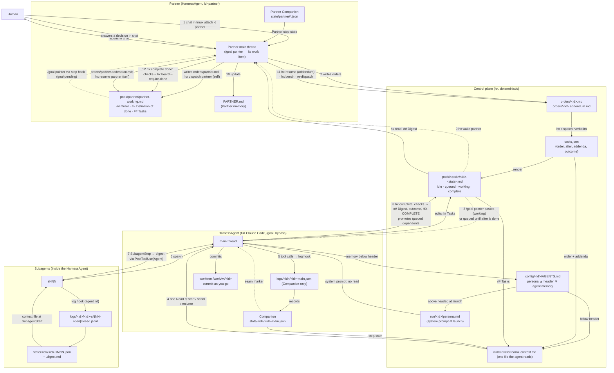

## 15. Data flow

Human → Partner → HarnessAgents → Subagents → HarnessAgents → Partner → Human. Solid arrows are data the receiver reads; dashed arrows are wake signals. Every hand-off is a file path, never inline content, and the Partner is driven by the same mechanism it drives workers with.

**Reading the numbers.** 1 is the human talking to the Partner; the Partner writes its own order and dispatches itself the way it dispatches workers, and the human never runs hx. 2–3 are dispatch: orders are files, the pointer is the only thing pasted, and `queued` items wait on `after` without a Partner wake. 4 is the only read an agent does to know what it is doing and where it left off; who it is came with the system prompt at launch; the read repeats after every seam and resume. 5 is continuous: every tool call becomes evidence the Companion turns into step state. 6–7 are the subagent round trip, with the parent receiving a Companion-written digest, not a transcript. 8 is the provable end of a task: checks first, then the line the evaluator reads. 9–12 close the loop through the Partner's memory back to the human, and a `decision` comes back down as an addendum, not a fresh start.

**What never crosses an arrow.** Raw logs (Companion-only). Claude's own compaction summary (bypassed by seams). Persona files of other agents (guard). Task text on a command line (always a file, then a pointer).
