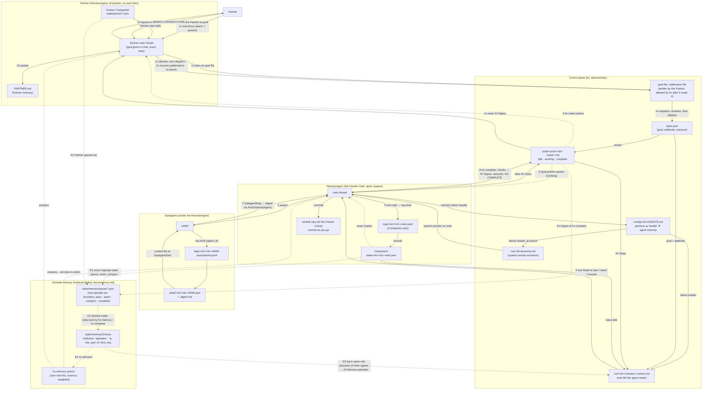

## 15. Data flow

Human → Partner → HarnessAgents → Subagents → HarnessAgents → Partner → Human, with one sideways loop: every Companion compaction also becomes an episode in the instance-global memory store, which flows back into every agent's context file. Solid arrows are data the receiver reads; dashed arrows are wake signals; dotted arrows into and out of the memory store are the episode path. Every hand-off is a file path, never inline content. The human drives the Partner by talking to it; the Partner drives workers with the harness.

**Reading the numbers.** 1 is the human giving the Partner its goal, in conversation, every time; there is no goal file and no dispatch for the Partner, and nothing else starts its work. 2–3 are dispatch: the goal is a file hx consumes and deletes, so the text ends up in exactly two places, and the pointer is the only thing pasted. 4 is the only read an agent does to know what it is doing and where it left off; who it is came with the system prompt at launch; the read repeats after every seam and resume. 5 is continuous: every tool call becomes evidence the Companion turns into step state. 6–7 are the subagent round trip, with the parent receiving a Companion-written digest, not a transcript. 8 is the provable end of a task: checks first, then the line the evaluator reads. 9–11 close the loop through the Partner's memory, and the Partner decides for itself when the next goal goes out. 12 is the Partner telling the human, in chat, what happened; a `decision` comes back down as an addendum, not a fresh start.

**Reading the letters.** E1 is the write side of episode memory and costs a hook one small file: every state the Companion produces (a `pass`), every seam, every native compaction and every Digest is queued as an episode with its time, agent, pod, role and kind. E2 is the only place ChromaDB is opened, always under `state/memory/index.lock`, so many agents' processes share one store safely. E3 is the passive read: at every boundary `hx compose` queries the store with the stream's own step state and puts the closest recency-weighted episodes of other agents with the same role into the context file, so the agent continues instead of searching. E4 is the active read, `hx memory search`, filtered to the caller's role by default and widened with `--all-roles` only when the own-role result is empty or off-topic (the `hx-memory` skill). Nothing on the E arrows is a precondition: an empty, broken or uninstalled store changes the section's text and nothing else.

**What never crosses an arrow.** Raw logs (Companion-only). Claude's own compaction summary (bypassed by seams). Task text on a command line (always a file, then a pointer).
