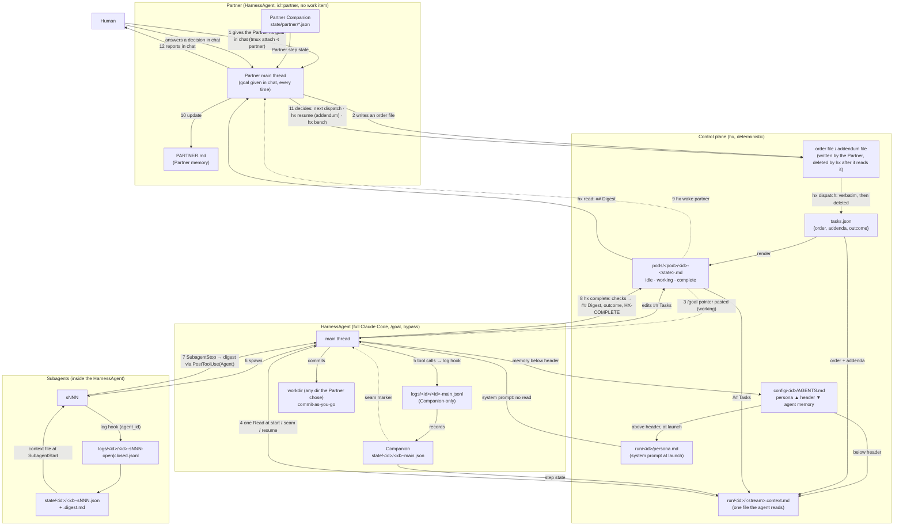

<!-- BEGIN 00-index.md -->
# HarnessAgent Runtime — Spec Index

Each file is one section. Edit one file per change; cross-references use file names.

| File | Covers |
|---|---|
| `01-terminology.md` | Terms |
| `02-decisions.md` | Architecture decisions |
| `03-layout.md` | Filesystem layout |
| `04-ownership.md` | Single writer per artifact |
| `05-configuration.md` | `models.json`, `harness.json` |
| `06-work-items.md` | Work item states (idle, working, complete), transitions, `/goal` pointer, executable definition of done, resume, template |
| `07-streams-and-step-state.md` | Raw stream (Companion-only), step state, context file, continuity checkpoints |
| `08-hx-cli.md` | `hx` commands |
| `09-hooks.md` | Hook events, seam handshake, Claude Code event mapping |
| `10-companion.md` | Companion process, prompts, seam policy, digests |
| `11-adapters.md` | Claude Code adapter: config home, persona, threshold, launch |
| `12-partner-loop.md` | Partner operating loop |
| `13-build-order.md` | Milestones and acceptance tests |
| `14-open-items.md` | Decisions pinned at implementation, with the milestone that verifies each |
| `15-dataflow.md` | Data flow human → Partner → HarnessAgents → Subagents and back |
| `16-ui.md` | Observing UI: board, agent, Partner chat, orders, archive |
| `17-packaging.md` | Package vs instance, `hx install`, isolation from the user's Claude, launch, skills, build plan |
<!-- END 00-index.md -->

<!-- BEGIN 01-terminology.md -->
## 1. Terminology

| Term | Definition |
|---|---|
| HarnessAgent | One full Claude Code instance in a tmux session named by its id. Not a bare model loop: every task is given to it as a `/goal` so it runs with the harness's full capability (subagents, hooks, compaction, skills). Claude Code only for now. |
| Partner | The supervising HarnessAgent, id `partner`. The human talks to it in its tmux session (`tmux attach -t partner`) and tells it what to do; it turns that into order files and dispatches workers, one or more at a time, when it decides to, as a human would. The Partner is not a work item and is never dispatched, resumed, or completed: its persistent state is `PARTNER.md`. It has its own Companion. |
| Subagent | A child agent spawned inside a HarnessAgent, addressed by handle `<id>-sNNN` |
| Order | A Partner-written markdown file holding `## Order` and `## Definition of done`. `hx dispatch` reads it, copies it verbatim into the work item and `tasks.json`, and deletes it; the order text then lives in exactly those two places. Never passed as command-line text |
| Task | The control-plane record for one id in `tasks.json`: order text, addenda, outcome, dispatch and completion timestamps. Delivered to the HarnessAgent as a `/goal` pointer, never as prompt text |
| Work item | `pods/<pod>/<id>-<state>.md`, one per worker; the Partner has none. State ∈ `idle`, `working`, `complete` is the filename suffix. The body is the HarnessAgent's own running task list, which it updates frequently |
| Stream | One append-only raw log: `<id>-main` or `<id>-sNNN` |
| Companion | A small model paired one-to-one with a HarnessAgent (the Partner included); maintains coherency state for each of its streams. Companion prompts are tuned to the persona of the HarnessAgent they support. |
| Step state | The bounded JSON the companion maintains per stream; the continuity payload the HarnessAgent is rehydrated with at every boundary. Subagent step state is not merged into the parent by hx. Claude Code delivers each subagent's result to the parent as a completion notification in a later turn, and `/goal` defers its evaluation and issues check-ins while subagents are still running, so subagent deliverables are the harness's responsibility, not the Companion's. |
| Persona | The part of `config/<id>/AGENTS.md` above `## UPDATES BELOW ONLY`, Partner-written. `start.sh` copies it to `run/<id>/persona.md` at every launch and Claude Code loads it as appended system prompt (`--append-system-prompt-file`), so it is present in every turn, survives compaction and `/clear`, and costs no read. |
| Memory | The part of `config/<id>/AGENTS.md` below the header, written only by that agent; carried in the context file at every boundary. |

### 1.1 Verified harness behavior (Claude Code docs, 2026-09-19)

| Behavior | Status | Source |
|---|---|---|
| Background subagents keep running through parent auto-compaction; the compacted context is seeded with a reminder of which are still running | Confirmed | `code.claude.com/docs/en/context-window` "What survives compaction" |
| Subagents have their own transcript and compact independently of the parent, in both directions; `CLAUDE_AUTOCOMPACT_PCT_OVERRIDE` applies to them too | Confirmed | `code.claude.com/docs/en/sub-agents#auto-compaction` |
| Subagent results reach the parent as a completion notification in a later turn | Confirmed | `code.claude.com/docs/en/sub-agents#run-subagents-in-foreground-or-background` |
| A completion notification pending at the moment of compaction is still delivered afterward | Not documented; inferred from the two rows above. Covered by an acceptance test in `13-build-order.md` | — |
| `/goal` is a session-scoped prompt-based Stop hook: after each turn a small evaluator model returns met / not yet met / impossible. It does not spawn or supervise subagents; it skips evaluation while background work runs and issues check-ins (default 30 min, backing off 2x, `CLAUDE_CODE_GOAL_CHECKIN_MINUTES`) | Confirmed | `code.claude.com/docs/en/goal` |
| `/goal` survives auto-compaction | Confirmed. The clearing events are enumerated (met, impossible, `/goal clear`, `/clear`, a turn failing on an error, a context overflow compaction could not clear) and successful compaction is not one. Changelog 2.1.274 fixed the one gap, goal loss on `--resume` after compaction | `code.claude.com/docs/en/goal`, CHANGELOG 2.1.274 |
| `/goal` is restored on `--continue` and `--resume` (condition kept; turn count, timer, token baseline reset) | Confirmed | `code.claude.com/docs/en/goal` |
| `/clear` kills only foreground tasks; background subagents and background shells keep running | Confirmed | CHANGELOG 2.1.72 |
| Cross-session messaging is on by default; `crossSessionInbound: accept` delivers every inbound message with no hold, in any permission mode; an idle session starts a turn, a busy one reads it between tool calls | Confirmed | `code.claude.com/docs/en/cross-session-messaging`, settings reference |
| `SubagentStart` context is re-injected only on the subagent's next run after its compaction discarded it, not at compaction time; only JSON `additionalContext` is accepted | Confirmed | `code.claude.com/docs/en/hooks#subagentstart` |
| `--append-system-prompt-file <path>` appends file text to the default system prompt in interactive mode; `--append-subagent-system-prompt-file` exists but applies only with `-p`, so subagents cannot get a file-based system prompt in the TUI | Confirmed 2026-09-20 | `code.claude.com/docs/en/cli-reference` |
| A `/clear` pasted mid-turn is queued; at turn end the `Stop` hook runs first, then `/clear` (`SessionEnd`/`SessionStart(clear)`), before the `/goal` evaluator resolves; a `/goal` pasted from inside the `SessionStart(clear)` hook is taken by the TUI once it is ready | Confirmed by live test 2026-09-20 | E3 |
| Blocking `PreCompact(auto)` suppresses compaction for the rest of that turn even if a later `PreCompact` is allowed; the payload never changes; the window is a soft target and the turn continues past it without error; compaction resumes next turn | Confirmed by live test | E4 |
| `PreCompact`/`PostCompact` also fire for subagent compactions, with the parent's `session_id` | Confirmed by live test | E8 |
| Background completions from before a `/clear` are delivered into the new conversation as task notifications | Confirmed by live test | E5 |
| Messaging socket and token are per process, unchanged across `/clear`; a message to a busy session is folded into the in-flight turn; wire format is an auth line then `{"type":"user","message":{"role":"user","content":"…"}}` | Confirmed by live test | E6 |
| `CLAUDE_CODE_AUTO_COMPACT_WINDOW` governs subagent compaction; `CLAUDE_AUTOCOMPACT_PCT_OVERRIDE` alone does nothing on a model with no native autocompact buffer | Confirmed by live test | E8 |
| On macOS Claude Code stores the login in the login Keychain (`Claude Code-credentials`), not in `.credentials.json`; a fresh `CLAUDE_CONFIG_DIR` is not logged in. Headless auth is `CLAUDE_CODE_OAUTH_TOKEN` from `claude setup-token` | Keychain and fresh-dir behaviour confirmed by live probe 2026-09-20 (build lane); the env var and `setup-token` to be re-verified against `docs/en/` by build-3 | build-3 |
| `SubagentStart` input is `{session_id, hook_event_name, agent_id, agent_type, cwd, permission_mode}`: no prompt, no `tool_input`, no `transcript_path`; the parent's prompt is the subagent's first message | Confirmed by docs and live run 2026-09-20 (build lane) | build-5 |
| Project `.claude/settings.json` in the cwd applies to a session (its `PreToolUse` hooks ran and denied every tool for an hx worker); `--setting-sources user` restricts loading to the config dir's settings | Applying confirmed by live rehearsal 2026-09-20; the flag's exact name and behaviour to be re-verified against `docs/en/cli-reference` and the binary by build-8 | build-8 |
<!-- END 01-terminology.md -->

<!-- BEGIN 02-decisions.md -->
## 2. Decisions

| Item | Decision |
|---|---|
| Orchestrator | tmux + `hx` CLI + per-id hooks |
| LangGraph | **No** |
| Supervisor | Partner: reads `hx board`, writes order files, launches and dispatches workers, consumes digests, resumes paused items. The human tells the Partner what to do by talking to it in its tmux session and answers its questions there. The Partner is not a work item and carries no `/goal` of its own; it decides when to dispatch the next order, the way a human running three sessions would. |
| Control-plane writes | Deterministic `hx` scripts: `tasks.json`, work item state, stream files, the derived persona file, context files |
| Knowledge writes | Companion: step state, digest. HarnessAgent: its own work item body (running task list) and the mutable section of its own `AGENTS.md` (long-term memory). The Companion does not drive execution and holds no task graph; it continuously interprets the agent's actions from the stream so that continuity survives seams and the agent does not re-call tools to relearn what it already knew. |
| Continuity | Companion step state + raw records after its last processed seq, kept as a file on disk. At start, resume, clear, compaction, and subagent start a hook hands the agent the path; the agent reads it with one tool call. Hooks never inject file contents. |
| Seams (replaces compaction) | Claude Code's compaction summarizer never decides what survives. A seam is `/clear` + rehydration, taken at a turn boundary: the `stop` hook runs `hx seam`, which flushes the Companion, composes the context file, pastes `/clear`, and removes the seam marker; the queued `/clear` runs after the hook returns; `SessionStart(clear)` runs the `context` hook, which hands over the path and, the item being `working`, pastes the `/goal` pointer. Live-verified order: `Stop` → `/clear` → `SessionStart(clear)` → next turn. Two triggers, one marker: (1) the Companion declares a step seam; (2) the `log` hook sees `context_tokens ≥ threshold` on the main stream. Seams are taken only when no background work is running (policy: `/goal` evaluates at the same quiet point, and a subagent finishing into a cleared conversation reports into a context that never dispatched it; its notification is still delivered, so nothing is lost). Fallback seam: `hx restart` relaunches bare and sends the pointer once the pane is ready. |
| Compaction (last resort) | Harness autocompact is left at its native window (about 967k on 1M models) and is never blocked. hx enforces its own seam threshold from `config/models.json` (500k on 1M models) through the `log` hook, so a seam is always taken long before the harness would compact. The harness compacts only if a single turn grows from the threshold to the native window without ending, which at 467k tokens of headroom does not happen in practice; if it does, `SessionStart(compact)` still hands over the context file and the persona is still in the system prompt. `PreCompact` is not used to block: live tests show a block suppresses compaction for the whole turn regardless of later hook output, and the hook also fires for subagent compactions, so blocking would silently disable subagent compaction. `PreCompact`/`PostCompact` are log-only. |
| Identity | One file per agent type, per id: `config/<id>/AGENTS.md` for the HarnessAgent main thread and `config/<id>/SUBAGENTS.md` for its subagents. `AGENTS.md` has two parts. Above the mutable header (`## UPDATES BELOW ONLY`) is the project-scoped persona, written and rarely edited by the Partner; `start.sh` copies it to `run/<id>/persona.md` and launches with `--append-system-prompt-file` pointing at it, so the persona is in every turn's system prompt, survives compaction and `/clear`, costs no tool call, and cannot be skipped. A persona edit takes effect at the next `hx restart`. Below the header the agent writes its own long-term memory; it travels in the context file. Subagents get `SUBAGENTS.md` inside their context file by path from the `SubagentStart` hook (the subagent system-prompt flag exists only in `-p` mode). These files live outside the workdir, so Claude Code's own `AGENTS.md` discovery never sees them. Repo `AGENTS.md` and `CLAUDE.md` discovery is turned off in the harness user's settings; the one global `config/CLAUDE.md` is the only CLAUDE.md that loads. |
| Single-file context | Everything the agent needs at a boundary that is not already in its system prompt (memory, task, `## Tasks`, step state, open handles) is composed by hx into one file per stream with a fixed section schema, always current on disk. The hook output is only the path to that file. Rehydration therefore costs exactly one read, never a search, and never a second file. No size cap applies because nothing is injected. |
| Goal delivery | The `/goal` pointer is pasted into a worker's pane by `hx goal <id>` on every conversation start of a `working` item: dispatch, resume, seam (`context` hook on `clear`), `hx restart`, `hx launch` of an item that is already working. It waits for the idle prompt before pasting; only the `context` hook on `clear` pastes immediately (`--now`), the live-verified path for a slash command issued from that hook. It is never a prompt argument and never freeform text: the order lives in the work item and is read from there. Claude Code is always launched bare. The Partner is never sent a `/goal`; the human tells it what to do in chat. |
| Orders | The Partner writes an order as a file with `## Order` and `## Definition of done`; `hx dispatch <id> <order-file>` copies it verbatim into the work item, records it in `tasks.json`, and deletes the file. Task text then lives in exactly two places: `tasks.json` and the work item. No task text crosses a command line. |
| Completion | `hx complete done` is machine-checked: the `### Checks` block of the definition of done runs in the workdir, `git status --porcelain` must be empty when the workdir is a git repo, and no subagent stream may be open. Failure prints `HX-CHECK-FAILED <id>` with the output, the item stays `working`, and the goal stays active, so the agent fixes and retries. Only success prints `HX-COMPLETE <id> done`. The evaluator judges a machine result, not prose. `blocked`, `decision`, and `exhausted` run no checks. |
| Sequencing | None in hx. A work item has no dependency field and no waiting state; hx never sequences anything. The Partner dispatches the next order when it decides to, from what it read in the digest, exactly as a human managing several sessions does. |
| Resume | `hx resume <id> <addendum-file>` continues a `complete` item with outcome `blocked` or `decision` with everything it had: `## Tasks`, step state, memory, workdir, logs. Only the order grows, by the addendum, and the addendum file is deleted once appended. `hx bench` + `hx dispatch` is a fresh start and is used only when the task itself changes or moves to another id. |
| Model calls | Every model call in hx is a Claude Code session in tmux that hx operates by pasting files' paths: HarnessAgents, subagents (Claude Code's own), and Companions alike. No `claude -p`, no API client. One mechanism for launch, auth, permissions, persona, and observation | Spec author, 2026-09-20 |
<!-- END 02-decisions.md -->

<!-- BEGIN 03-layout.md -->
## 3. Layout

```
$HARNESS_ROOT/                             # the instance (default /srv/hx on a server, ~/hx on a workstation); config/ is the part worth committing
  bin/hx                                   # CLI (08-hx-cli.md); the installed package's entry point, path recorded in config/hx.json
  bin/hx-hook                              # hook entrypoint (09-hooks.md)
  adapters/claude/install.sh               # writes per-id hook/config files and the bypass acceptance; copies no credentials
  adapters/claude/start.sh                 # derives run/<id>/persona.md, launches Claude Code bare from harness.json
  templates/work-item.md
  companion/BASE.md                        # shared companion system prompt
  companion/roles/<role>.md                # per-role retention rules
  config/CLAUDE.md                         # the ONE CLAUDE.md: truly global info; installed as the harness user's ~/.claude/CLAUDE.md
  config/models.json                       # per-model window + seam threshold
  config/claude.json                       # {bin, version} of the pinned Claude Code binary (17-packaging.md)
  config/hx.json                           # {bin} absolute path of the hx entry point, recorded by hx install and baked into hook commands
  config/ui.json                           # {port}
  config/<id>/AGENTS.md                    # persona above the mutable header (→ system prompt); the agent's memory below it (→ context file)
  config/<id>/SUBAGENTS.md                 # identity for this HarnessAgent's subagents (→ subagent context file)
  config/<id>/harness.json                 # per-agent config (05-configuration.md)
  PARTNER.md                               # Partner state doc; the Partner's whole persistent state
  tasks.json                               # {"<id>": {order, addenda, outcome, dispatched, completed}}
  pods/<pod>/<id>-<state>.md               # work items, one per worker; state is the suffix
  pods/<pod>/archive/<id>-<ts>.md          # benched bodies
  logs/<id>/<id>-main.jsonl                # main stream
  logs/<id>/<id>-sNNN-<open|closed>.jsonl  # subagent streams
  logs/<id>/<id>-pane.log                  # raw pane text via tmux pipe-pane, started by start.sh; UI fallback when the session is dead; not a Companion stream
  state/<id>/<stream>.json                 # companion step state per stream
  state/<id>/<stream>.digest.md            # closed-stream digest (subagent streams), returned to the parent
  archive/<id>/<ts>/                       # logs and state from prior dispatches (not from resumes)
  run/<id>/persona.md                      # derived at each launch from AGENTS.md above the header; --append-system-prompt-file target
  run/<id>/<stream>.context.md             # the single file handed to the agent at each boundary (02 Single-file context)
  run/<id>/home/                           # CLAUDE_CONFIG_DIR for this agent: its settings (hooks), auto memory, transcripts; auth comes from seed/token via env
  run/<id>/companion-home/                 # CLAUDE_CONFIG_DIR for this agent's Companion session (its own stop hook only, hx-companion skill)
  run/<id>/companion-system.md             # the Companion's composed system prompt (BASE.md + role + harness facts)
  run/<id>/companion/<stream>.pass.md      # one pass: which state, which log, from which seq, where to write
  run/<id>/companion/<stream>.out.json     # the Companion's output, validated and moved to state/ by hx
  run/<id>/subagents.json                  # {"<harness agent_id>": "sNNN"}
  run/<id>/turn                            # turn-end marker with last background_tasks
  run/<id>/goal                            # goal-sent marker with ts
  run/<id>/seam                            # seam-requested marker (Companion or log hook); removed by hx seam
  run/partner/socket.json                  # Partner messaging socket + token, rewritten at every SessionStart
  run/ui-token                             # UI bearer token, mode 0600
  seed/token                               # long-lived OAuth token from `claude setup-token`, pasted by the human once, mode 0600; exported as CLAUDE_CODE_OAUTH_TOKEN into every agent env. No Keychain or ~/.claude is ever read
```

- `.gitignore`: `pods/`, `logs/`, `state/`, `run/`, `tasks.json`.
- System setup, once, by the human: `hx install` (17-packaging.md 17.2). From then on the human talks to the Partner in `tmux attach -t partner`; the hx commands that run the fleet are run by the Partner or by a worker. `hx up` and `hx heartbeat` exist for the human to run, or to put in their own cron, if they want them; hx ships no unit files.
- The human authors and commits `config/CLAUDE.md`, `config/models.json`, `companion/**`, `templates/**`, and commits `PARTNER.md`.
- Personas and per-agent config live in `config/<id>/`, outside every agent's working directory; each agent is told the exact absolute paths of its own files and that it reads nothing else under `HARNESS_ROOT`. Nothing is enforced.
- `config/<id>/AGENTS.md` has two writers separated by the mutable header (`## UPDATES BELOW ONLY`). Above it: the project-scoped persona for that id, written by the Partner and edited rarely; it reaches the agent as system prompt via `run/<id>/persona.md`. Below it: that HarnessAgent's own long-term memory, written only by that agent; it reaches the agent in the context file. Neither the human nor the Companion writes this file. It survives seams because it is a file, not context.
- The work item is the HarnessAgent's own running task list. The agent updates its body frequently as it works; hx owns the state suffix and the `## Order` addenda.
- `config/CLAUDE.md` is the only CLAUDE.md that loads. The product repo's own `CLAUDE.md` and `AGENTS.md` are not loaded and are not edited: the harness user's settings set `claudeMdExcludes` for the repo file and instruction-files mode `claude-md`, so nothing in the agent's workdir is discovered.
- Per-agent `run/<id>/home/` isolates each HarnessAgent's hooks, credentials, auto memory, and transcripts, so one agent's memory never pollutes another's and hx can reset it between dispatches.
<!-- END 03-layout.md -->

<!-- BEGIN 04-ownership.md -->
## 4. Ownership

One writer per artifact. Where two writers share a file, the boundary is mechanical and named here.

Personas and per-agent config live in `config/<id>/`, outside every agent's working directory; each agent is told the exact absolute paths of its own files and that it reads nothing else under `HARNESS_ROOT`. Nothing is enforced: this table is a description of who writes what, not a permission system.

| Artifact | Writer | Via |
|---|---|---|
| `config/CLAUDE.md`, `config/models.json`, `companion/**`, `templates/**` | Human | Editor |
| `config/<id>/AGENTS.md` above `## UPDATES BELOW ONLY` | Partner, rarely, only on direct human instruction | Edit tool |
| `config/<id>/AGENTS.md` below `## UPDATES BELOW ONLY` | That HarnessAgent | Edit tool |
| `config/<id>/SUBAGENTS.md`, `config/<id>/harness.json` | Partner, rarely, only on direct human instruction | Edit tool |
| `run/<id>/persona.md` | `hx` | `start.sh`, derived from the part of `AGENTS.md` above the header at every launch |
| `PARTNER.md` | Partner | Edit tool |
| Order and addendum files (any path the Partner chooses) | Partner | Write tool; `hx dispatch` / `hx resume` read them and delete them |
| `tasks.json` | `hx` | `hx dispatch`, `hx complete`, `hx resume` (an ordinary write) |
| Work item create / rename (state suffix) | `hx`; the HarnessAgent may rename its own item directly | `hx launch`, `hx dispatch`, `hx complete`, `hx resume`, `hx bench` |
| Work item `## Order` addendum | `hx` | `hx resume`, appended verbatim from the addendum file |
| Work item body (running task list) | That HarnessAgent | Edit tool |
| Raw streams (`logs/**`), incl. open→closed rename of subagent streams | Hooks | `hx-hook` |
| Step state (`state/**`) | Companion | `hx companion` |
| Digest | Companion | `hx companion` |
| `run/<id>/<stream>.context.md` | `hx` | composed from memory, task, `## Tasks`, step state at each boundary |
| `run/<id>/seam` | Companion, `log` hook | touch-file; writes are idempotent; removed by `hx seam` |
| `run/<id>/home/` | `hx` installs settings and seeds credentials; Claude Code writes its own auto memory and transcripts there | `adapters/claude/install.sh`, Claude Code |
| `run/**` (everything else) | `hx`, hooks | — |

- Work item rename vs. body edit can race if hx renames while the agent's Edit tool is mid-write. Accepted: rare, and hx transitions happen at turn boundaries; the Partner and the agent never touch the item at the same time.
- Partner edits to the top of `AGENTS.md` can race with the agent's edits below the header. Accepted: the Partner only does this on direct human instruction, and the human is aware of the timing.
- `hx resume` appends to `## Order` while the agent is stopped (the item is `complete`), so it never races the agent.
<!-- END 04-ownership.md -->

<!-- BEGIN 05-configuration.md -->
## 5. Configuration

**`config/models.json`** — one row per model. `threshold` is hx's seam threshold: when the main stream's `context_tokens` reaches it, the `log` hook marks a seam. It is not passed to Claude Code; the harness autocompact stays native and only fires if one turn grows from `threshold` to `window` without ending. 1M-window models are capped at 500000.

```json
{
  "claude-opus-5":   { "window": 1000000, "threshold": 500000 },
  "claude-sonnet-5": { "window": 1000000, "threshold": 500000 }
}
```

Model id strings are placeholders until implementation; they are validated against the Models API then, not here. 1M-window models are capped at 500000.

**`config/<id>/harness.json`**:

```json
{
  "id": "eng-001",
  "pod": "engineers",
  "role": "engineer",
  "model": "claude-opus-5",
  "effort": "xhigh",
  "workdir": "/work/eng-001",
  "harness": { "args": ["…"] },
  "companion": {
    "model": "claude-haiku-4-5-20251001",
    "batch_records": 20,
    "cache_ttl": "1h",
    "state_budget_tokens": 10000,
    "seam_min_context_tokens": 60000,
    "seam_min_interval_s": 600
  }
}
```

- **Permissions: every HarnessAgent, its subagents, and the Partner run with bypass permissions.** Full trust, no prompts, no approval gates. `adapters/claude/install.sh` writes this into `run/<id>/home/` settings and `start.sh` launches accordingly. This is not configurable per agent.
- `effort` is the HarnessAgent model's effort level, passed at launch.
- `workdir` is any absolute directory the Partner chooses as this worker's working directory: it creates one, or points the agent at an existing checkout. hx does not manage git for it: it creates nothing, resets nothing, and pushes nothing. It only requires the directory to exist at launch, and `hx complete done` requires `git status --porcelain` to be empty there when the directory is a git repository.
- `companion.state_budget_tokens` bounds the step state and therefore the context file. Target is roughly 10k tokens: the hypothesis under test is that one intelligently constructed file holding the complete useful memory of the task fits in context and yields maximum quality, so this number is a tuning knob, not a ceiling.
- `companion.seam_*` are the seam policy: the Companion does not declare a seam before `seam_min_context_tokens` are in use, nor more often than `seam_min_interval_s`. Context size comes from the `usage` block of the latest assistant record in the transcript, which `hx-hook` has the path to. The `models.json` threshold is the hard trigger that does not wait for a step to close.
- The Companion learns everything it needs about its HarnessAgent (id, role, pod, budgets, seam policy, persona) from a system prompt hx composes at Companion start from this file, `companion/BASE.md`, and `companion/roles/<role>.md`. It does not read config at runtime.
- `adapters/claude/install.sh` derives the per-agent home settings from this file: hooks with the id baked in, instruction-files mode `claude-md` (the real key is `pluginConfigs["agents-md@builtin"].options.instructionFiles`, honoured in the settings file at the root of `CLAUDE_CONFIG_DIR`; verified 2026-09-20 against `docs/en/memory`), `claudeMdExcludes` for the product repo, the bypass acceptance entry; for the Partner, `crossSessionInbound: accept` (messaging itself is on by default). It then writes the bypass acceptance entry directly; auth is the token in `seed/token`, exported into the agent's environment by `start.sh`, so no credentials are copied from anywhere; both stay in `run/<id>/home/` across dispatches. Nothing about launch is interactive. Effort, model, and the persona file are launch flags (`11-adapters.md`); no compaction env vars are set.
- Validate: `id` equals directory name; `model` exists in `models.json`; `role` has `companion/roles/<role>.md`; `workdir` exists. On failure, exit 2.
- Partner: `"role": "partner"`, no `pod` and no `workdir` — it has no work item and runs in `HARNESS_ROOT`. Validated the same way otherwise.
- The Companion is a Claude Code session in window `<id>:companion` (10-companion.md), launched by `start.sh <id> --companion` with `companion.model`, its own home `run/<id>/companion-home`, `--dangerously-skip-permissions`, `IS_SANDBOX=1`, and the composed system prompt via `--append-system-prompt-file`. hx has no API client and no headless calls; there is no `provider` field.
<!-- END 05-configuration.md -->

<!-- BEGIN 06-work-items.md -->
## 6. Work items

- **File:** `pods/<pod>/<id>-<state>.md`, one per worker id, state ∈ `idle`, `working`, `complete`. The state is the filename suffix: renaming the file is the transition, and reading the directory is reading the fleet. The Partner has no work item.

**Who renames.** `hx launch` creates the item `-idle`; `hx dispatch <id> <order-file>` renames `idle → working`; `hx complete <outcome>` renames `working → complete`; `hx resume <id> <addendum-file>` renames a `complete` item whose outcome is `blocked` or `decision` back to `working`; `hx bench <id>` renames `complete → idle`. The HarnessAgent may also rename its own item directly; the Partner and the agent never touch it at the same time. A `working` item has a live tmux session and a `run/<id>/goal` marker.

**The order is a file, and hx consumes it.** The Partner writes an order file — any path it likes — containing exactly two sections, `## Order` and `## Definition of done`. `hx dispatch` refuses an order that lacks either section or the `### Checks` block. The order has no length limit; it is copied verbatim into the work item and recorded in `tasks.json`, and the file is deleted once the dispatch succeeds. The order text then lives in exactly two places, `tasks.json` and the work item, and nowhere else. No task text is ever a command-line argument.

**The task is a `/goal`, delivered by pointer.** What `hx goal` pastes is a fixed short form that never grows with the task:

```
/goal The order for <id> is in <abs path to work item>; read it first. Done when `hx complete <outcome>` has been run and its output line `HX-COMPLETE <id> <outcome>` appears.
```

The same pointer is sent on every conversation start of a `working` item: dispatch, resume, seam (`context` hook on `clear`), `hx restart`, and `hx launch` of an item that is already working. Claude Code is launched bare; nothing is passed as a prompt argument. The Partner is never sent a `/goal`: the human tells it what to do in chat.

The evaluator reads the conversation including tool results, but calls no tools itself, so completion is proven by a deterministic line hx prints to stdout, which appears in the transcript, not by the agent's claims. The evaluator's no-progress guard (several turns with no tool use) never trips on a working agent. The Partner's job at dispatch is scoping: a definition of done the agent can satisfy and `hx complete` can check, sized to finish inside one context window with seams as backup rather than plan, and self-contained so the work item is the whole order.

**Definition of done** has two parts, both Partner-written in the order file:

1. An acceptance checklist the goal evaluator can judge from the transcript.
2. A `### Checks` fenced `bash` block. `hx complete done` runs it in the workdir with `bash -e`; every command must exit 0. When nothing is executable the check verifies the deliverable exists (`test -s report.md`); an empty block is refused at dispatch.

**Outcome mapping.** `outcome ∈ {done, blocked, decision, exhausted}`, set by `hx complete`. Goal evaluator verdict → outcome: met → `done`; impossible → `blocked` (cannot be done) or `decision` (needs the Partner or human to choose); check-in retries run out → `exhausted`. `hx complete done` is refused with `HX-CHECK-FAILED <id>` and the failing output when a check fails, the workdir is a git repository and is dirty, or a subagent stream is open; the item stays `working`, the goal stays active, and the agent fixes and retries. A refused completion is the agent's problem, never the Partner's.

**Body** (HarnessAgent-maintained; sections defined by `templates/work-item.md`):

`templates/work-item.md`, rendered by `hx dispatch` with the id, pod, timestamp, and the order file filled in:

```markdown
---
id: <id>
pod: <pod>
outcome:
dispatched: <ts>
---
<order file verbatim: ## Order, then ## Definition of done with its ### Checks block>

## Standing instructions
- Keep `## Tasks` current: mark a task done the moment it is done, add tasks the moment you discover them. This section is what you get back after a seam.
- Commit each finished sub-task immediately with a descriptive message. `git log --oneline` is your memory of what is done; do not leave the workdir dirty.
- Read a file once. Note the fact you needed in `## Tasks` next to the task that needed it.
- Use subagents freely; each gets its own context file.
- Before finishing: write what should outlive this task below `## UPDATES BELOW ONLY` in your `AGENTS.md`.
- `hx complete done` runs `### Checks` and requires a clean workdir. On `HX-CHECK-FAILED`, fix and run it again.
- Your last action is `hx complete <outcome>`. Nothing after it.

## Tasks
- [ ] …

## Deliverables

## Commands

## Open decision

## Digest
<written by the Companion at completion>
```

- `## Order` and `## Definition of done` are the Partner's, written once at dispatch; `hx resume` appends `## Order addendum <ts>` beneath `## Order`.
- `## Tasks`, `## Deliverables`, `## Commands`, `## Open decision` are the agent's, updated as it works. `## Tasks` is what the context file carries at a seam.
- `## Digest` is the Partner-facing summary, the only section written by the Companion, in its final pass inside `hx complete`. Two writers on this file is safe because the Companion writes only after the agent has stopped.
<!-- END 06-work-items.md -->

<!-- BEGIN 07-streams-and-step-state.md -->
## 7. Streams and step state

### 7.1 Raw stream (Companion-only)

The raw stream exists for one reader: the Companion. The HarnessAgent never reads it, and it is never part of what the agent is handed. Its job is to give the Companion enough recent, structured evidence to keep step state current. Everything about it follows from that.

**Raw record** (one JSON line per hook event, appended by `hx-hook`; event vocabulary in `09-hooks.md`):

```json
{"seq":412,"ts":"…","stream":"eng-001-s002","event":"post_tool","tool":"Bash",
 "input":"<head excerpt>","output":"<head excerpt>","exit":1,"agent_id":"…","context_tokens":148220,
 "ref":{"transcript":"<transcript_path>","tool_use_id":"<id>"}}
```

- `seq` is monotonic per stream, assigned by `hx-hook` under a per-stream lock.
- `context_tokens` is read by the hook from the `usage` block of the latest assistant record in the transcript at `transcript_path`.
- `input`/`output` are head excerpts (`excerpt_chars`, default 2000) plus `ref`, a pointer to the full payload in the transcript. Nothing is lost: the Companion follows `ref` when an excerpt is not enough. The excerpt size is a Companion evidence budget, not a cap on what the agent may produce.

**Retention (deterministic FIFO).** Each stream file is append-only and bounded:

- `max_records` (default 500) and `max_bytes` (default 4 MB) per stream, whichever is hit first.
- `hx-hook` truncates from the head on every append that would exceed a bound, but never below `state.seq − keep_behind` (default 100), so the Companion always has a window of already-processed evidence behind its cursor and everything ahead of it.
- Backpressure: if a stream is `max_records − keep_behind` records ahead of `state.seq`, the `log` hook waits before appending until the Companion catches up. The tool call has already run; only the next model request is delayed. Evidence is never dropped ahead of the cursor, and there is no timeout.
- Subagent streams close on `SubagentStop` (rename `open` → `closed`) and are retained until the Companion's final pass over them completes, then deleted.

### 7.2 Step state (Companion-written)

`state/<id>/<stream>.json`:

```json
{
  "seq": 412,
  "prompt_version": {"base": "<sha>", "role": "<sha>"},
  "goal": "",
  "constraints": [],
  "decisions": [{"d": "", "why": "", "ev": [401]}],
  "open_steps": [{"id": "st7", "intent": "", "next": "", "ev": [398, 410]}],
  "closed_steps": [{"id": "st6", "outcome": "", "verified": true, "commit": "<sha>", "ev": [390]}],
  "dead_ends": [],
  "working_set": {
    "commits": [{"sha": "", "msg": ""}],
    "dirty": [],
    "files": [{"path": "", "note": ""}],
    "last_failure": "",
    "hypothesis": ""
  },
  "blockers": [],
  "subagents_open": []
}
```

- `hx` validates schema and size (`chars/4 ≤ state_budget_tokens`); an invalid write keeps the previous state.
- `ev` entries are `seq` references into the raw stream. They are for the Companion's own use across its passes; the agent has no recall command.
- **Structure as memory.** The task template instructs the agent to commit each finished sub-task immediately with a descriptive message rather than leaving the workdir dirty. Then `git log --oneline`, `git diff --stat`, and `ls` recover most of the working state in one Bash call each, and the Companion records the commit sha on the closed step instead of describing the change. `working_set.commits` and `working_set.dirty` are derived from those records. `working_set.files` is only for files the agent read but did not change, with a one-line `note` of the fact it needed from them, so it does not read them again.
- Step state is kept across `hx resume`: an item paused on `blocked` or `decision` continues from the step state it paused with. Only `hx dispatch` archives it.

### 7.3 Context file (hx-composed)

At every boundary (start, resume, clear, compaction, subagent start) hx composes `run/<id>/<stream>.context.md` and the hook hands the agent its path. The persona is not in this file: it is in the system prompt (`02-decisions.md` Identity). Sections in order:

1. Memory: the part of `config/<id>/AGENTS.md` below `## UPDATES BELOW ONLY` (main stream); `config/<id>/SUBAGENTS.md` whole (subagent streams)
2. Task: the verbatim `## Order` and every addendum from the work item (the live copy the agent edits; `tasks.json` before the first render). For a subagent stream this section says only that the task is the message it was spawned with, already in its conversation: `SubagentStart` carries no prompt (verified live 2026-09-20) and hx does not guess a pairing from the parent's `PreToolUse(Agent)` payload, which cannot be correlated when two spawns are in flight. The Partner has no work item and no order: its sections 2 and 3 are `PARTNER.md` and the current `hx board` output
3. Work item `## Tasks` section (main stream only)
4. Step state, rendered from `state/<id>/<stream>.json`
5. Open subagent handles

Before composing at a planned seam, hx waits for the Companion to process to the head of the stream, so step state is current and no raw tail is needed. On crash or resume the Companion catches up first, then hx composes. The agent reads one file and nothing else.

### 7.4 Seam records

`hx` appends a `seam` record to the stream at every boundary with `prompt_version`, `context_tokens` before, and the context file size. Tool calls in the 10 turns after each seam are the metric for whether the context file worked, split into Reads of files already noted in `working_set` (waste) and everything else; `prompt_version` is what it is compared across. `hx metrics <id>` reads it from the seam records.

### 7.5 Continuity checkpoints

The design question at every critical step: *if this stopped right now, is there an up-to-date, deliberately curated context for this specific process that avoids searching, re-reading, and re-running tools?* The answer at each step, and who guarantees it:

| Step | What exists on disk at that instant | Guaranteed by |
|---|---|---|
| Dispatch | Work item with `## Order`, `## Definition of done` (checks), empty `## Tasks`; `tasks.json` entry; the order file consumed and deleted; fresh logs/state; agent home wiped of prior transcripts and auto memory; persona + agent memory in `AGENTS.md` | `hx dispatch` |
| Session start | Persona in the system prompt; context file composed from memory, task, `## Tasks`, step state; the agent's first action is one Read | `start.sh`, `context` hook, `hx compose` |
| Every tool call | One raw record with excerpt + ref appended before the next call; Companion within `batch_records` of head | `log` hook, Companion loop |
| Every `## Tasks` edit | The agent's own plan is current in the work item; the Companion sees the edit as a record | Standing instructions, `log` hook |
| Every commit | Done work is in git with a message; `closed_steps[].commit` set on the Companion's next pass | Standing instructions, Companion |
| Subagent start | Its own context file: `SUBAGENTS.md`, its prompt, empty step state; parent main stream records the spawn | `subagent-start` hook |
| Subagent stop | Stream closed; closed-stream digest written; parent receives it via `subagent-result` | `subagent-stop`, Companion, `subagent-result` |
| Turn end | `run/<id>/turn` with `background_tasks`; Companion woken; seam taken if pending and safe | `stop` hook |
| Seam | Companion at head; context file recomposed; `/clear` then `/goal` pointer; persona still in the system prompt; first action after is one Read | `hx seam`, `context` hook |
| Threshold hit | `log` hook touches `run/<id>/seam`; the next `stop` with no background work takes the seam; native compaction is never reached on the planned path, and if it is, `SessionStart(compact)` still hands over the context file | `log`, `stop`, `context` hooks |
| Crash / restart | Companion catches up to head; context file recomposed; goal restored by Claude Code on `resume`, or sent by `hx goal` after `hx restart` once the pane is ready | `context` hook, `hx restart` |
| Complete | Zero open streams; checks passed and workdir clean (for `done`); Companion final pass; `## Digest` written; agent memory updated; outcome set in the work item and `tasks.json`; `HX-COMPLETE` line printed | `hx complete`, standing instructions |
| Resume | The item's logs, step state, `## Tasks`, memory, and workdir exactly as it paused; the addendum appended to `## Order`; context file recomposed; goal sent | `hx resume` |
| Partner wake | The worker's renamed work item and the wake message are the signal; the Partner's context file is `PARTNER.md` plus the board | `12-partner-loop.md` |
| Bench | Body archived with timestamp; item reset; logs/state archived at next dispatch | `hx bench`, `hx dispatch` |
<!-- END 07-streams-and-step-state.md -->

<!-- BEGIN 08-hx-cli.md -->
## 8. `hx` CLI

Zero-dependency Python (3.14, stdlib only: `json`, `fcntl`, `subprocess`, `tempfile`), one file per command group. Renames use same-directory rename. Agent-side commands identify the caller by `HARNESS_ID` from the tmux session env; Partner commands refuse when `HARNESS_ID` is set and is not `partner`; `hx up` and `hx heartbeat` run with no `HARNESS_ID`, from the human's shell or their own cron. Day to day the human runs nothing: they talk to the Partner. No timeouts anywhere: hx waits for the condition it needs. Models are always passed as full ids (`claude-opus-5`), never aliases, which drift. No task text is ever a command-line argument: orders and addenda are files, and hx deletes each one once it has read it.

| Command | Caller | Effect |
|---|---|---|
| `hx launch <id>` | Partner, `hx up` | Idempotent. Create the `-idle` work item if missing (not for `partner`, which has none); run `install.sh` (writes `run/<id>/home/` settings: hooks with id baked in, bypass permissions, instruction-files mode `claude-md`, `claudeMdExcludes`, the bypass acceptance and the pre-seeded first-launch state); `tmux new-session -d -s <id>` with `HARNESS_ID`, `HARNESS_ROOT`, `CLAUDE_CONFIG_DIR=run/<id>/home`; run `start.sh` in window `main` (derives `run/<id>/persona.md`, launches bare); run `hx companion <id>` in window `companion`. If the item is already `working` (relaunch after a reboot), `hx goal <id>` once the pane is ready |
| `hx install` | Human, once | 17-packaging.md 17.2: checks, instance skeleton, seed token gate, `hx launch partner` |
| `hx doctor` | Partner, human | Check `tmux`, `git`, Python ≥ 3.14, the pinned `claude` binary and version; the paths in `config/hx.json` resolve; `seed/token` present and mode 0600; each `run/<id>/home/settings.json` and its pre-seeded first-launch state file; and, for each running agent, `--dangerously-skip-permissions` in argv and `IS_SANDBOX=1` in env (a warning, not an error, while `start.sh` has not yet exec'd). Exit 1 with the list. It does not inspect work items |
| `hx show <id> [--json]` | Partner, UI | Work item, step state, context file, stream tails, metrics, subagent handles for one id |
| `hx orders [--json]` | Partner, UI | The `tasks.json` record for every id: its order text, its addenda in order, outcome, dispatched and completed timestamps |
| `hx archive [--json]` | Partner, UI | Benched bodies and archived dispatches per id with their digests |
| `hx ui` | Human, Partner | 16-ui.md server on `127.0.0.1` |
| `hx up` | Human, or their own cron at boot | `hx launch <id>` for every `config/<id>/`, `partner` first |
| `hx dispatch <id> <order-file> [<id> <order-file> …]` | Partner | Validate each order file (`## Order`, `## Definition of done`, non-empty `### Checks`). Then per id: write the `tasks.json` entry; archive `logs/<id>/` and `state/<id>/` to `archive/<id>/<ts>/`; clear `run/<id>/` except `home/` and `persona.md` (and wipe `home/projects/`, `home/file-history/`, `home/history.jsonl`); render the body with the order verbatim; rename `idle → working`; `hx goal <id>`; delete the order file. It does not inspect or reset git: a dirty workdir is the agent's business, not hx's |
| `hx goal <id> [--now]` | `hx dispatch`, `hx resume`, `hx restart`, `hx launch`, `context` hook | Workers only. Paste the fixed-form `/goal` pointer from `06-work-items.md` into window `main` via tmux buffer; write `run/<id>/goal` marker with ts. It waits for the idle prompt (`capture-pane`) before pasting — dispatch, resume, restart, and launch all call it when the pane is idle. `--now` pastes without checking and is used only from the `context` hook on `clear` (E3), where the pane is by construction about to be ready. The pointer names the work item path and the `HX-COMPLETE` line; it never carries the order itself. The Partner is never a target: it has no work item and no goal |
| `hx task` | HarnessAgent | Print own full order and addenda |
| `hx compose <id> <stream>` | Hooks, `hx seam`, `hx resume` | Write `run/<id>/<stream>.context.md` per `07-streams-and-step-state.md` 7.3; print its path |
| `hx seam <id>` | `stop` hook, when `run/<id>/seam` exists | Require empty `background_tasks` in the Stop payload, else return and retry at the next boundary; `hx flush`; `hx compose <id> <id>-main`; paste `/clear` (it queues and runs after the hook returns); append `seam` record; remove `run/<id>/seam`; return. The `context` hook on `source=clear` finishes the seam by sending the goal because the item is `working` |
| `hx restart <id>` | Partner, `hx heartbeat` | Fallback seam: `hx flush`; `hx compose`; kill window `main`; `start.sh <id>` bare; for a worker, `hx goal <id>` once the pane is ready. Restarting `partner` sends no goal; its state is `PARTNER.md` and the human talks to it |
| `hx complete <outcome>` | HarnessAgent | Require zero `-open` subagent streams. For `done`: run the `### Checks` block with `bash -e` in the workdir and, when the workdir is a git repository, require `git status --porcelain` to be empty; on any failure print `HX-CHECK-FAILED <id>` and the failing output, exit 1, change nothing. Then: `hx flush`; companion writes Digest; write outcome to the work item and `tasks.json`; rename `working → complete`; remove `run/<id>/goal`; print `HX-COMPLETE <id> <outcome>` as the last line of stdout (the goal evaluator's proof: tool output is in the transcript it reads); `hx wake partner "<id> complete: <outcome>; hx read <id>"` |
| `hx resume <id> <addendum-file>` | Partner | Require `complete` with outcome `blocked` or `decision`. Append `## Order addendum <ts>` + the file verbatim beneath `## Order`; record the addendum in `tasks.json` and clear the outcome; keep logs, state, `## Tasks`, memory, workdir; rename `complete → working`; `hx compose`; `hx goal <id>`; delete the addendum file |
| `hx read <id>` | Partner | Print Digest of a `complete` work item; `--full` prints the whole body |
| `hx bench <id>` | Partner | Archive the completed body to `pods/<pod>/archive/<id>-<ts>.md`; reset the body from `templates/work-item.md`; rename `complete → idle`. It touches neither git nor the workdir. Does not touch `tasks.json`: the board shows the benched id as `idle` with its last outcome until the next dispatch, by design (the outcome is history, the state is the board) |
| `hx board [--json]` | Partner, UI | A plain listing of what is on disk, one line per id: id, pod, state, outcome, dispatched, session alive, open subagents, `context_tokens` of the last record, seams this dispatch. It judges nothing and exits 0 |
| `hx flush <id>` | `hx complete`, `hx seam` | For every stream with records past `state.seq`: `hx companion <id> --wake <stream>` and wait (no timeout) until `state.seq` is at the log head |
| `hx companion <id>` | `hx launch` | Launch the Companion session in window `<id>:companion` via `start.sh <id> --companion` (idempotent); write `run/<id>/companion-system.md` first |
| `hx companion <id> --wake <stream>` | `stop` hook, `hx flush`, `subagent-stop` | Write `run/<id>/companion/<stream>.pass.md`; paste `/clear` then the fixed pointer into `<id>:companion` when its pane is idle; else queue the pass and paste it from the Companion's own `stop` hook |
| `hx wake partner "<text>"` | `hx complete`, `hx heartbeat` | Connect to the unix socket in `run/partner/socket.json`; write `{"type":"auth","token":"<token>"}` then `{"type":"user","message":{"role":"user","content":"<text>"}}`, newline-terminated; the socket answers nothing. An idle Partner starts a turn; a busy one takes it as steering in the current turn. The text is a fixed short form composed by hx, never an order |
| `hx heartbeat` | Human's own cron, if they want it | `hx board`; `hx restart <id>` for every `working` item whose session is dead; `hx launch partner` if the Partner's session is dead; then, if any item is `working` and the board output differs from the last heartbeat's, `hx wake partner "check on each HarnessAgent: <board diff>"` |
| `hx metrics <id>` | Partner | Per seam: tool calls in the next 10 turns (Reads of `working_set` files vs. other), context-file Reads, `prompt_version`, context tokens before |

**`tasks.json`** (control-plane record per id, written only by hx, with an ordinary write):

```json
{
  "eng-002": {
    "order": "<the order file verbatim>",
    "addenda": [{"ts": "…", "text": "…"}],
    "outcome": null,
    "dispatched": "20260920T101500Z",
    "completed": null
  }
}
```

Together with the work item this is the only place task text lives. `hx bench` does not touch `tasks.json`.

**`hx dispatch`** (the shape; Python in the implementation):

```
for each (id, order_file):
    refuse unless item is idle and tmux session <id> exists
    refuse unless HARNESS_ID is partner
    require ## Order, ## Definition of done, non-empty ### Checks
    tasks[id] = {order, addenda: [], outcome: null, dispatched: ts, completed: null}
write tasks.json
for each id:
    move logs/<id>, state/<id> to archive/<id>/<ts>/; recreate
    remove run/<id>/* except home/ and persona.md
    remove home/projects, home/file-history, home/history.jsonl
    write run/<id>/subagents.json = {}
    render templates/work-item.md with the order file verbatim → pods/<pod>/<id>-idle.md
    rename to -working; hx goal <id>
    delete the order file
```

- Write order: tasks, then per-id archive, reset, render, rename, goal, delete the order file. Re-running the same `hx dispatch` completes an interrupted one, except that an order file already consumed is gone — the order text is in `tasks.json` and hx re-renders from there.
- `home/` wipe is exactly `projects/` (all session and subagent transcripts, spilled tool results, and per-project auto memory with its `MEMORY.md`), `file-history/` (pre-edit snapshots), and `history.jsonl` (typed prompts). `settings.json`, `.credentials.json`, `agents/`, `skills/`, `plugins/`, and `agent-memory/` are siblings and survive. Auto memory is keyed by git repo, so without a per-agent home two agents pointed at the same checkout would share one memory; the per-agent home is what isolates it.
<!-- END 08-hx-cli.md -->

<!-- BEGIN 09-hooks.md -->
## 9. Hooks

Every hook command is `/srv/hx/bin/hx-hook --id <id> <event>`, with the id written literally by `adapters/claude/install.sh` into `run/<id>/home/settings.json` (the settings file at the root of `CLAUDE_CONFIG_DIR`). Those hooks apply to the main thread and to every subagent spawned in the session. These are the only hooks hx configures. This file is the single source for hook behavior; `11-adapters.md` covers launch and config only.

Verified facts this file relies on (docs 2026-09-19, live tests 2026-09-20, `01-terminology.md` 1.1): tool hooks fire inside subagents with `agent_id`/`agent_type`; `SessionStart` plain stdout is injected as context but `SubagentStart` needs JSON; `Stop` fires after every turn and runs before a queued `/clear`, and a slash command pasted from inside it runs after it returns; a `/goal` pasted from inside the `SessionStart(clear)` hook is taken by the TUI once ready; `PreCompact` blocks suppress compaction for the whole turn and fire for subagent compactions too; `SubagentStart` context is not re-injected at a subagent's compaction.

### 9.1 Events

| `hx-hook` event | Claude Code event | Applies to | Action |
|---|---|---|---|
| `context` | `SessionStart`, matcher `startup\|resume\|clear\|compact` | Main thread | `hx compose <id> <id>-main`; print one line to stdout: `Use the Read tool once on <path> before anything else; do not cat it and do not read it twice.` Never JSON, never a leading brace. On `source=clear`, if the work item is `working`: `hx goal <id> --now` (this completes a seam). On `startup` and `resume` the hook sends no goal: `hx launch`/`hx restart` send it from outside once the pane is ready, and `resume` restores it natively. Partner: the same, with `PARTNER.md` and `hx board` output included by compose, plus write `CLAUDE_CODE_MESSAGING_SOCKET` and `CLAUDE_CODE_MESSAGING_TOKEN` to `run/partner/socket.json` (they are exported before `SessionStart` runs). |
| `subagent-start` | `SubagentStart` | Non-Partner | Assign next `sNNN`; record `{agent_id: sNNN}` in `run/<id>/subagents.json`; create `logs/<id>/<id>-sNNN-open.jsonl` with an `open` record (spawn prompt); append `spawned sNNN` to main; `hx compose <id> <id>-sNNN`; return `{"hookSpecificOutput":{"hookEventName":"SubagentStart","additionalContext":"Read <path> before doing anything else."}}`. Plain stdout is not injected for this event (only `SessionStart`, `UserPromptSubmit`, `UserPromptExpansion`, `PostModelSwitch` inject stdout) |
| `subagent-stop` | `SubagentStop` | Non-Partner | Append `close` record (last assistant message, transcript path); rename stream to `-closed`; append `closed sNNN` to main; wake companion. No decision output |
| `subagent-result` | `PostToolUse`, matcher `Agent` | Non-Partner | When `tool_response.status = completed`: map `tool_response.agentId` to `sNNN`; if the companion has written a closed-stream digest for it, return it as `additionalContext`. This is the only path that reaches the parent |
| `log` | `PostToolUse`, matcher `*` | All, including subagents | Resolve stream: `agent_id` present → `subagents.json` handle, else main. Append one raw record. On the main stream, if `context_tokens ≥ threshold` from `models.json`, touch `run/<id>/seam` |
| `stop` | `Stop` | Main thread | Write `background_tasks` to `run/<id>/turn`; wake companion; if `run/<id>/seam` exists, `hx seam <id>`. No decision output: the `/goal` evaluator owns continuation. Live-verified: `Stop` runs before a queued `/clear` |
| `precompact` | `PreCompact` | All (fires for subagent compactions too, with the parent's `session_id`) | Log-only: append a `compact_pending` record; `hx flush`. Never blocks: a block suppresses compaction for the whole turn and would also disable subagent compaction |
| `postcompact` | `PostCompact` | All | Append a `compact` record with `compact_summary` so the companion sees what Claude kept on the fallback path |

**Write discipline for streams:** each raw record is one line under 4 KB, written with a single `write(2)` on an `O_APPEND` descriptor, with `seq` assigned under a per-stream lock. Concurrent hook invocations on the same stream then append whole lines in order.

**Removed:** the stop gate and `stopblocks` counter. `/goal` keeps the agent working and decides met / impossible; `exhausted` is its check-in retries running out (`06-work-items.md`). A `working` item whose goal was lost shows on the board as a live session with no goal marker, and the Partner restarts it.

No hook enforces anything. There is no `PreToolUse` guard: each agent is told the absolute paths of its own files and that it reads nothing else under `HARNESS_ROOT`, and the Partner-only `hx` commands check their caller inside hx from `HARNESS_ID` (`08-hx-cli.md`). That is the whole of it.

### 9.2 Seam handshake (live-verified order)

1. `run/<id>/seam` is written by the Companion (step seam) or by the `log` hook (`context_tokens ≥ threshold` on the main stream).
2. Next `stop`: `hx seam <id>` runs. It requires empty `background_tasks`; otherwise it returns and the next `stop` retries.
3. `hx seam` flushes, composes the context file, pastes `/clear`, appends a `seam` record, removes the marker, and returns. The queued `/clear` runs after the hook returns.
4. `SessionEnd(clear)` then `SessionStart(clear)`: the `context` hook prints the path line and, the item being `working`, runs `hx goal <id> --now`.
5. The agent's first action in the new conversation is one Read (the Read tool, once; never `cat`) of the context file. Its persona is already in the system prompt and costs no tool call.

`hx seam` cannot wait for step 4 inside step 3: the clear only runs once the `Stop` hook has returned.

### 9.3 Subagent compaction (accepted limitation)

No hook fires on a subagent's own compaction, so its step state cannot be recomposed at that moment. What is documented: after a subagent's auto-compaction discards the `SubagentStart` context, Claude Code injects it again on that subagent's *next run* (a resume or a new message to it), not at the moment of compaction. A subagent that compacts and finishes without being re-run gets nothing back. Decision: accept this. Two mitigations are in force: the parent's standing instructions size subagent tasks to finish inside one window, and `SUBAGENTS.md` tells the subagent to commit as it goes so `git log` carries its progress across its own compaction. No subagent-scoped hooks are used, and the subagent system-prompt flag is unavailable in interactive mode.
<!-- END 09-hooks.md -->

<!-- BEGIN 10-companion.md -->
## 10. Companion

**Process:** the Companion is a Claude Code session, like every other agent in hx: `start.sh <id> --companion` launches it in tmux window `<id>:companion`, one per HarnessAgent including the Partner, with its own home `run/<id>/companion-home` (no hx hooks but its own `stop` hook, no product skills, the `hx-companion` skill), `--dangerously-skip-permissions`, `IS_SANDBOX=1`, `--model companion.model`, and its system prompt via `--append-system-prompt-file run/<id>/companion-system.md` (BASE.md + role + harness facts, composed at launch). There is no headless `claude -p` anywhere in hx; every model call is a tmux session hx operates by pasting. The Companion reads streams and writes step state, digests, and the seam marker with its own tools; hx validates what it wrote. It never writes the agent's files, with one exception: the `## Digest` section of the work item, once, inside `hx complete`.

**System prompt** is composed once at start (05-configuration.md): `companion/BASE.md`, `companion/roles/<role>.md`, and the facts from `config/<id>/harness.json`. The Companion reads no config at runtime.

**Loop** (hx drives it; the Companion's skill tells it what to do with each pass):
1. hx wakes the Companion on: `batch_records` new records in any stream, `run/<id>/turn` touched, subagent stop, or `hx flush`. A wake is `hx companion <id> --wake <stream>`: paste `/clear`, then paste the fixed pointer `Companion pass: read <abs run/<id>/companion/<stream>.pass.md> and do what it says.` The pass file, written by hx, names the state file, the log file, the first new `seq`, and the output path. `/clear` makes every pass stateless; the system prompt is the cached prefix.
2. Per pass the Companion reads exactly those files and writes the new step state to the output path with its Write tool. Nothing is passed as prompt text but the pointer. The layers it sees:

```
[companion/BASE.md]                       cache breakpoint (shared by all companions on this model)
[companion/roles/<role>.md]               cache breakpoint
[config/<id>/AGENTS.md or SUBAGENTS.md]   cache breakpoint, cache_ttl
[task: order + addenda]                   cache breakpoint, cache_ttl
[current step state]
[raw records with seq > state.seq]
→ new step state, written by the Companion to run/<id>/companion/<stream>.out.json
```

3. hx (in the Companion's `stop` hook) validates the output against the 07.2 schema and moves it to `state/<id>/<stream>.json`, stamping `prompt_version` with the shas of `BASE.md` and the role file. Invalid or missing output keeps the prior state; hx re-wakes once with the failure named in the pass file, then logs and waits for the next wake.
4. Evaluate the seam policy on the main stream; when it fires, write `run/<id>/seam`. The stop hook does the rest (09-hooks.md 9.2).

**Seam policy:** a step closed on the main stream AND `context_tokens ≥ seam_min_context_tokens` AND time since the last `seam` record `≥ seam_min_interval_s` AND `subagents_open` is empty.

**Across `hx resume`:** the Companion keeps running against the same streams and state; `seq` continues. The addendum appears in the task block of its next call, so the step state absorbs the new instruction without losing the old steps. Only `hx dispatch` archives streams and state.

**Closed-stream digest.** When a subagent stream closes, the Companion's next pass over it writes `state/<id>/<stream>.digest.md`: a few lines of what the subagent did, what it committed, what it left open. The `subagent-result` hook returns it to the parent.

**Final pass** (inside `hx complete`, after the checks have passed for `done`): read the main step state and every closed-stream digest; write the `## Digest` section of the work item for the Partner. For `blocked` and `decision` the digest states the blocker or the question first, so the Partner's addendum can answer it.

**`companion/BASE.md` defines:**
- **Keep until task completes:** goal, constraints, decisions with reason, open steps with intent and next action, working set, blockers.
- **Collapse:** closed steps to one line with outcome, commit sha, and evidence seqs; repeated attempts to one line.
- **Discard:** raw command text and tool output; dead ends that changed no decision; anything one Bash call recovers (`git log --oneline`, `git diff --stat`, `ls`).
- **Keep:** any fact the agent had to Read a file to learn, as a `working_set.files` entry with a one-line note. Discarding it costs a Read after the seam.
- **Evict under budget, in order:** collapsed closed steps, oldest dead ends, working-set detail of closed steps, notes on files not touched by any open step.
- **Evidence:** close a step with `verified: true` only when citing raw record seqs proving it; otherwise `verified: false`.
- **Agent signals lead:** the agent's edits to the `## Tasks` section of its work item (log records on Edit/Write) and todo-tool calls set step status; the Companion fills gaps. Commits set `closed_steps[].commit`.
- **Boundary records** (`seam`, `goal`, `compact`) are evidence of a boundary, not of work. After a `compact` record, treat Claude's summary as unverified.

**`companion/roles/<role>.md` defines** role-specific retention (engineer: paths, failing tests; QA: boundaries, correlation ids, per-case results; partner: dispatch outcomes, digests consumed, cross-pod blockers, open decisions awaiting the human).
<!-- END 10-companion.md -->

<!-- BEGIN 11-adapters.md -->
## 11. Claude Code adapter

`adapters/claude/install.sh <id>` writes the per-agent home and hook wiring from `09-hooks.md` and writes the bypass acceptance; it copies no credentials; `adapters/claude/start.sh <id>` derives the persona file and launches Claude Code bare in window `<id>:main`. The adapter is launchable once the M2–M6 suites pass under it (`13-build-order.md`).

| Item | Claude Code |
|---|---|
| Config home | `CLAUDE_CONFIG_DIR=/srv/hx/run/<id>/home` in the tmux session env. `install.sh` writes `home/settings.json` (hooks with `--id <id>` baked in, instruction-files mode `claude-md` (the real key is `pluginConfigs["agents-md@builtin"].options.instructionFiles`, honoured in the settings file at the root of `CLAUDE_CONFIG_DIR`; verified 2026-09-20 against `docs/en/memory`), `claudeMdExcludes` for the product repo's `CLAUDE.md`/`AGENTS.md`) and `home/CLAUDE.md` as a copy of `config/CLAUDE.md` |
| Auth | One long-lived OAuth token for the whole instance. The human runs `claude setup-token` once (interactive, human-only) and pastes the result into `$HARNESS_ROOT/seed/token` (mode 0600). `start.sh` exports it as `CLAUDE_CODE_OAUTH_TOKEN` in every agent's tmux session env; agent homes hold no credentials file. hx never reads the user's `~/.claude`, credentials file, or macOS Keychain (where Claude Code stores logins on macOS; confirmed 2026-09-20: a fresh `CLAUDE_CONFIG_DIR` is not logged in). `install.sh` and `start.sh` refuse when `seed/token` is missing or not mode 0600. Nothing about launch is interactive |
| Permissions | **Every HarnessAgent, its subagents, the Partner, and every Companion call runs with `--dangerously-skip-permissions` and `IS_SANDBOX=1` in its environment. Always. No prompts, no approval gates, no trust or bypass-acceptance dialog is ever shown to an agent.** `IS_SANDBOX=1` is Claude Code's own signal that it runs inside a sandbox and may skip the bypass-permissions confirmation; `install.sh` additionally pre-seeds the home's state file so no first-run dialog can appear (First-launch dialogs row). If either flag is missing from a launched agent's argv or env, `hx doctor` fails |
| Persona | `--append-system-prompt-file /srv/hx/run/<id>/persona.md`. `start.sh` derives the file from `config/<id>/AGENTS.md` above `## UPDATES BELOW ONLY` at every launch. The persona is therefore in the system prompt of every turn, survives compaction and `/clear`, and costs no read. Interactive-mode flag; the subagent variant exists only under `-p`, so subagents keep the hook path to their context file |
| Initial prompt | Never. Claude Code is launched bare; every instruction arrives as the `/goal` pointer pasted by `hx goal` or as a file path from a hook |
| Effort, model | `--effort <level>` and `--model <full id>` at launch from `config/<id>/harness.json` (`low`…`max`) |
| Compaction | Native, untouched: no `CLAUDE_CODE_AUTO_COMPACT_WINDOW`, no `CLAUDE_AUTOCOMPACT_PCT_OVERRIDE`, `CLAUDE_CODE_DISABLE_1M_CONTEXT` unset. The 1M window is default for Opus 5 and Sonnet 5 on the API and Max/Team/Enterprise plans. hx's seam threshold (`models.json`, 500k on 1M models) fires through the `log` hook well before the native window (~967k) |
| Compaction summary | Never used on the planned path; seams replace it. If a single turn runs from the seam threshold to the native window, the harness compacts and `SessionStart(compact)` still hands over the context file; the persona is untouched because it is system prompt. `PreCompact`/`PostCompact` are log-only |
| Subagents | Built-in; `agent_id`/`agent_type` on tool events inside subagents; `tool_response.agentId` on the parent's `PostToolUse(Agent)` |
| `context_tokens` source | `usage` of the latest assistant record at `transcript_path` |
| Run mode | Interactive TUI in tmux, driven by `/goal` |
| Goal delivery | `hx goal`: the pointer pasted via tmux buffer into `<id>:main` for workers only; from outside a hook it waits for the idle prompt first; from the `context` hook on `clear` it pastes immediately (`--now`). The Partner gets no goal |
| Fallback seam | `hx restart`: kill `<id>:main`, `start.sh <id>` bare, `hx goal <id>` once the pane is ready |
| Messaging (Partner only) | `crossSessionInbound: accept` in `home/settings.json` (messaging is on by default, nothing to enable); the `context` hook records socket and token to `run/partner/socket.json` (`12-partner-loop.md`) |
| Env in session | `HARNESS_ID`, `HARNESS_ROOT`, `CLAUDE_CONFIG_DIR`, `DISABLE_AUTOUPDATER=1 IS_SANDBOX=1` |
| Binary and version | `config/claude.json` `{bin, version}` recorded by `hx install`, which requires the bare version string to be in the package's tested list (`17-packaging.md`) |
| Working directory | `harness.json.workdir`: any absolute directory the Partner chose for this worker, a fresh one it created or an existing checkout. hx does not manage git for it. `HARNESS_ROOT` for the Partner |
| Pane log | `start.sh` runs `tmux pipe-pane -o -t <id> 'cat >> $HARNESS_ROOT/logs/<id>/<id>-pane.log'` right after launch; the file is the UI's capture fallback when the session is dead and is archived with `logs/<id>/` at the next dispatch |
| First-launch dialogs | `install.sh` pre-seeds `run/<id>/home/.claude.json` with onboarding complete and the workspace trust dialog accepted for the agent's cwd, so a fresh home never shows the theme, login, or "Quick safety check … trust this folder" prompts (seen live 2026-09-20). Keys per CONTRACTS.md. Nothing about launch is interactive |
| Project settings | A product repo's own `.claude/settings.json` (hooks, `permissions.defaultMode`, everything) would apply to an agent working in that checkout: confirmed live 2026-09-20 when a worker loaded a repo's deny-all `PreToolUse` tripwire and could never run `hx complete`. Every launch (agent and Companion) therefore passes `--setting-sources user`, so only the agent's own home settings load; `claudeMdExcludes` already keeps the repo's `CLAUDE.md`/`AGENTS.md` out. hx never edits the checkout's `.claude/` |

Verified 2026-09-20 against the CLI reference, permission-modes, model-config, and cross-session-messaging pages.
<!-- END 11-adapters.md -->

<!-- BEGIN 12-partner-loop.md -->
## 12. Partner loop

The Partner is a HarnessAgent with its own Companion, running in `tmux attach -t partner`. It has no work item, no order file of its own, and no `/goal`: the human gives it its goal every time, by talking to it. Its persistent state is `PARTNER.md`. Everything the harness does to a worker — dispatch, goal delivery, seams, restart, completion — the Partner does to workers; nothing does it to the Partner. It is the human's counterpart in the fleet, and it runs on the same thing the human runs on: a conversation and a memory file.

1. **The human tells the Partner what to do in chat.** No order file, no dispatch, no goal: the Partner reads the ask, asks back whatever is unclear, and starts working in that same conversation. The human's messages are the only clock the Partner answers to.
2. **Decompose** (06-work-items.md): one order file per work item, with a definition of done the agent can satisfy and `### Checks` that `hx complete` can run; sized to finish inside one context window, seams being backup rather than plan. The Partner writes each order to a file, `hx launch <id>` for any id with no session yet, and picks each worker's `workdir` — a directory it creates or an existing checkout — in `config/<id>/harness.json`.
3. **Dispatch when it decides to.** `hx dispatch eng-001 <order-file>` starts one worker; `hx dispatch eng-001 <f1> eng-002 <f2>` starts two at once. There is no dependency field and no queue: if `eng-002` should not start until `eng-001` is done, the Partner simply waits for `eng-001` to complete and then dispatches `eng-002`, the way a human running three sessions does. Each order file is consumed and deleted by the dispatch that reads it.
4. **Wake on worker completion: cross-session messaging.** Messaging is on by default. An idle session starts a new turn on an inbound message; a busy one reads it between tool calls, so a wake is never lost. With an explicit `crossSessionInbound: accept` there is no approval hold in any permission mode. The Partner's `context` hook records `CLAUDE_CODE_MESSAGING_SOCKET` and `CLAUDE_CODE_MESSAGING_TOKEN` to `run/partner/socket.json` at every `SessionStart` (so it survives `/clear`), and the Partner's home settings set `crossSessionInbound: accept`. `hx wake partner "<text>"` posts the auth line then the message. Callers: `hx complete` (`<id> complete: <outcome>; hx read <id>`) and `hx heartbeat` when the board changed. `hx heartbeat` runs outside Claude Code, from the human's own cron if they want it: it runs `hx board`, restarts dead sessions, and wakes the Partner only when something changed. Rejected: `watchPaths`/`FileChanged` (cannot start a turn), Monitor (30-minute ceiling, not restored), session crons and `/loop` (cleared by `/clear`).
5. **On each completion:** `hx read <id>` → update `PARTNER.md` (the Partner's long-term memory) → act by outcome:
   - `done` → read the digest, update `PARTNER.md`, and dispatch whatever that unblocks. `hx bench <id>` when the id is wanted for something else; there is no reason to keep it `complete`.
   - `decision` → ask the human in chat and note the open question in `PARTNER.md`; leave the item `complete`. When the human answers, write an addendum file with the answer and `hx resume <id> <addendum-file>`: the worker continues from its `## Tasks` and step state.
   - `blocked` → if the blocker can be lifted by rescoping, `hx resume` with an addendum that lifts it; if the work belongs elsewhere, `hx bench` and dispatch a new order to another id.
   - `exhausted` → the task was too big; `hx bench`, split it into two orders, and dispatch the first.
6. **On a dead session or a `working` item with no goal marker:** `hx restart <id>`.
7. **Rarely, on direct human instruction only:** edit a worker's persona above the header in `config/<id>/AGENTS.md` or its `SUBAGENTS.md` (04-ownership.md); it takes effect at that worker's next `hx restart`.
8. **Goal met: the Partner says so in chat.** There is nothing to complete and no check to run: the Partner reports what was done, what it read in the digests, and what it recommends next, and the human takes it from there. It benches the workers it is finished with so their ids are free, and keeps `PARTNER.md` current so the next conversation starts where this one ended.
9. **The Partner's own decisions.** The Partner asks in chat and carries on. If the human is away, it says so in `PARTNER.md`, finishes what it can, and waits: there is no state to pause and nothing to resume, because its session, streams, and step state are continuous whether or not anyone is typing.
<!-- END 12-partner-loop.md -->

<!-- BEGIN 13-build-order.md -->
## 13. Build order and acceptance tests

pytest, temp `HARNESS_ROOT` fixtures, hook JSON piped into stdin, recorded raw logs for companion tests, and for M0–M5 a fake `claude` executable inside a real tmux session that records argv, env, and pasted input and emits scripted hook payloads. Milestones M6 onward run against a live Claude Code.

| M | Build | Pass criteria |
|---|---|---|
| M0 | Layout, `models.json` + `harness.json` validators, order-file parser, `install.sh`, `start.sh` | Validators and the order-file parser reject every malformed fixture (order without `### Checks` included); `run/<id>/home/settings.json` validates: hooks present with the right `--id`, instruction-files mode `claude-md` (the real key is `pluginConfigs["agents-md@builtin"].options.instructionFiles`, honoured in the settings file at the root of `CLAUDE_CONFIG_DIR`; verified 2026-09-20 against `docs/en/memory`), `claudeMdExcludes` set; `start.sh` argv is exactly `--dangerously-skip-permissions --effort … --model … --append-system-prompt-file run/<id>/persona.md` with no prompt argument; `persona.md` equals `AGENTS.md` above the header |
| M1 | `hx` control-plane commands | `hx dispatch` renames `idle → working`, renders the order verbatim, archives that id's logs and state, wipes exactly `home/projects`, `home/file-history`, `home/history.jsonl`, sends the goal, and deletes the order file; dispatching 2 of 20 ids changes exactly 2 tasks and 2 work items and archives 2 log/state dirs, and leaves a dirty workdir untouched; `hx complete done` is refused with `HX-CHECK-FAILED` on a failing check, on a dirty workdir that is a git repo, or on an open stream, and changes nothing; `hx complete` on a non-git workdir runs the checks and skips the git test; `hx resume` keeps logs, state, and `## Tasks`, appends the addendum, sends the goal, and deletes the addendum file; `hx bench` archives the body before reset and touches no git; `hx board` lists every id it finds and exits 0; an interrupted dispatch is completed by re-running it from the order text in `tasks.json`; `hx dispatch`, `hx resume`, and `hx complete` refuse the id `partner`, which has no work item |
| M2 | `context`, `hx compose`, Claude adapter | On `startup`, `resume`, `clear`, `compact` the hook prints one path line; the file holds memory section, task with addenda, `## Tasks`, step state, open handles, in that order and no persona; the Partner's file holds `PARTNER.md` and board output in place of task and `## Tasks`; the agent's first tool call after a boundary is one Read-tool call on that path and it is not read again in that turn (no `cat`); asked who it is, the agent answers from the persona without reading any identity file (the persona is system prompt, verified live 2026-09-20) |
| M3 | (removed in the v1 cut, D25) | — |
| M4 | `log`, `subagent-start`, `subagent-stop`, `subagent-result`, `stop` (turn marker) | Three parallel subagents produce three isolated streams with correct handles; each receives its own context file path; main stream records every spawn and close; closed-stream digest reaches the parent via `PostToolUse(Agent)`; `hx complete` refuses while any stream is `-open` |
| M5 | Companion loop, schema validator, cache layering, FIFO retention | State stays within budget across a 500-record replay; cache-read tokens reported on every call after the first; invalid output keeps prior state; `hx flush` returns with `seq` at log head; stream truncation never drops records ahead of `state.seq`; `prompt_version` stamped on every write; after a replayed `hx resume` the state keeps its closed steps and absorbs the addendum |
| M6 | Seam policy + `hx seam` + `context` on `clear` + `hx goal` readiness wait | Companion marker written only at step close above `seam_min_context_tokens`, after `seam_min_interval_s`, with no open subagents; `log` hook marker written when `context_tokens ≥ threshold` on the main stream and never for subagent streams; `hx seam` refuses while `background_tasks` is non-empty and succeeds at the next boundary; transcript order is `Stop` → `SessionStart(clear)` → `/goal` → one Read of the context file; `hx restart` and `hx launch` of a working item deliver the goal after the idle prompt appears; no `compact_boundary` in the main transcript across a 10-seam run |
| M7 | Companion replay eval | From recorded logs, seam at 5 points per task; a fresh HarnessAgent continues from each context file without re-reading files noted in `working_set` or repeating dead ends. Record via `hx metrics`: tool calls in the first 10 turns after each seam, split into Reads of noted files vs. other; Reads of the context file per seam (must be 1) |
| M8 | End-to-end: Partner + 2 HarnessAgents with subagents | The human types the goal to the Partner in its pane; the Partner writes two order files and dispatches `eng-001`; when `eng-001` completes, the Partner reads the digest and dispatches `eng-002`; `eng-002` works with subagents and takes seams, then ends `decision`; the human answers in chat; the Partner writes an addendum file and `hx resume eng-002 <file>`, which continues it from its step state; both items end `complete`/`done` with a Digest; the Partner updates `PARTNER.md`, benches both, and reports the result in chat. The human runs no hx command at any point, and the Partner is never dispatched, resumed, or completed. Same metrics as M7 recorded per seam |
| M9 | UI (`16-ui.md`) | Board, agent, Partner, orders, archive views render from `hx board --json` and `hx show --json` fixtures; SSE fires within 1 s of a file change; a message from the Partner page arrives in the Partner pane; no endpoint mutates instance state |
| M10 | Packaging (`17-packaging.md`) | `uv tool install` from a wheel; `hx install` on a clean macOS and Linux user refuses root, gates on the tested version list, creates the instance, exits 4 with the two human steps until `seed/token` exists, then exports that token into every agent environment and launches the Partner; the user's `~/.claude` is byte-identical before and after a full M8 run |

All harness assumptions were settled by docs, changelog, or live test on 2026-09-20 (`01-terminology.md` 1.1).
<!-- END 13-build-order.md -->

<!-- BEGIN 14-open-items.md -->
## 14. Decisions pinned, and what verifies them

Nothing here is an option. Each row is a decision already written into the named section, with the milestone whose test confirms it against a live Claude Code. A failed test changes the design, not the decision's existence.

| ID | Decision | Written in | Verified by |
|---|---|---|---|
| D1 | Partner wake is cross-session messaging via `hx wake partner`, with `hx heartbeat` from a system cron. Not `watchPaths`, Monitor, session crons, or `/loop` | `12-partner-loop.md` 4, `08-hx-cli.md`, `09-hooks.md` `context` | design (socket re-recorded at every `SessionStart`) |
| D2 | Dispatch wipes exactly `home/projects/`, `home/file-history/`, `home/history.jsonl`; settings, credentials, agents, skills, plugins, agent-memory survive | `08-hx-cli.md` | M1 |
| D3 | Launch: bare, with `--dangerously-skip-permissions`, `--effort`, `--model <full id>`, `--append-system-prompt-file run/<id>/persona.md`; no prompt argument; no compaction env vars; non-root harness user; login and bypass acceptance seeded per home at install | `11-adapters.md` | M0, M2 |
| D4 | 1M window needs no configuration; hx seam threshold 500000 on 1M models, enforced by the `log` hook, native autocompact untouched | `05-configuration.md`, `09-hooks.md`, `11-adapters.md` | M6 |
| D5 | Subagent compaction continuity is an accepted limitation (live test: `SubagentStart` context is not re-injected at compaction; the subagent system-prompt flag is `-p` only); mitigations are scoping and commit-as-you-go; subagents compact natively | `09-hooks.md` 9.3 | design |
| D6 | `PreCompact` never blocks (live test: a block suppresses compaction for the whole turn and fires for subagent compactions). Seam threshold is enforced by the `log` hook instead | `02-decisions.md`, `09-hooks.md` | M6 |
| D7 | `/goal` is a fixed-form pointer to the work item plus the `HX-COMPLETE <id> <outcome>` line; the order is unbounded in `## Order`; the pointer is sent on every conversation start of a working item and never as a prompt argument | `06-work-items.md`, `08-hx-cli.md` | M2, M6, M8 |
| D8 | Seam metric is tool calls in the 10 turns after a seam, split into `working_set` re-Reads vs. other, plus context-file Reads (must be 1) | `07-streams-and-step-state.md` 7.4, `08-hx-cli.md` `hx metrics` | M7 |
| D9 | Work item template content and standing instructions | `06-work-items.md` | M1 |
| D10 | Step-state schema and the 10k-token budget as a tuning knob | `07-streams-and-step-state.md` 7.2, `05-configuration.md` | M5 |
| D11 | Companion prompt rules (keep / collapse / discard / evict / evidence / signals) | `10-companion.md` | M7 |
| D12 | Raw records are excerpt + `ref` into the transcript; FIFO bounds never drop ahead of the Companion's cursor; the agent never reads the raw log | `07-streams-and-step-state.md` 7.1 | M5 |
| D13 | Persona (above the header) reaches the agent as system prompt through `--append-system-prompt-file` on a file hx derives at launch; memory (below the header) travels in the context file | `02-decisions.md` Identity, `11-adapters.md` | M0, M2 |
| D14 | The Partner is not a work item: it is never dispatched, resumed, seamed by a goal, or completed. The human gives it its goal every time by talking to it in its tmux session, and its persistent state is `PARTNER.md` | `01-terminology.md`, `12-partner-loop.md` | M8 |
| D15 | Orders and addenda are files the Partner writes and hx deletes after reading; task text then lives only in `tasks.json` and the work item; no task text is a command-line argument anywhere | `02-decisions.md` Orders, `08-hx-cli.md` | M0, M1 |
| D16 | `hx complete done` is machine-checked: `### Checks` run in the workdir, `git status --porcelain` empty when the workdir is a git repo, no open stream; failure prints `HX-CHECK-FAILED` and changes nothing | `06-work-items.md`, `08-hx-cli.md` | M1, M8 |
| D20 | Package and instance are separate: `hx` is a zero-dependency Python package; `HARNESS_ROOT` is the user's instance; a package upgrade never writes into an instance, and hook commands reference the absolute path recorded in `config/hx.json` | `17-packaging.md` 17.1 | M10 |
| D21 | Isolation from the user's Claude is by config dir, a seed token in the agent environment, and a pinned binary with the autoupdater off; the user's `~/.claude` is never read and never written | `17-packaging.md` 17.3, `11-adapters.md` | M10 |
| D23 | Skills `hx-partner` and `hx-worker` are installed into each agent home from the package; autodev's operator and GM skills are dropped; nothing is linked into `~/.claude/skills` | `17-packaging.md` 17.5 | M10 |
| D24 | The UI observes only: SSE on file mtimes, `hx board --json` and `hx show --json` as the data layer, chat through `hx wake partner` with replies from pane capture | `16-ui.md` | M9 |
| D18 | `hx resume` continues a `blocked`/`decision` item with its logs, step state, `## Tasks`, memory, and workdir; only the order grows | `06-work-items.md`, `08-hx-cli.md`, `10-companion.md` | M1, M5, M8 |
| D25 | v1 scope cut, 2026-09-20. Cut: `after` dependency chains, the `queued` state, and promotion; the Partner as a work item (`pods/partner/`, its own order, self-dispatch, self-resume, self-completion, `goal-pending`, `hx board --require-done`); the `guard` `PreToolUse` hook and its rule list; the `run/tasks.lock` flock around `tasks.json`; the `orders/` directory as a permanent home for task text; git management by hx (`hx repo add`, `config/repo.json`, the bare mirror, sparse worktrees, `keep_claude_dir`, `base_branch`, `harness.json.branch`, `hx push`); `hx upgrade` and its tested-list gate; shipped launchd/systemd unit files; `hx bench` patch files and worktree resets; `hx dispatch` refusing or resetting a dirty workdir; and all enforcement machinery around work items — the filename regex as a validation gate, the transitions table, the nine `hx board` invariants and "invariant errors", and `hx doctor` policing work items. The spec author's rule: the human already runs one Partner managing three tmux sessions with nothing; hx adds only what that cannot do | everywhere | — |

Content still to be authored, not decided: `companion/BASE.md` and `companion/roles/*.md` text (M7), each `AGENTS.md` persona above the header, `SUBAGENTS.md`, and `PARTNER.md` (M8), `config/CLAUDE.md` (M2), `skills/hx-partner/SKILL.md` and `skills/hx-worker/SKILL.md` (M10). These are prompts, tuned against the M7 metric.
<!-- END 14-open-items.md -->

<!-- BEGIN 15-dataflow.md -->
## 15. Data flow

Human → Partner → HarnessAgents → Subagents → HarnessAgents → Partner → Human. Solid arrows are data the receiver reads; dashed arrows are wake signals. Every hand-off is a file path, never inline content. The human drives the Partner by talking to it; the Partner drives workers with the harness.



**Reading the numbers.** 1 is the human giving the Partner its goal, in conversation, every time; there is no order file and no dispatch for the Partner, and nothing else starts its work. 2–3 are dispatch: the order is a file hx consumes and deletes, so the text ends up in exactly two places, and the pointer is the only thing pasted. 4 is the only read an agent does to know what it is doing and where it left off; who it is came with the system prompt at launch; the read repeats after every seam and resume. 5 is continuous: every tool call becomes evidence the Companion turns into step state. 6–7 are the subagent round trip, with the parent receiving a Companion-written digest, not a transcript. 8 is the provable end of a task: checks first, then the line the evaluator reads. 9–11 close the loop through the Partner's memory, and the Partner decides for itself when the next order goes out. 12 is the Partner telling the human, in chat, what happened; a `decision` comes back down as an addendum, not a fresh start.

**What never crosses an arrow.** Raw logs (Companion-only). Claude's own compaction summary (bypassed by seams). Task text on a command line (always a file, then a pointer).
<!-- END 15-dataflow.md -->

<!-- BEGIN 16-ui.md -->
## 16. UI

The UI observes; it does not operate. Everything it shows is a file under `HARNESS_ROOT` or a tmux pane, read through the same code as `hx board --json` and `hx show <id> --json`. Its only write path is a message to the Partner. Operating the fleet is the Partner's job, on the human's instruction in chat.

### 16.1 Server

`hx ui` serves one instance on `127.0.0.1:<port>` (`config/ui.json`, default 8765). `hx install` (last step) and `hx up` start it in tmux session `ui`, so the human never runs it: they open the URL. `GET /` sets the bearer token as a cookie for the browser; the token file stays `run/ui-token`. Python stdlib `http.server`, no build step, no CDN: static vanilla JS and CSS from the package. Requests carry a bearer token from `run/ui-token` (mode 0600), the pattern autodev already has. Live updates are server-sent events: the server checks the mtimes of `tasks.json`, `pods/`, `state/`, `logs/`, `run/*/turn`, and `run/*/goal` once a second and pushes the ids that changed; the browser re-fetches those views. Hooks keep writing files and know nothing about the UI.

### 16.2 Views

| View | Shows | Source |
|---|---|---|
| Board | One row per id, `partner` first: pod, state, outcome, dispatched, open subagents, goal ts, session alive, `context_tokens` of the last record, seams this dispatch. It shows what is there; it judges nothing | `hx board --json` |
| Agent | The work item rendered (frontmatter, `## Order` with addenda, definition of done with its checks, `## Tasks` live, deliverables, open decision, digest); step state rendered (open steps with next action, closed steps with commits, working set, blockers, dead ends); the last composed context file with the seam record it belongs to; main and subagent stream tails; `hx metrics`; pane capture (last 120 lines, refreshed with the SSE tick, ANSI stripped); subagent handles with their digests | `hx show <id> --json`, `tmux capture-pane` |
| Partner | `PARTNER.md` rendered; the board; chat: a text box that sends through `hx wake partner`, replies read from the Partner's pane capture. Full control (slash commands, interrupts) stays `tmux attach -t partner`; the page says so | messaging socket, `capture-pane` |
| Orders | Per id, the order text and every addendum in order, with dispatched and completed timestamps and the outcome. Order files are consumed and deleted at dispatch, so `tasks.json` is the whole source | `tasks.json` |
| Archive | Benched bodies and archived dispatches per id, with their digests | `pods/*/archive/`, `archive/` |

Rendering of `## Tasks` and step state is the point of the UI: the human sees, without reading a transcript, what the agent believes it is doing and what the Companion has recorded as done. A seam appears as a marker in the stream tail with the context file size and the tool calls of the ten turns that followed.

### 16.3 Not in v1

Editing configuration or personas (the Partner does that on instruction; the human uses an editor), starting or stopping agents from the page, a mailbox chat protocol, demo mode, pillar and contract views, per-task ledgers. A web terminal to the Partner pane is deferred; it needs a websocket pty bridge outside the stdlib.

### 16.4 From autodev's UI

| autodev | Disposition |
|---|---|
| `service.py` loopback server, token file, bearer auth | Keep |
| `fleet.py` tmux snapshot, `capture-pane` with log-file fallback, ANSI strip | Keep, feeding the board and agent views |
| Fleet model: pillars → agents → ledger tasks, counts, `interrupted` | Replace with board → agent → work item, step state, streams |
| GM chat mailbox (`chat.py`, delivery thread, reply CLI) | Drop; chat is `hx wake partner` in, pane capture out |
| Config and pillar editing endpoints | Drop |
| Demo mode (`demo.js`, `?demo=1`) | Drop |
| 2 s client refresh with 1 s server cache | Replace with SSE on file mtimes |
| `web/style.css`, layout | Keep and restyle to the board/agent/partner navigation |
<!-- END 16-ui.md -->

<!-- BEGIN 17-packaging.md -->
## 17. Packaging, install, launch, and isolation

### 17.1 Package and instance

Two things exist and are never mixed.

- **Package** `hx`: the autodev rewrite. Python 3.14, zero runtime dependencies, `pyproject.toml`, entry points `hx` and `hx-hook`. Installed with `uv tool install hx` (or `pipx`). Ships `adapters/claude/{install.sh,start.sh}`, `templates/`, `companion/{BASE.md,roles/}`, `skills/{hx-partner,hx-worker}`, `ui/` static files, and the instance skeleton. Upgrading the package never writes into an instance.
- **Instance** `HARNESS_ROOT`: the user's data, created by `hx install` (default `/srv/hx` on a server, `~/hx` on a workstation). Holds `config/`, `pods/`, `logs/`, `state/`, `run/`, `archive/`, `seed/` (`03-layout.md`). `config/` is the only part worth committing to the user's own git; everything else is runtime state.

`bin/hx` and `bin/hx-hook` in `03-layout.md` are the package entry points; hook commands in `run/<id>/home/settings.json` reference the absolute path `hx install` recorded in `config/hx.json`. If a package upgrade moves the binary, `hx doctor` says so and `hx install` re-records it.

### 17.2 `hx install` (the one manual command)

1. Refuse root. Check `tmux`, `git`, Python ≥ 3.14, and the `claude` binary; record `{bin, version}` in `config/claude.json` and the hx entry-point path in `config/hx.json`. The bare version string must be in the package's tested list (the list the M6 live suite last passed on); otherwise install stops and says which version to install.
2. Create `HARNESS_ROOT` from the skeleton: `config/CLAUDE.md`, `config/models.json`, `config/partner/{AGENTS.md,SUBAGENTS.md,harness.json}`, `companion/`, `templates/`, empty `pods/`.
3. **Seed token.** Print the two steps the human performs: run `claude setup-token` (their own Claude, interactive) and paste the token into `$HARNESS_ROOT/seed/token`; `hx install` then sets mode 0600. Until that file exists, install stops with exit 4. There is no `--from-user-config`: hx reads nothing from `~/.claude`, on any platform.
4. `hx launch partner`; print `tmux attach -t partner`. Then start the UI: `hx ui` in tmux session `ui`, and print `http://127.0.0.1:<port>/`. The human runs nothing after this.

That is the whole of deployment. hx ships no launchd plist and no systemd unit: `hx up` (launch everything) and `hx heartbeat` (restart dead sessions, wake the Partner when the board moved) are ordinary commands, and a human who wants them at boot or on a timer puts them in their own cron. After install the human types nothing but chat.

Working directories are not hx's business. Each worker's `workdir` is whatever absolute directory the Partner puts in `config/<id>/harness.json` — a fresh directory it created, or a checkout that already exists. hx creates no repository and no branch for it and pushes nothing anywhere. The only git it ever runs is `git status --porcelain` inside `hx complete done`, and only when the workdir is a git repository.

### 17.3 Same binary, two worlds

The harness runs the same `claude` binary the user already has. Separation is by config dir and version pin; nothing about the user's own Claude changes.

| | The user's normal `claude` | A harness session (`start.sh`) |
|---|---|---|
| Config dir | `~/.claude` | `CLAUDE_CONFIG_DIR=$HARNESS_ROOT/run/<id>/home` |
| Settings and hooks | The user's | `home/settings.json` written by `install.sh`: hx hooks, bypass acceptance, `claudeMdExcludes`, instruction-files mode `claude-md` (the real key is `pluginConfigs["agents-md@builtin"].options.instructionFiles`, honoured in the settings file at the root of `CLAUDE_CONFIG_DIR`; verified 2026-09-20 against `docs/en/memory`), Partner `crossSessionInbound: accept` |
| Skills | The user's `~/.claude/skills` | `home/skills/hx-partner` or `home/skills/hx-worker` only |
| CLAUDE.md | The user's and the repo's | `config/CLAUDE.md` only; the repo's is excluded |
| Memory and transcripts | The user's, accumulating | Per home, wiped at every dispatch |
| Credentials | The user's login (macOS Keychain or `~/.claude/.credentials.json`) | A long-lived token in `seed/token`, exported as `CLAUDE_CODE_OAUTH_TOKEN`; the user's login is never read |
| Permissions | Whatever the user chose | Bypass, always |
| Working dir | The user's checkout | `harness.json.workdir`, the directory the Partner chose for that agent |
| System prompt | Default | Default + `run/<id>/persona.md` |
| Companion | Not applicable | A second Claude Code session per agent, window `<id>:companion`, same binary, same flags, own home; woken by pasting, never `claude -p` |
| Version | Auto-updating | Pinned: `DISABLE_AUTOUPDATER=1 IS_SANDBOX=1` in the session env |
| Goal | None | The `/goal` pointer (workers; the Partner has none) |
| Visibility | Their terminal | Only through `tmux attach` or `hx ui` |

The guarantee is about the user's Claude, not their repo: hx never reads or writes `~/.claude`, never touches the Keychain, and runs on a pinned binary with the autoupdater off. What happens inside a worker's `workdir` is the worker's own work, committed as it goes, in a directory the Partner picked for it.

### 17.4 Launch

`start.sh <id>` is the entire launch; nothing else ever starts a Claude Code process:

```
env HARNESS_ID=<id> HARNESS_ROOT=<root> CLAUDE_CONFIG_DIR=<root>/run/<id>/home DISABLE_AUTOUPDATER=1 IS_SANDBOX=1 \
  <config/claude.json bin> --dangerously-skip-permissions --effort <level> --model <full id> \
  --append-system-prompt-file <root>/run/<id>/persona.md --setting-sources user
```

No prompt argument, no `--resume`, no compaction variables, cwd `harness.json.workdir` (`HARNESS_ROOT` for `partner`). `run/<id>/persona.md` is regenerated from `config/<id>/AGENTS.md` above the header immediately before exec. `hx up` runs `hx launch` for every id; `hx launch` runs `start.sh` in window `main` and `hx companion` in window `companion`, and sends the goal if the item is `working`. The human's manual commands, in total: `hx install` once, `tmux attach -t partner` whenever they want to talk.

### 17.5 Skills and instruction files

Operating knowledge is delivered in three layers, none of which touches `~/.claude`:

- `config/CLAUDE.md` (always loaded, short): what the `/goal` pointer means, that the work item is the task list, that the first action after any boundary is one Read of the path the hook printed, that `hx complete` is the last action, and that the agent's own files live at named absolute paths under `config/<id>/` and it reads nothing else under `HARNESS_ROOT`.
- `config/<id>/AGENTS.md` above the header (system prompt): the project-scoped persona.
- Skills, installed by `install.sh` into `run/<id>/home/skills/` from the package, loaded on demand:
  - `hx-partner`: the order file format and what makes a good definition of done and `### Checks`; `hx launch`, `dispatch`, `board`, `read`, `resume`, `bench`, `restart`; what each outcome means and the action for it; that sequencing is its own judgement, not a field; that its own goal comes from the human in chat and its memory is `PARTNER.md`.
  - `hx-worker`: `## Tasks` discipline, commit-as-you-go, one Read per file, subagent use and what `SUBAGENTS.md` gives them, `hx task`, `hx complete` and `HX-CHECK-FAILED`, memory below the header.

autodev's `autodev-operator` and `autodev-gm` skills are dropped: the operator role does not exist and the GM is the Partner. Nothing is symlinked into the user's skill directories.

### 17.6 Build plan from autodev

| autodev module | Disposition in `hx` |
|---|---|
| `storage.py` (`locked`, `atomic_json`) | Reuse the helpers where a lock is genuinely needed (per-stream `seq`); `tasks.json` is an ordinary write |
| `state.py` (root resolution, per-project paths, registry) | Reuse; one instance, `HARNESS_ROOT` |
| `sessions.py` (tmux lifecycle, paste-buffer transport, `pipe-pane` log, launcher script) | Reuse; launch becomes bare (17.4), launcher script keeps the exec-from-file pattern for the env and flags |
| `providers.py` | Claude only; argv per 17.4 |
| `prompts.py`, `identity.py` | Drop; replaced by the pointer and `persona.md` derivation |
| `tasks.py`, `task_plans.py` | Rewrite as work items, `tasks.json`, `resume` (`06`, `08`); the plan graph is dropped entirely |
| `workspaces.py`, `integrate.py`, `contracts.py`, `pillars.py` | Drop; a workdir is a path in `harness.json` and `### Checks` replaces contract checks |
| `config.py` | Rewrite as `models.json`, `harness.json`, `claude.json`, `hx.json`, `ui.json` validators |
| `chat.py` | Drop |
| `fleet.py` | Reuse tmux snapshot and capture; feed `hx board --json` |
| `service.py`, `web/` | Reuse server; rewrite the model (`16`) |
| `skills/` | Replace with `hx-partner`, `hx-worker` |
| `scaffold.py`, `wizard.py` | Replace with `hx install` |
| `cli.py` | Rewrite to the `08-hx-cli.md` command set plus `install`, `up`, `doctor`, `ui`, `show` |
| tests with a fake harness in real tmux | Keep the pattern (`13`) |
<!-- END 17-packaging.md -->

