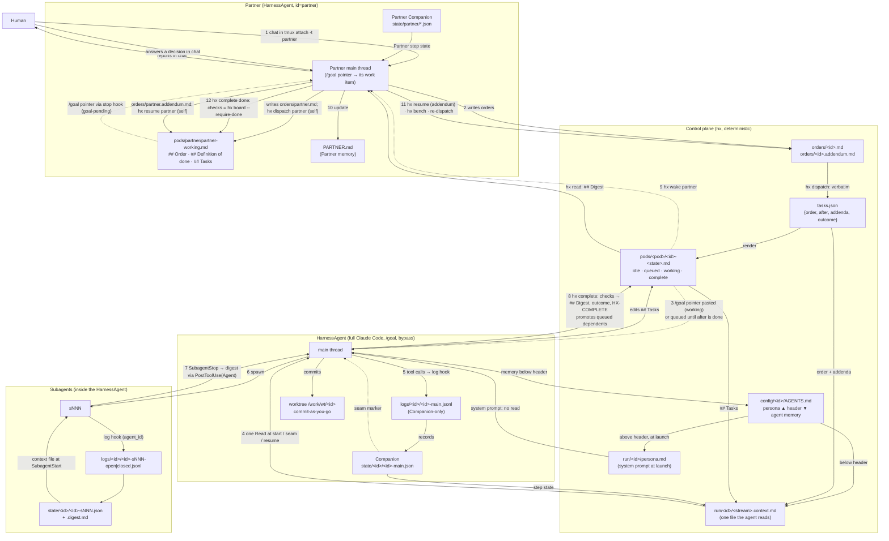

<!-- BEGIN 00-index.md -->
# HarnessAgent Runtime — Spec Index

Each file is one section. Edit one file per change; cross-references use file names.

| File | Covers |
|---|---|
| `01-terminology.md` | Terms |
| `02-decisions.md` | Architecture decisions |
| `03-layout.md` | Filesystem layout |
| `04-ownership.md` | Single writer per artifact |
| `05-configuration.md` | `models.json`, `harness.json` |
| `06-work-items.md` | Work item states (idle, queued, working, complete), transitions, `/goal` pointer, executable definition of done, resume, template |
| `07-streams-and-step-state.md` | Raw stream (Companion-only), step state, context file, continuity checkpoints |
| `08-hx-cli.md` | `hx` commands |
| `09-hooks.md` | Hook events, guard, seam handshake, Claude Code event mapping |
| `10-companion.md` | Companion process, prompts, seam policy, digests |
| `11-adapters.md` | Claude Code adapter: config home, persona, threshold, launch |
| `12-partner-loop.md` | Partner operating loop |
| `13-build-order.md` | Milestones and acceptance tests |
| `14-open-items.md` | Decisions pinned at implementation, with the milestone that verifies each |
| `15-dataflow.md` | Data flow human → Partner → HarnessAgents → Subagents and back |
| `16-ui.md` | Observing UI: board, agent, Partner chat, orders, archive |
| `17-packaging.md` | Package vs instance, `hx install`, isolation from the user's Claude and repo, launch, skills, upgrade, build plan |
<!-- END 00-index.md -->

<!-- BEGIN 01-terminology.md -->
## 1. Terminology

| Term | Definition |
|---|---|
| HarnessAgent | One full Claude Code instance in a tmux session named by its id. Not a bare model loop: every task is given to it as a `/goal` so it runs with the harness's full capability (subagents, hooks, compaction, skills). Claude Code only for now. |
| Partner | The supervising HarnessAgent, id `partner`, pod `partner`. The human never runs hx: the human talks to the Partner in its tmux session, and the Partner turns what it is told into its own order (`orders/partner.md`) and dispatches itself with `hx dispatch partner`, which queues the `/goal` pointer for its own next turn. It has its own Companion and its own work item, so goal delivery, seams, restart, and completion are one mechanism for every id. |
| Subagent | A child agent spawned inside a HarnessAgent, addressed by handle `<id>-sNNN` |
| Order | The Partner-written markdown file `orders/<id>.md` (its own `orders/partner.md` included, written from what the human said in chat) holding `## Order` and `## Definition of done`; consumed by `hx dispatch`, copied verbatim into the work item. Never passed as command-line text |
| Task | The control-plane record for one id in `tasks.json`: order text, `after` list, outcome, dispatch and completion timestamps. Delivered to the HarnessAgent as a `/goal` pointer, never as prompt text |
| Work item | `pods/<pod>/<id>-<state>.md`; state ∈ `idle`, `queued`, `working`, `complete` is the filename suffix. The body is the HarnessAgent's own running task list, which it updates frequently |
| Stream | One append-only raw log: `<id>-main` or `<id>-sNNN` |
| Companion | A small model paired one-to-one with a HarnessAgent (the Partner included); maintains coherency state for each of its streams. Companion prompts are tuned to the persona of the HarnessAgent they support. |
| Step state | The bounded JSON the companion maintains per stream; the continuity payload the HarnessAgent is rehydrated with at every boundary. Subagent step state is not merged into the parent by hx. Claude Code delivers each subagent's result to the parent as a completion notification in a later turn, and `/goal` defers its evaluation and issues check-ins while subagents are still running, so subagent deliverables are the harness's responsibility, not the Companion's. |
| Persona | The part of `config/<id>/AGENTS.md` above `## UPDATES BELOW ONLY`, Partner-written. `start.sh` copies it to `run/<id>/persona.md` at every launch and Claude Code loads it as appended system prompt (`--append-system-prompt-file`), so it is present in every turn, survives compaction and `/clear`, and costs no read. |
| Memory | The part of `config/<id>/AGENTS.md` below the header, written only by that agent; carried in the context file at every boundary. |

### 1.1 Verified harness behavior (Claude Code docs, 2026-09-19)

| Behavior | Status | Source |
|---|---|---|
| Background subagents keep running through parent auto-compaction; the compacted context is seeded with a reminder of which are still running | Confirmed | `code.claude.com/docs/en/context-window` "What survives compaction" |
| Subagents have their own transcript and compact independently of the parent, in both directions; `CLAUDE_AUTOCOMPACT_PCT_OVERRIDE` applies to them too | Confirmed | `code.claude.com/docs/en/sub-agents#auto-compaction` |
| Subagent results reach the parent as a completion notification in a later turn | Confirmed | `code.claude.com/docs/en/sub-agents#run-subagents-in-foreground-or-background` |
| A completion notification pending at the moment of compaction is still delivered afterward | Not documented; inferred from the two rows above. Covered by an acceptance test in `13-build-order.md` | — |
| `/goal` is a session-scoped prompt-based Stop hook: after each turn a small evaluator model returns met / not yet met / impossible. It does not spawn or supervise subagents; it skips evaluation while background work runs and issues check-ins (default 30 min, backing off 2x, `CLAUDE_CODE_GOAL_CHECKIN_MINUTES`) | Confirmed | `code.claude.com/docs/en/goal` |
| `/goal` survives auto-compaction | Confirmed. The clearing events are enumerated (met, impossible, `/goal clear`, `/clear`, a turn failing on an error, a context overflow compaction could not clear) and successful compaction is not one. Changelog 2.1.274 fixed the one gap, goal loss on `--resume` after compaction | `code.claude.com/docs/en/goal`, CHANGELOG 2.1.274 |
| `/goal` is restored on `--continue` and `--resume` (condition kept; turn count, timer, token baseline reset) | Confirmed | `code.claude.com/docs/en/goal` |
| `/clear` kills only foreground tasks; background subagents and background shells keep running | Confirmed | CHANGELOG 2.1.72 |
| Cross-session messaging is on by default; `crossSessionInbound: accept` delivers every inbound message with no hold, in any permission mode; an idle session starts a turn, a busy one reads it between tool calls | Confirmed | `code.claude.com/docs/en/cross-session-messaging`, settings reference |
| `SubagentStart` context is re-injected only on the subagent's next run after its compaction discarded it, not at compaction time; only JSON `additionalContext` is accepted | Confirmed | `code.claude.com/docs/en/hooks#subagentstart` |
| `--append-system-prompt-file <path>` appends file text to the default system prompt in interactive mode; `--append-subagent-system-prompt-file` exists but applies only with `-p`, so subagents cannot get a file-based system prompt in the TUI | Confirmed 2026-09-20 | `code.claude.com/docs/en/cli-reference` |
| A `/clear` pasted mid-turn is queued; at turn end the `Stop` hook runs first, then `/clear` (`SessionEnd`/`SessionStart(clear)`), before the `/goal` evaluator resolves; a `/goal` pasted from inside the `SessionStart(clear)` hook is taken by the TUI once it is ready | Confirmed by live test 2026-09-20 | E3 |
| Blocking `PreCompact(auto)` suppresses compaction for the rest of that turn even if a later `PreCompact` is allowed; the payload never changes; the window is a soft target and the turn continues past it without error; compaction resumes next turn | Confirmed by live test | E4 |
| `PreCompact`/`PostCompact` also fire for subagent compactions, with the parent's `session_id` | Confirmed by live test | E8 |
| Background completions from before a `/clear` are delivered into the new conversation as task notifications | Confirmed by live test | E5 |
| Messaging socket and token are per process, unchanged across `/clear`; a message to a busy session is folded into the in-flight turn; wire format is an auth line then `{"type":"user","message":{"role":"user","content":"…"}}` | Confirmed by live test | E6 |
| `CLAUDE_CODE_AUTO_COMPACT_WINDOW` governs subagent compaction; `CLAUDE_AUTOCOMPACT_PCT_OVERRIDE` alone does nothing on a model with no native autocompact buffer | Confirmed by live test | E8 |
<!-- END 01-terminology.md -->

<!-- BEGIN 02-decisions.md -->
## 2. Decisions

| Item | Decision |
|---|---|
| Orchestrator | tmux + `hx` CLI + per-id hooks |
| LangGraph | **No** |
| Supervisor | Partner: reads `hx board`, writes orders, launches and dispatches workers, consumes digests, resumes paused items. The human only chats with the Partner; the Partner writes its own order from that conversation and dispatches itself, so goal delivery, seams, restart, and completion are one mechanism for every id and the human never runs hx after system setup. |
| Control-plane writes | Deterministic `hx` scripts: `tasks.json`, work item state, stream files, the derived persona file, context files |
| Knowledge writes | Companion: step state, digest. HarnessAgent: its own work item body (running task list) and the mutable section of its own `AGENTS.md` (long-term memory). The Companion does not drive execution and holds no task graph; it continuously interprets the agent's actions from the stream so that continuity survives seams and the agent does not re-call tools to relearn what it already knew. |
| Continuity | Companion step state + raw records after its last processed seq, kept as a file on disk. At start, resume, clear, compaction, and subagent start a hook hands the agent the path; the agent reads it with one tool call. Hooks never inject file contents. |
| Seams (replaces compaction) | Claude Code's compaction summarizer never decides what survives. A seam is `/clear` + rehydration, taken at a turn boundary: the `stop` hook runs `hx seam`, which flushes the Companion, composes the context file, pastes `/clear`, and removes the seam marker; the queued `/clear` runs after the hook returns; `SessionStart(clear)` runs the `context` hook, which hands over the path and, the item being `working`, pastes the `/goal` pointer. Live-verified order: `Stop` → `/clear` → `SessionStart(clear)` → next turn. Two triggers, one marker: (1) the Companion declares a step seam; (2) the `log` hook sees `context_tokens ≥ threshold` on the main stream. Seams are taken only when no background work is running (policy: `/goal` evaluates at the same quiet point, and a subagent finishing into a cleared conversation reports into a context that never dispatched it; its notification is still delivered, so nothing is lost). Fallback seam: `hx restart` relaunches bare and sends the pointer once the pane is ready. |
| Compaction (last resort) | Harness autocompact is left at its native window (about 967k on 1M models) and is never blocked. hx enforces its own seam threshold from `config/models.json` (500k on 1M models) through the `log` hook, so a seam is always taken long before the harness would compact. The harness compacts only if a single turn grows from the threshold to the native window without ending, which at 467k tokens of headroom does not happen in practice; if it does, `SessionStart(compact)` still hands over the context file and the persona is still in the system prompt. `PreCompact` is not used to block: live tests show a block suppresses compaction for the whole turn regardless of later hook output, and the hook also fires for subagent compactions, so blocking would silently disable subagent compaction. `PreCompact`/`PostCompact` are log-only. |
| Identity | One file per agent type, per id: `config/<id>/AGENTS.md` for the HarnessAgent main thread and `config/<id>/SUBAGENTS.md` for its subagents. `AGENTS.md` has two parts. Above the mutable header (`## UPDATES BELOW ONLY`) is the project-scoped persona, written and rarely edited by the Partner; `start.sh` copies it to `run/<id>/persona.md` and launches with `--append-system-prompt-file` pointing at it, so the persona is in every turn's system prompt, survives compaction and `/clear`, costs no tool call, and cannot be skipped. A persona edit takes effect at the next `hx restart`. Below the header the agent writes its own long-term memory; it travels in the context file. Subagents get `SUBAGENTS.md` inside their context file by path from the `SubagentStart` hook (the subagent system-prompt flag exists only in `-p` mode). These files live outside the workdir, so Claude Code's own `AGENTS.md` discovery never sees them. Repo `AGENTS.md` and `CLAUDE.md` discovery is turned off in the harness user's settings; the one global `config/CLAUDE.md` is the only CLAUDE.md that loads. |
| Single-file context | Everything the agent needs at a boundary that is not already in its system prompt (memory, task, `## Tasks`, step state, open handles) is composed by hx into one file per stream with a fixed section schema, always current on disk. The hook output is only the path to that file. Rehydration therefore costs exactly one read, never a search, and never a second file. No size cap applies because nothing is injected. |
| Goal delivery | The `/goal` pointer is pasted into the pane by `hx goal` on every conversation start of a `working` item: dispatch, resume, seam (`context` hook on `clear`), `hx restart`, `hx launch` of an item that is already working. When the target pane is mid-turn (the Partner dispatching or resuming itself from its own Bash tool), `hx goal` leaves `run/<id>/goal-pending` and the `stop` hook pastes the pointer at the end of that turn, the live-verified way a slash command queued from a hook runs after the hook returns. It is never a prompt argument and never freeform text: the order lives in the work item and is read from there. Claude Code is always launched bare. |
| Orders | The Partner writes an order as a file, `orders/<id>.md`, with `## Order` and `## Definition of done`; `hx dispatch <id> orders/<id>.md` copies it verbatim into the work item and records it in `tasks.json`. The Partner writes `orders/partner.md` the same way, from what the human asked for in chat. No task text crosses a command line. |
| Completion | `hx complete done` is machine-checked: the `### Checks` block of the definition of done runs in the worktree, the worktree must be clean, and no subagent stream may be open. Failure prints `HX-CHECK-FAILED <id>` with the output, the item stays `working`, and the goal stays active, so the agent fixes and retries. Only success prints `HX-COMPLETE <id> done`. The evaluator judges a machine result, not prose. `blocked`, `decision`, and `exhausted` run no checks. |
| Dependencies | `after: [<id>…]` in the order's frontmatter and in `tasks.json`. An item with an unmet dependency is dispatched as `queued` (body rendered, no goal). `hx complete done` of the last unmet dependency promotes it to `working` and sends its goal. The Partner dispatches a whole plan in one call; hx sequences it without a Partner wake in between. |
| Resume | `hx resume <id> orders/<id>.addendum.md` continues a `complete` item with outcome `blocked` or `decision` with everything it had: `## Tasks`, step state, memory, worktree, logs. Only the order grows, by the addendum. `hx bench` + `hx dispatch` is a fresh start and is used only when the task itself changes or moves to another id. |
<!-- END 02-decisions.md -->

<!-- BEGIN 03-layout.md -->
## 3. Layout

```
$HARNESS_ROOT/                             # the instance (default /srv/hx on a server, ~/hx on a workstation); config/ is the part worth committing
  bin/hx                                   # CLI (08-hx-cli.md); the installed package's entry point, path recorded in config/hx.json
  bin/hx-hook                              # hook entrypoint (09-hooks.md)
  adapters/claude/install.sh               # writes per-id hook/config files; seeds credentials + bypass acceptance from the harness user's ~/.claude
  adapters/claude/start.sh                 # derives run/<id>/persona.md, launches Claude Code bare from harness.json
  templates/work-item.md
  companion/BASE.md                        # shared companion system prompt
  companion/roles/<role>.md                # per-role retention rules
  config/CLAUDE.md                         # the ONE CLAUDE.md: truly global info; installed as the harness user's ~/.claude/CLAUDE.md
  config/models.json                       # per-model window + seam threshold
  config/claude.json                       # {bin, version} of the pinned Claude Code binary (17-packaging.md)
  config/repo.json                         # {name, upstream, base_branch, keep_claude_dir}
  config/ui.json                           # {port}
  config/<id>/AGENTS.md                    # persona above the mutable header (→ system prompt); the agent's memory below it (→ context file)
  config/<id>/SUBAGENTS.md                 # identity for this HarnessAgent's subagents (→ subagent context file)
  config/<id>/harness.json                 # per-agent config (05-configuration.md)
  PARTNER.md                               # Partner state doc
  orders/<id>.md                           # Partner-written order (## Order, ## Definition of done); orders/partner.md too, from the human's chat
  orders/<id>.addendum.md                  # Partner-written addendum for hx resume
  tasks.json                               # {"<id>": {order, after, outcome, dispatched, completed}}
  pods/<pod>/<id>-<state>.md               # work items incl. pods/partner/partner-<state>.md; state is the suffix
  pods/<pod>/archive/<id>-<ts>.md          # benched bodies
  logs/<id>/<id>-main.jsonl                # main stream
  logs/<id>/<id>-sNNN-<open|closed>.jsonl  # subagent streams
  state/<id>/<stream>.json                 # companion step state per stream
  state/<id>/<stream>.digest.md            # closed-stream digest (subagent streams), returned to the parent
  archive/<id>/<ts>/                       # logs and state from prior dispatches (not from resumes)
  run/<id>/persona.md                      # derived at each launch from AGENTS.md above the header; --append-system-prompt-file target
  run/<id>/<stream>.context.md             # the single file handed to the agent at each boundary (02 Single-file context)
  run/<id>/home/                           # CLAUDE_CONFIG_DIR for this agent: its settings (hooks), credentials, auto memory, transcripts
  run/<id>/subagents.json                  # {"<harness agent_id>": "sNNN"}
  run/<id>/turn                            # turn-end marker with last background_tasks
  run/<id>/goal                            # goal-sent marker with ts
  run/<id>/goal-pending                    # goal owed to a busy pane; consumed by the stop hook
  run/<id>/seam                            # seam-requested marker (Companion or log hook); removed by hx seam
  run/partner/socket.json                  # Partner messaging socket + token, rewritten at every SessionStart
  run/tasks.lock                           # flock target
  run/ui-token                             # UI bearer token, mode 0600
  seed/home/                               # the one home a human logs into; credentials copied from here into every run/<id>/home
  repos/<name>.git                         # bare mirror of the product repo; agent branches live here, never upstream until pushed
  wt/<id>/                                 # sparse worktree per HarnessAgent from the mirror, without the repo's .claude/ (none for partner)
```

- `.gitignore`: `pods/`, `logs/`, `state/`, `run/`, `orders/`, `tasks.json`.
- System setup, once, by the human: install hx, log the harness user's default `~/.claude` in, enable the `hx up` unit. From then on the human only talks to the Partner in `tmux attach -t partner`; every hx command is run by the Partner, a worker, `hx up`, or `hx heartbeat`.
- The human authors and commits `config/CLAUDE.md`, `config/models.json`, `companion/**`, `templates/**`, and commits `PARTNER.md`.
- `config/<id>/AGENTS.md` has two writers separated by the mutable header (`## UPDATES BELOW ONLY`). Above it: the project-scoped persona for that id, written by the Partner and edited rarely; it reaches the agent as system prompt via `run/<id>/persona.md`. Below it: that HarnessAgent's own long-term memory, written only by that agent; it reaches the agent in the context file. Neither the human nor the Companion writes this file. It survives seams because it is a file, not context.
- The work item is the HarnessAgent's own running task list. The agent updates its body frequently as it works; hx owns only the state suffix and the `## Order` addenda.
- `config/CLAUDE.md` is the only CLAUDE.md that loads. The product repo's own `CLAUDE.md` and `AGENTS.md` are not loaded and are not edited: the harness user's settings set `claudeMdExcludes` for the repo file and instruction-files mode `claude-md`, so nothing in `/work/wt/<id>/` is discovered.
- Per-agent `run/<id>/home/` isolates each HarnessAgent's hooks, credentials, auto memory, and transcripts, so one agent's memory never pollutes another's and hx can reset it between dispatches.
<!-- END 03-layout.md -->

<!-- BEGIN 04-ownership.md -->
## 4. Ownership

One writer per artifact. Where two writers share a file, the boundary is mechanical and named here.

| Artifact | Writer | Via |
|---|---|---|
| `config/CLAUDE.md`, `config/models.json`, `companion/**`, `templates/**` | Human | Editor |
| `config/<id>/AGENTS.md` above `## UPDATES BELOW ONLY` | Partner, rarely, only on direct human instruction | Edit tool |
| `config/<id>/AGENTS.md` below `## UPDATES BELOW ONLY` | That HarnessAgent | Edit tool |
| `config/<id>/SUBAGENTS.md`, `config/<id>/harness.json` | Partner, rarely, only on direct human instruction | Edit tool |
| `run/<id>/persona.md` | `hx` | `start.sh`, derived from the part of `AGENTS.md` above the header at every launch |
| `PARTNER.md` | Partner | Edit tool |
| `orders/<id>.md`, `orders/<id>.addendum.md` | Partner, its own `orders/partner.md` and addendum included | Write tool |
| `tasks.json` | `hx` | `hx dispatch`, `hx complete`, `hx resume` (under `run/tasks.lock`) |
| Work item create / rename (state suffix) | `hx` | `hx launch`, `hx dispatch`, `hx complete` (including promotion of `queued` items), `hx resume`, `hx bench` |
| Work item `## Order` addendum | `hx` | `hx resume`, appended verbatim from the addendum file |
| Work item body (running task list) | That HarnessAgent (the Partner for `partner`) | Edit tool |
| Raw streams (`logs/**`), incl. open→closed rename of subagent streams | Hooks | `hx-hook` |
| Step state (`state/**`) | Companion | `hx companion` |
| Digest | Companion | `hx companion` |
| `run/<id>/<stream>.context.md` | `hx` | composed from memory, task, `## Tasks`, step state at each boundary |
| `run/<id>/seam` | Companion, `log` hook | touch-file; writes are idempotent; removed by `hx seam` |
| `run/<id>/home/` | `hx` installs settings and seeds credentials; Claude Code writes its own auto memory and transcripts there | `adapters/claude/install.sh`, Claude Code |
| `run/**` (everything else) | `hx`, hooks | — |

- Work item rename vs. body edit can race if hx renames while the agent's Edit tool is mid-write. Accepted: rare, and hx transitions happen at turn boundaries.
- Partner edits to the top of `AGENTS.md` can race with the agent's edits below the header. Accepted: the Partner only does this on direct human instruction, and the human is aware of the timing.
- `hx resume` appends to `## Order` while the agent is stopped (the item is `complete`), so it never races the agent.
<!-- END 04-ownership.md -->

<!-- BEGIN 05-configuration.md -->
## 5. Configuration

**`config/models.json`** — one row per model. `threshold` is hx's seam threshold: when the main stream's `context_tokens` reaches it, the `log` hook marks a seam. It is not passed to Claude Code; the harness autocompact stays native and only fires if one turn grows from `threshold` to `window` without ending. 1M-window models are capped at 500000.

```json
{
  "claude-opus-5":   { "window": 1000000, "threshold": 500000 },
  "claude-sonnet-5": { "window": 1000000, "threshold": 500000 }
}
```

Model id strings are placeholders until implementation; they are validated against the Models API then, not here. 1M-window models are capped at 500000.

**`config/<id>/harness.json`**:

```json
{
  "id": "eng-001",
  "pod": "engineers",
  "role": "engineer",
  "model": "claude-opus-5",
  "effort": "xhigh",
  "workdir": "/work/wt/eng-001",
  "branch": "agent/eng-001",
  "harness": { "args": ["…"] },
  "companion": {
    "provider": "anthropic",
    "model": "…",
    "batch_records": 20,
    "cache_ttl": "1h",
    "state_budget_tokens": 10000,
    "seam_min_context_tokens": 60000,
    "seam_min_interval_s": 600
  }
}
```

- **Permissions: every HarnessAgent, its subagents, and the Partner run with bypass permissions.** Full trust, no prompts, no approval gates. `adapters/claude/install.sh` writes this into `run/<id>/home/` settings and `start.sh` launches accordingly. This is not configurable per agent.
- `effort` is the HarnessAgent model's effort level, passed at launch.
- `companion.state_budget_tokens` bounds the step state and therefore the context file. Target is roughly 10k tokens: the hypothesis under test is that one intelligently constructed file holding the complete useful memory of the task fits in context and yields maximum quality, so this number is a tuning knob, not a ceiling.
- `companion.seam_*` are the seam policy: the Companion does not declare a seam before `seam_min_context_tokens` are in use, nor more often than `seam_min_interval_s`. Context size comes from the `usage` block of the latest assistant record in the transcript, which `hx-hook` has the path to. The `models.json` threshold is the hard trigger that does not wait for a step to close.
- The Companion learns everything it needs about its HarnessAgent (id, role, pod, budgets, seam policy, persona) from a system prompt hx composes at Companion start from this file, `companion/BASE.md`, and `companion/roles/<role>.md`. It does not read config at runtime.
- `adapters/claude/install.sh` derives the per-agent home settings from this file: hooks with the id baked in, instruction-files mode `claude-md`, `claudeMdExcludes` for the product repo, the bypass acceptance entry; for the Partner, `crossSessionInbound: accept` (messaging itself is on by default). It then seeds the home's credentials and the bypass acceptance entry from the harness user's own `~/.claude`, logged in once at system setup; both stay in `run/<id>/home/` across dispatches. Nothing about launch is interactive. Effort, model, and the persona file are launch flags (`11-adapters.md`); no compaction env vars are set.
- Validate: `id` equals directory name; `model` exists in `models.json`; `role` has `companion/roles/<role>.md`; `workdir` exists (Partner: no `workdir`, no `branch`). On failure, exit 2.
- Partner: `"pod": "partner"`, `"role": "partner"`. Validated the same way.
<!-- END 05-configuration.md -->

<!-- BEGIN 06-work-items.md -->
## 6. Work items

- **Filename:** `^(?<id>partner|[a-z]+-[0-9]{3})-(?<state>idle|queued|working|complete)\.md$`
- **Invariants:** one work item per id, the Partner included; every `working` item has a live tmux session and a `run/<id>/goal` marker; every `queued` item has a non-empty `after` with at least one entry whose `tasks.json` outcome is not `done`, and no goal marker. A live pane on a `working` item with no goal marker is a violation.

| From | To | Actor | Command |
|---|---|---|---|
| — | idle | Launcher | `hx launch <id>` |
| idle | working | Partner (itself included) | `hx dispatch <id> orders/<id>.md` when `after` is empty or every entry is `done` |
| idle | queued | Partner | `hx dispatch <id> orders/<id>.md` when an `after` entry is not yet `done` |
| queued | working | `hx` | inside `hx complete done` of the last unmet dependency |
| working | complete | HarnessAgent, as the last action of its goal | `hx complete <outcome>`; for `done`: checks pass, worktree clean, no open subagent stream |
| complete (`blocked`, `decision`) | working | Partner | `hx resume <id> orders/<id>.addendum.md` — keeps `## Tasks`, step state, memory, worktree, logs; appends the addendum to `## Order`; sends the goal |
| complete | idle | Partner | `hx bench <id>` (archives the body to `pods/<pod>/archive/<id>-<ts>.md`, resets from `templates/work-item.md`) |

**The order is a file.** `orders/<id>.md` is written by the Partner, its own `orders/partner.md` included, and contains exactly two sections, `## Order` and `## Definition of done`, plus optional frontmatter `after: [<id>…]`. `hx dispatch` refuses an order that lacks either section or the `### Checks` block. The order has no length limit; it is copied verbatim into the work item and recorded in `tasks.json`. No task text is ever a command-line argument.

**The task is a `/goal`, delivered by pointer.** What `hx goal` pastes is a fixed short form that never grows with the task:

```
/goal The order for <id> is in <abs path to work item>; read it first. Done when `hx complete <outcome>` has been run and its output line `HX-COMPLETE <id> <outcome>` appears.
```

The same pointer is sent on every conversation start of a `working` item: dispatch, resume, seam (`context` hook on `clear`), `hx restart`, and `hx launch` of an item that is already working. Claude Code is launched bare; nothing is passed as a prompt argument.

The evaluator reads the conversation including tool results, but calls no tools itself, so completion is proven by a deterministic line hx prints to stdout, which appears in the transcript, not by the agent's claims. The evaluator's no-progress guard (several turns with no tool use) never trips on a working agent. The Partner's job at dispatch is scoping: a definition of done the agent can satisfy and `hx complete` can check, sized to finish inside one context window with seams as backup rather than plan, and self-contained so the work item is the whole order.

**Definition of done** has two parts, both Partner-written in the order file:

1. An acceptance checklist the goal evaluator can judge from the transcript.
2. A `### Checks` fenced `bash` block. `hx complete done` runs it in the worktree with `bash -e`; every command must exit 0. When nothing is executable the check verifies the deliverable exists (`test -s report.md`); an empty block is refused at dispatch.

**Outcome mapping.** `outcome ∈ {done, blocked, decision, exhausted}`, set by `hx complete`. Goal evaluator verdict → outcome: met → `done`; impossible → `blocked` (cannot be done) or `decision` (needs the Partner or human to choose); check-in retries run out → `exhausted`. `hx complete done` is refused with `HX-CHECK-FAILED <id>` and the failing output when a check fails, the worktree is dirty, or a subagent stream is open; the item stays `working`, the goal stays active, and the agent fixes and retries. A refused completion is the agent's problem, never the Partner's.

**Body** (HarnessAgent-maintained; sections defined by `templates/work-item.md`):

`templates/work-item.md`, rendered by `hx dispatch` with the id, pod, `after`, timestamp, and the order file filled in:

```markdown
---
id: <id>
pod: <pod>
after: [<ids from the order frontmatter>]
outcome:
dispatched: <ts>
---
<orders/<id>.md verbatim: ## Order, then ## Definition of done with its ### Checks block>

## Standing instructions
- Keep `## Tasks` current: mark a task done the moment it is done, add tasks the moment you discover them. This section is what you get back after a seam.
- Commit each finished sub-task immediately with a descriptive message. `git log --oneline` is your memory of what is done; do not leave the worktree open.
- Read a file once. Note the fact you needed in `## Tasks` next to the task that needed it.
- Use subagents freely; each gets its own context file.
- Before finishing: write what should outlive this task below `## UPDATES BELOW ONLY` in your `AGENTS.md`.
- `hx complete done` runs `### Checks` and requires a clean worktree. On `HX-CHECK-FAILED`, fix and run it again.
- Your last action is `hx complete <outcome>`. Nothing after it.

## Tasks
- [ ] …

## Deliverables

## Commands

## Open decision

## Digest
<written by the Companion at completion>
```

- `## Order` and `## Definition of done` are the Partner's, written once at dispatch; `hx resume` appends `## Order addendum <ts>` beneath `## Order`.
- `## Tasks`, `## Deliverables`, `## Commands`, `## Open decision` are the agent's, updated as it works. `## Tasks` is what the context file carries at a seam.
- `## Digest` is the Partner-facing summary, the only section written by the Companion, in its final pass inside `hx complete`. Two writers on this file is safe because the Companion writes only after the agent has stopped.
- For `partner` the worktree rules do not apply (no worktree); its checks run in `HARNESS_ROOT`, typically `hx board --require-done <id>…`. `hx dispatch partner` and `hx resume partner` archive and wipe nothing: the Partner's session, streams, and state are continuous, and the pointer is queued for its next turn through `run/partner/goal-pending`.
<!-- END 06-work-items.md -->

<!-- BEGIN 07-streams-and-step-state.md -->
## 7. Streams and step state

### 7.1 Raw stream (Companion-only)

The raw stream exists for one reader: the Companion. The HarnessAgent never reads it, and it is never part of what the agent is handed. Its job is to give the Companion enough recent, structured evidence to keep step state current. Everything about it follows from that.

**Raw record** (one JSON line per hook event, appended by `hx-hook`; event vocabulary in `09-hooks.md`):

```json
{"seq":412,"ts":"…","stream":"eng-001-s002","event":"post_tool","tool":"Bash",
 "input":"<head excerpt>","output":"<head excerpt>","exit":1,"agent_id":"…","context_tokens":148220,
 "ref":{"transcript":"<transcript_path>","tool_use_id":"<id>"}}
```

- `seq` is monotonic per stream, assigned by `hx-hook` under a per-stream lock.
- `context_tokens` is read by the hook from the `usage` block of the latest assistant record in the transcript at `transcript_path`.
- `input`/`output` are head excerpts (`excerpt_chars`, default 2000) plus `ref`, a pointer to the full payload in the transcript. Nothing is lost: the Companion follows `ref` when an excerpt is not enough. The excerpt size is a Companion evidence budget, not a cap on what the agent may produce.

**Retention (deterministic FIFO).** Each stream file is append-only and bounded:

- `max_records` (default 500) and `max_bytes` (default 4 MB) per stream, whichever is hit first.
- `hx-hook` truncates from the head on every append that would exceed a bound, but never below `state.seq − keep_behind` (default 100), so the Companion always has a window of already-processed evidence behind its cursor and everything ahead of it.
- Backpressure: if a stream is `max_records − keep_behind` records ahead of `state.seq`, the `log` hook waits before appending until the Companion catches up. The tool call has already run; only the next model request is delayed. Evidence is never dropped ahead of the cursor, and there is no timeout.
- Subagent streams close on `SubagentStop` (rename `open` → `closed`) and are retained until the Companion's final pass over them completes, then deleted.

### 7.2 Step state (Companion-written)

`state/<id>/<stream>.json`:

```json
{
  "seq": 412,
  "prompt_version": {"base": "<sha>", "role": "<sha>"},
  "goal": "",
  "constraints": [],
  "decisions": [{"d": "", "why": "", "ev": [401]}],
  "open_steps": [{"id": "st7", "intent": "", "next": "", "ev": [398, 410]}],
  "closed_steps": [{"id": "st6", "outcome": "", "verified": true, "commit": "<sha>", "ev": [390]}],
  "dead_ends": [],
  "working_set": {
    "commits": [{"sha": "", "msg": ""}],
    "dirty": [],
    "files": [{"path": "", "note": ""}],
    "last_failure": "",
    "hypothesis": ""
  },
  "blockers": [],
  "subagents_open": []
}
```

- `hx` validates schema and size (`chars/4 ≤ state_budget_tokens`); an invalid write keeps the previous state.
- `ev` entries are `seq` references into the raw stream. They are for the Companion's own use across its passes; the agent has no recall command.
- **Structure as memory.** The task template instructs the agent to commit each finished sub-task immediately with a descriptive message rather than leaving the worktree open. Then `git log --oneline`, `git diff --stat`, and `ls` recover most of the working state in one Bash call each, and the Companion records the commit sha on the closed step instead of describing the change. `working_set.commits` and `working_set.dirty` are derived from those records. `working_set.files` is only for files the agent read but did not change, with a one-line `note` of the fact it needed from them, so it does not read them again.
- Step state is kept across `hx resume`: an item paused on `blocked` or `decision` continues from the step state it paused with. Only `hx dispatch` archives it.

### 7.3 Context file (hx-composed)

At every boundary (start, resume, clear, compaction, subagent start) hx composes `run/<id>/<stream>.context.md` and the hook hands the agent its path. The persona is not in this file: it is in the system prompt (`02-decisions.md` Identity). Sections in order:

1. Memory: the part of `config/<id>/AGENTS.md` below `## UPDATES BELOW ONLY` (main stream); `config/<id>/SUBAGENTS.md` whole (subagent streams)
2. Task: the verbatim order and every addendum from `tasks.json` (or the subagent prompt)
3. Work item `## Tasks` section (main stream only)
4. Step state, rendered from `state/<id>/<stream>.json`
5. Open subagent handles

Before composing at a planned seam, hx waits for the Companion to process to the head of the stream, so step state is current and no raw tail is needed. On crash or resume the Companion catches up first, then hx composes. The agent reads one file and nothing else.

### 7.4 Seam records

`hx` appends a `seam` record to the stream at every boundary with `prompt_version`, `context_tokens` before, and the context file size. Tool calls in the 10 turns after each seam are the metric for whether the context file worked, split into Reads of files already noted in `working_set` (waste) and everything else; `prompt_version` is what it is compared across. `hx metrics <id>` reads it from the seam records.

### 7.5 Continuity checkpoints

The design question at every critical step: *if this stopped right now, is there an up-to-date, deliberately curated context for this specific process that avoids searching, re-reading, and re-running tools?* The answer at each step, and who guarantees it:

| Step | What exists on disk at that instant | Guaranteed by |
|---|---|---|
| Dispatch | Work item with `## Order`, `## Definition of done` (checks), empty `## Tasks`; `tasks.json` entry; fresh logs/state; agent home wiped of prior transcripts and auto memory; persona + agent memory in `AGENTS.md` (for `partner`: nothing archived, session continuous) | `hx dispatch` |
| Queued | The same, without a goal; the item waits on `after`; nothing runs | `hx dispatch` |
| Session start | Persona in the system prompt; context file composed from memory, task, `## Tasks`, step state; the agent's first action is one Read | `start.sh`, `context` hook, `hx compose` |
| Every tool call | One raw record with excerpt + ref appended before the next call; Companion within `batch_records` of head | `log` hook, Companion loop |
| Every `## Tasks` edit | The agent's own plan is current in the work item; the Companion sees the edit as a record | Standing instructions, `log` hook |
| Every commit | Done work is in git with a message; `closed_steps[].commit` set on the Companion's next pass | Standing instructions, Companion |
| Subagent start | Its own context file: `SUBAGENTS.md`, its prompt, empty step state; parent main stream records the spawn | `subagent-start` hook |
| Subagent stop | Stream closed; closed-stream digest written; parent receives it via `subagent-result` | `subagent-stop`, Companion, `subagent-result` |
| Turn end | `run/<id>/turn` with `background_tasks`; Companion woken; seam taken if pending and safe | `stop` hook |
| Seam | Companion at head; context file recomposed; `/clear` then `/goal` pointer; persona still in the system prompt; first action after is one Read | `hx seam`, `context` hook |
| Threshold hit | `log` hook touches `run/<id>/seam`; the next `stop` with no background work takes the seam; native compaction is never reached on the planned path, and if it is, `SessionStart(compact)` still hands over the context file | `log`, `stop`, `context` hooks |
| Crash / restart | Companion catches up to head; context file recomposed; goal restored by Claude Code on `resume`, or sent by `hx goal` after `hx restart` once the pane is ready | `context` hook, `hx restart` |
| Complete | Zero open streams; checks passed and worktree clean (for `done`); Companion final pass; `## Digest` written; agent memory updated; outcome set in the work item and `tasks.json`; `HX-COMPLETE` line printed; queued dependents promoted | `hx complete`, standing instructions |
| Resume | The item's logs, step state, `## Tasks`, memory, and worktree exactly as it paused; the addendum appended to `## Order`; context file recomposed; goal sent | `hx resume` |
| Partner wake | Renamed work item and the wake message are the signal; Partner's context file includes board and `PARTNER.md` | `12-partner-loop.md` |
| Bench | Body archived with timestamp; item reset; logs/state archived at next dispatch | `hx bench`, `hx dispatch` |
<!-- END 07-streams-and-step-state.md -->

<!-- BEGIN 08-hx-cli.md -->
## 8. `hx` CLI

Zero-dependency Python (3.12, stdlib only: `json`, `fcntl`, `subprocess`, `tempfile`), one file per command group. Renames use same-directory rename. Agent-side commands identify the caller by `HARNESS_ID` from the tmux session env; Partner commands refuse when `HARNESS_ID` is set and is not `partner`; system commands (`hx up`, `hx heartbeat`) run from systemd and cron with no `HARNESS_ID`. The human runs nothing after system setup. No timeouts anywhere: hx waits for the condition it needs. Models are always passed as full ids (`claude-opus-5`), never aliases, which drift. No task text is ever a command-line argument: orders and addenda are files.

| Command | Caller | Effect |
|---|---|---|
| `hx launch <id>` | Partner, `hx up` | Idempotent. Create worktree (not for `partner`) and `-idle` work item if missing; run `install.sh` (writes `run/<id>/home/` settings: hooks with id baked in, bypass permissions, instruction-files mode `claude-md`, `claudeMdExcludes`; seeds credentials and the bypass acceptance from the harness user's `~/.claude`); `tmux new-session -d -s <id>` with `HARNESS_ID`, `HARNESS_ROOT`, `CLAUDE_CONFIG_DIR=run/<id>/home`; run `start.sh` in window `main` (derives `run/<id>/persona.md`, launches bare); run `hx companion <id>` in window `companion`. If the item is already `working` (relaunch after a reboot), `hx goal <id>` once the pane is ready |
| `hx install` | Human, once | 17-packaging.md 17.2: checks, instance skeleton, seed login, repo mirror, boot and heartbeat units, `hx launch partner` |
| `hx doctor` | Partner, `hx up` | Check tmux, git, the pinned `claude` binary and version, seed credentials, every home's settings, mirror reachability; exit 1 with the list |
| `hx repo add <url\|path>` | `hx install`, Partner | Bare mirror at `repos/<name>.git`; `config/repo.json` |
| `hx push <id>` | Partner, on instruction | `git push upstream agent/<id>` from the mirror; the only command that touches the user's remote |
| `hx show <id> [--json]` | Partner, UI | Work item, step state, context file, stream tails, metrics, subagent handles for one id |
| `hx ui` | systemd/launchd, Partner | 16-ui.md server on `127.0.0.1` |
| `hx upgrade` | Human, rarely | 17-packaging.md 17.6 |
| `hx up` | systemd/launchd at boot | `hx launch <id>` for every `config/<id>/`, `partner` first |
| `hx dispatch <id> <order-file> [<id> <order-file> …]` | Partner (itself included) | Validate each order file (`## Order`, `## Definition of done`, non-empty `### Checks`; optional frontmatter `after`). Under flock: write `tasks.json` entries; per id archive `logs/<id>/` and `state/<id>/` to `archive/<id>/<ts>/`, clear `run/<id>/` except `home/` and `persona.md` (auto memory and transcripts under `home/` are cleared); render the body with the order verbatim; rename `idle → working` and `hx goal <id>` when every `after` entry is `done`, else `idle → queued`. For `partner`: no archive, no wipe, no reset (its session is continuous); render, record, rename, `hx goal partner`, which lands in `goal-pending` because the Partner's own pane is mid-turn |
| `hx goal <id> [--now]` | `hx dispatch`, `hx resume`, `hx restart`, `hx launch`, `context` hook | Paste the fixed-form `/goal` pointer from `06-work-items.md` into window `main` via tmux buffer; write `run/<id>/goal` marker with ts. If the pane is at the idle prompt (`capture-pane`), paste now. If the pane is mid-turn (the Partner dispatching or resuming itself from its own Bash tool), write `run/<id>/goal-pending` and return; the `stop` hook pastes the pointer at the end of that turn, the live-verified path for a slash command queued from a hook. `--now` pastes without checking and is used only from the `context` hook on `clear` (E3) and the `stop` hook. The pointer names the work item path and the `HX-COMPLETE` line; it never carries the order itself |
| `hx task` | HarnessAgent | Print own full order and addenda |
| `hx compose <id> <stream>` | Hooks, `hx seam`, `hx resume` | Write `run/<id>/<stream>.context.md` per `07-streams-and-step-state.md` 7.3; print its path |
| `hx seam <id>` | `stop` hook, when `run/<id>/seam` exists | Require empty `background_tasks` in the Stop payload, else return and retry at the next boundary; `hx flush`; `hx compose <id> <id>-main`; paste `/clear` (it queues and runs after the hook returns); append `seam` record; remove `run/<id>/seam`; return. The `context` hook on `source=clear` finishes the seam by sending the goal because the item is `working` |
| `hx restart <id>` | Partner, `hx heartbeat` | Fallback seam: `hx flush`; `hx compose`; kill window `main`; `start.sh <id>` bare; `hx goal <id>` once the pane is ready |
| `hx complete <outcome>` | HarnessAgent | Require zero `-open` subagent streams. For `done`: require `git status --porcelain` empty in the worktree (not for `partner`) and run the `### Checks` block with `bash -e` in the worktree (`HARNESS_ROOT` for `partner`); on any failure print `HX-CHECK-FAILED <id>` and the failing output, exit 1, change nothing. Then: `hx flush`; companion writes Digest; write outcome to the work item and `tasks.json`; rename `working → complete`; remove `run/<id>/goal`; for `done`, promote every `queued` item whose `after` entries are all `done` (`queued → working`, `hx goal`); print `HX-COMPLETE <id> <outcome>` as the last line of stdout (the goal evaluator's proof: tool output is in the transcript it reads); unless id is `partner`, `hx wake partner "<id> complete: <outcome>; hx read <id>"` |
| `hx resume <id> <addendum-file>` | Partner (itself included; for `partner` the goal lands in `goal-pending`) | Require `complete` with outcome `blocked` or `decision`. Under flock: append `## Order addendum <ts>` + the file verbatim beneath `## Order`; record the addendum in `tasks.json` and clear the outcome; keep logs, state, `## Tasks`, memory, worktree; rename `complete → working`; `hx compose`; `hx goal <id>` |
| `hx read <id>` | Partner | Print Digest of a `complete` work item; `--full` prints the whole body |
| `hx bench <id>` | Partner | Archive the completed body to `pods/<pod>/archive/<id>-<ts>.md`; reset from template; rename `complete → idle` |
| `hx board [--json] [--require-done <id>…]` | Partner, checks, UI | One line per id: `<work-item-file>  <after>  <outcome>  <open subagents>  <goal ts>`, then invariant errors; exit 1 on any error. With `--require-done`, exit 0 iff every listed item is `complete` with outcome `done` (the Partner's own `### Checks`) |
| `hx flush <id>` | Hooks, `hx complete`, `hx seam` | Signal companion; wait until every stream's state `seq` equals its log head |
| `hx companion <id>` | `hx launch` | Companion loop (10-companion.md) |
| `hx wake partner "<text>"` | `hx complete`, `hx heartbeat` | Connect to the unix socket in `run/partner/socket.json`; write `{"type":"auth","token":"<token>"}` then `{"type":"user","message":{"role":"user","content":"<text>"}}`, newline-terminated; the socket answers nothing. An idle Partner starts a turn; a busy one takes it as steering in the current turn. The text is a fixed short form composed by hx, never an order |
| `hx heartbeat` | System cron, every 15 min | `hx board`; `hx restart <id>` for every `working` item whose session is dead, `partner` included; then, if any item is `working` or `queued` and the board output differs from the last heartbeat's, `hx wake partner "check on each HarnessAgent: <board diff>"` |
| `hx metrics <id>` | Partner | Per seam: tool calls in the next 10 turns (Reads of `working_set` files vs. other), context-file Reads, `prompt_version`, context tokens before |

**`tasks.json`** (control-plane record per id, written only by hx under `run/tasks.lock`):

```json
{
  "eng-002": {
    "order": "<orders/eng-002.md verbatim>",
    "after": ["eng-001"],
    "addenda": [{"ts": "…", "text": "…"}],
    "outcome": null,
    "dispatched": "20260920T101500Z",
    "completed": null
  }
}
```

Readiness of an `after` entry is `tasks.json[<dep>].outcome == "done"`. A re-dispatch of the dependency resets its outcome to `null`, so a stale completion never satisfies a newer dependent. `hx bench` does not touch `tasks.json`.

**`hx dispatch`** (the shape; Python in the implementation):

```
lock run/tasks.lock
for each (id, order_file):
    refuse unless item is idle and tmux session <id> exists
    refuse unless HARNESS_ID is partner
    parse frontmatter after: []; require ## Order, ## Definition of done, non-empty ### Checks
    tasks[id] = {order, after, addenda: [], outcome: null, dispatched: ts, completed: null}
write tasks.json (tmp + rename)
for each id:
    if id != partner:
        move logs/<id>, state/<id> to archive/<id>/<ts>/; recreate
        remove run/<id>/* except home/ and persona.md
        remove home/projects, home/file-history, home/history.jsonl
        write run/<id>/subagents.json = {}
    render templates/work-item.md with the order file verbatim → pods/<pod>/<id>-idle.md
    if every after entry has outcome done: rename to -working; hx goal <id>   # partner: goal-pending, sent by its stop hook
    else: rename to -queued
```

- Write order: tasks, then per-id archive, reset, render, rename, goal. Re-running the same `hx dispatch` completes an interrupted one.
- `home/` wipe is exactly `projects/` (all session and subagent transcripts, spilled tool results, and per-project auto memory with its `MEMORY.md`), `file-history/` (pre-edit snapshots), and `history.jsonl` (typed prompts). `settings.json`, `.credentials.json`, `agents/`, `skills/`, `plugins/`, and `agent-memory/` are siblings and survive. Auto memory is keyed by git repo, so without a per-agent home every worktree of the product repo would share one memory; the per-agent home is what isolates it.

**`hx board` invariants:** one work item per id, `partner` included; names match the regex; every work item has `config/<id>/`; every `config/<id>/` has a work item; every `tasks.json` key has `config/<id>/`; every `working` item has a live session and a `run/<id>/goal` marker; every `queued` item has an unmet `after` entry and no goal marker; every `complete` item has zero `-open` streams; every `run/<id>/home/` has its settings file and credentials.
<!-- END 08-hx-cli.md -->

<!-- BEGIN 09-hooks.md -->
## 9. Hooks

Every hook command is `/srv/hx/bin/hx-hook --id <id> <event>`, with the id written literally by `adapters/claude/install.sh` into `run/<id>/home/settings.json` (the settings file at the root of `CLAUDE_CONFIG_DIR`). Those hooks apply to the main thread and to every subagent spawned in the session. The worktree carries no `.claude/settings.json`, so this is the only hook source. This file is the single source for hook behavior; `11-adapters.md` covers launch and config only.

Verified facts this file relies on (docs 2026-09-19, live tests 2026-09-20, `01-terminology.md` 1.1): `PreToolUse` denies block under bypass permissions; tool hooks fire inside subagents with `agent_id`/`agent_type`; `SessionStart` plain stdout is injected as context but `SubagentStart` needs JSON; `Stop` fires after every turn and runs before a queued `/clear`, and a slash command pasted from inside it runs after it returns; a `/goal` pasted from inside the `SessionStart(clear)` hook is taken by the TUI once ready; `PreCompact` blocks suppress compaction for the whole turn and fire for subagent compactions too; `SubagentStart` context is not re-injected at a subagent's compaction.

### 9.1 Events

| `hx-hook` event | Claude Code event | Applies to | Action |
|---|---|---|---|
| `context` | `SessionStart`, matcher `startup\|resume\|clear\|compact` | Main thread | `hx compose <id> <id>-main`; print one line to stdout: `Read <path> before doing anything else.` Never JSON, never a leading brace. On `source=clear`, if the work item is `working`: `hx goal <id> --now` (this completes a seam). On `startup` and `resume` the hook sends no goal: `hx launch`/`hx restart` send it from outside once the pane is ready, and `resume` restores it natively. Partner: the same, with `PARTNER.md` and `hx board` output included by compose, plus write `CLAUDE_CODE_MESSAGING_SOCKET` and `CLAUDE_CODE_MESSAGING_TOKEN` to `run/partner/socket.json` (they are exported before `SessionStart` runs). |
| `subagent-start` | `SubagentStart` | Non-Partner | Assign next `sNNN`; record `{agent_id: sNNN}` in `run/<id>/subagents.json`; create `logs/<id>/<id>-sNNN-open.jsonl` with an `open` record (spawn prompt); append `spawned sNNN` to main; `hx compose <id> <id>-sNNN`; return `{"hookSpecificOutput":{"hookEventName":"SubagentStart","additionalContext":"Read <path> before doing anything else."}}`. Plain stdout is not injected for this event (only `SessionStart`, `UserPromptSubmit`, `UserPromptExpansion`, `PostModelSwitch` inject stdout) |
| `subagent-stop` | `SubagentStop` | Non-Partner | Append `close` record (last assistant message, transcript path); rename stream to `-closed`; append `closed sNNN` to main; wake companion. No decision output |
| `subagent-result` | `PostToolUse`, matcher `Agent` | Non-Partner | When `tool_response.status = completed`: map `tool_response.agentId` to `sNNN`; if the companion has written a closed-stream digest for it, return it as `additionalContext`. This is the only path that reaches the parent |
| `guard` | `PreToolUse`, matcher `*` | All, including subagents | Rules in 9.2. Deny = exit 2 with the reason on stderr. Never exit 1 |
| `log` | `PostToolUse`, matcher `*` | All, including subagents | Resolve stream: `agent_id` present → `subagents.json` handle, else main. Append one raw record. On the main stream, if `context_tokens ≥ threshold` from `models.json`, touch `run/<id>/seam` |
| `stop` | `Stop` | Main thread | Write `background_tasks` to `run/<id>/turn`; wake companion; if `run/<id>/goal-pending` exists, `hx goal <id> --now` and remove it (the Partner's self-dispatch and self-resume land here); else if `run/<id>/seam` exists, `hx seam <id>`. No decision output: the `/goal` evaluator owns continuation. Live-verified: `Stop` runs before a queued `/clear` |
| `precompact` | `PreCompact` | All (fires for subagent compactions too, with the parent's `session_id`) | Log-only: append a `compact_pending` record; `hx flush`. Never blocks: a block suppresses compaction for the whole turn and would also disable subagent compaction |
| `postcompact` | `PostCompact` | All | Append a `compact` record with `compact_summary` so the companion sees what Claude kept on the fallback path |

**Write discipline for streams:** each raw record is one line under 4 KB, written with a single `write(2)` on an `O_APPEND` descriptor, with `seq` assigned under a per-stream lock. Concurrent hook invocations on the same stream then append whole lines in order.

**Removed:** the stop gate and `stopblocks` counter. `/goal` keeps the agent working and decides met / impossible; `exhausted` is its check-in retries running out (`06-work-items.md`). The board invariant (working item with no goal marker) catches a session whose goal was lost.

### 9.2 `guard` rules

First match wins. Evaluate over every string in `.tool_input`, after `cd` to `.cwd`, resolving paths with `realpath -m`. `<id>` is the hook's baked-in id.

1. Edit/Write target is `config/<id>/AGENTS.md` → **allow** iff the resulting file is byte-identical above the line `## UPDATES BELOW ONLY` (compute by applying the edit to a copy). Otherwise **deny**: `only the section below the header is yours`.
2. Any string resolves under `config/` or `companion/`, or contains `hx-hook` → **deny**: `identity is delivered by hook`.
3. Edit/Write target is `PARTNER.md` → **allow** iff id = `partner`.
4. Edit/Write target is `pods/<pod>/<id>-working.md` for this `<id>` → **allow**.
5. Edit/Write target is under `orders/` → **allow** iff id = `partner`; otherwise **deny**: `orders are the Partner's`.
6. Edit/Write target is under `pods/`, `logs/`, `state/`, `run/`, `archive/`, or is `tasks.json` → **deny**: `managed by hx`.
7. Bash command contains `$HARNESS_ROOT` → **allow** iff it starts with `hx `.
8. Otherwise → **allow**.

Bypass permissions removes every prompt; these rules are the only enforcement and they are not bypassable by permission mode. Partner-only `hx` commands enforce their caller inside hx from `HARNESS_ID` (`08-hx-cli.md`).

### 9.3 Seam handshake (live-verified order)

1. `run/<id>/seam` is written by the Companion (step seam) or by the `log` hook (`context_tokens ≥ threshold` on the main stream).
2. Next `stop`: `hx seam <id>` runs. It requires empty `background_tasks`; otherwise it returns and the next `stop` retries.
3. `hx seam` flushes, composes the context file, pastes `/clear`, appends a `seam` record, removes the marker, and returns. The queued `/clear` runs after the hook returns.
4. `SessionEnd(clear)` then `SessionStart(clear)`: the `context` hook prints the path line and, the item being `working`, runs `hx goal <id> --now`.
5. The agent's first action in the new conversation is one Read of the context file. Its persona is already in the system prompt.

`hx seam` cannot wait for step 4 inside step 3: the clear only runs once the `Stop` hook has returned.

### 9.4 Subagent compaction (accepted limitation)

No hook fires on a subagent's own compaction, so its step state cannot be recomposed at that moment. What is documented: after a subagent's auto-compaction discards the `SubagentStart` context, Claude Code injects it again on that subagent's *next run* (a resume or a new message to it), not at the moment of compaction. A subagent that compacts and finishes without being re-run gets nothing back. Decision: accept this. Two mitigations are in force: the parent's standing instructions size subagent tasks to finish inside one window, and `SUBAGENTS.md` tells the subagent to commit as it goes so `git log` carries its progress across its own compaction. No subagent-scoped hooks are used, and the subagent system-prompt flag is unavailable in interactive mode.
<!-- END 09-hooks.md -->

<!-- BEGIN 10-companion.md -->
## 10. Companion

**Process:** `hx companion <id>` runs in tmux window `<id>:companion`, one per HarnessAgent including the Partner, serving all of that agent's streams. It reads streams and writes step state, digests, and the seam marker. It never writes the agent's files, with one exception: the `## Digest` section of the work item, once, inside `hx complete`.

**System prompt** is composed once at start (05-configuration.md): `companion/BASE.md`, `companion/roles/<role>.md`, and the facts from `config/<id>/harness.json`. The Companion reads no config at runtime.

**Loop:**
1. Wake on: `batch_records` new records in any stream, `run/<id>/turn` touched, subagent stop, or `hx flush`.
2. Per stream with new records, make one stateless call:

```
[companion/BASE.md]                       cache breakpoint (shared by all companions on this model)
[companion/roles/<role>.md]               cache breakpoint
[config/<id>/AGENTS.md or SUBAGENTS.md]   cache breakpoint, cache_ttl
[task: order + addenda]                   cache breakpoint, cache_ttl
[current step state]
[raw records with seq > state.seq]
→ new step state
```

3. Validate and write `state/<id>/<stream>.json`, stamping `prompt_version` with the shas of `BASE.md` and the role file.
4. Evaluate the seam policy on the main stream; when it fires, write `run/<id>/seam`. The stop hook does the rest (09-hooks.md 9.3).

**Seam policy:** a step closed on the main stream AND `context_tokens ≥ seam_min_context_tokens` AND time since the last `seam` record `≥ seam_min_interval_s` AND `subagents_open` is empty.

**Across `hx resume`:** the Companion keeps running against the same streams and state; `seq` continues. The addendum appears in the task block of its next call, so the step state absorbs the new instruction without losing the old steps. Only `hx dispatch` archives streams and state.

**Closed-stream digest.** When a subagent stream closes, the Companion's next pass over it writes `state/<id>/<stream>.digest.md`: a few lines of what the subagent did, what it committed, what it left open. The `subagent-result` hook returns it to the parent.

**Final pass** (inside `hx complete`, after the checks have passed for `done`): read the main step state and every closed-stream digest; write the `## Digest` section of the work item for the Partner. For `blocked` and `decision` the digest states the blocker or the question first, so the Partner's addendum can answer it.

**`companion/BASE.md` defines:**
- **Keep until task completes:** goal, constraints, decisions with reason, open steps with intent and next action, working set, blockers.
- **Collapse:** closed steps to one line with outcome, commit sha, and evidence seqs; repeated attempts to one line.
- **Discard:** raw command text and tool output; dead ends that changed no decision; anything one Bash call recovers (`git log --oneline`, `git diff --stat`, `ls`).
- **Keep:** any fact the agent had to Read a file to learn, as a `working_set.files` entry with a one-line note. Discarding it costs a Read after the seam.
- **Evict under budget, in order:** collapsed closed steps, oldest dead ends, working-set detail of closed steps, notes on files not touched by any open step.
- **Evidence:** close a step with `verified: true` only when citing raw record seqs proving it; otherwise `verified: false`.
- **Agent signals lead:** the agent's edits to the `## Tasks` section of its work item (log records on Edit/Write) and todo-tool calls set step status; the Companion fills gaps. Commits set `closed_steps[].commit`.
- **Boundary records** (`seam`, `goal`, `compact`) are evidence of a boundary, not of work. After a `compact` record, treat Claude's summary as unverified.

**`companion/roles/<role>.md` defines** role-specific retention (engineer: paths, failing tests; QA: boundaries, correlation ids, per-case results; partner: dispatch outcomes, digests consumed, cross-pod blockers, open decisions awaiting the human).
<!-- END 10-companion.md -->

<!-- BEGIN 11-adapters.md -->
## 11. Claude Code adapter

`adapters/claude/install.sh <id>` writes the per-agent home and hook wiring from `09-hooks.md` and seeds credentials and bypass acceptance from the harness user's `~/.claude`; `adapters/claude/start.sh <id>` derives the persona file and launches Claude Code bare in window `<id>:main`. The adapter is launchable once the M2–M6 suites pass under it (`13-build-order.md`).

| Item | Claude Code |
|---|---|
| Config home | `CLAUDE_CONFIG_DIR=/srv/hx/run/<id>/home` in the tmux session env. `install.sh` writes `home/settings.json` (hooks with `--id <id>` baked in, instruction-files mode `claude-md`, `claudeMdExcludes` for the product repo's `CLAUDE.md`/`AGENTS.md`) and `home/CLAUDE.md` as a copy of `config/CLAUDE.md`. No `.claude/` in the worktree |
| Auth | Credentials are per home. The human logs the harness user's default `~/.claude` in once at system setup; `install.sh` copies its credentials file and writes the bypass acceptance entry into each `run/<id>/home/`, so no launch is ever interactive. Both survive every dispatch wipe (`08-hx-cli.md`). `start.sh` refuses to launch a home without them. Live experiments hit exactly this gap |
| Permissions | Bypass, always: `--dangerously-skip-permissions` at launch. The harness user is non-root (Claude Code refuses the flag under root/sudo). `permissions.defaultMode` is not used: it is ignored in project/local scope and would silently degrade to manual |
| Persona | `--append-system-prompt-file /srv/hx/run/<id>/persona.md`. `start.sh` derives the file from `config/<id>/AGENTS.md` above `## UPDATES BELOW ONLY` at every launch. The persona is therefore in the system prompt of every turn, survives compaction and `/clear`, and costs no read. Interactive-mode flag; the subagent variant exists only under `-p`, so subagents keep the hook path to their context file |
| Initial prompt | Never. Claude Code is launched bare; every instruction arrives as the `/goal` pointer pasted by `hx goal` or as a file path from a hook |
| Effort, model | `--effort <level>` and `--model <full id>` at launch from `config/<id>/harness.json` (`low`…`max`) |
| Compaction | Native, untouched: no `CLAUDE_CODE_AUTO_COMPACT_WINDOW`, no `CLAUDE_AUTOCOMPACT_PCT_OVERRIDE`, `CLAUDE_CODE_DISABLE_1M_CONTEXT` unset. The 1M window is default for Opus 5 and Sonnet 5 on the API and Max/Team/Enterprise plans. hx's seam threshold (`models.json`, 500k on 1M models) fires through the `log` hook well before the native window (~967k) |
| Compaction summary | Never used on the planned path; seams replace it. If a single turn runs from the seam threshold to the native window, the harness compacts and `SessionStart(compact)` still hands over the context file; the persona is untouched because it is system prompt. `PreCompact`/`PostCompact` are log-only |
| Subagents | Built-in; `agent_id`/`agent_type` on tool events inside subagents; `tool_response.agentId` on the parent's `PostToolUse(Agent)` |
| `context_tokens` source | `usage` of the latest assistant record at `transcript_path` |
| Run mode | Interactive TUI in tmux, driven by `/goal` |
| Goal delivery | `hx goal`: the pointer pasted via tmux buffer into `<id>:main`; from outside a hook it waits for the idle prompt first; from the `context` hook on `clear` it pastes immediately (`--now`) |
| Fallback seam | `hx restart`: kill `<id>:main`, `start.sh <id>` bare, `hx goal <id>` once the pane is ready |
| Messaging (Partner only) | `crossSessionInbound: accept` in `home/settings.json` (messaging is on by default, nothing to enable); the `context` hook records socket and token to `run/partner/socket.json` (`12-partner-loop.md`) |
| Env in session | `HARNESS_ID`, `HARNESS_ROOT`, `CLAUDE_CONFIG_DIR`, `DISABLE_AUTOUPDATER=1` |
| Binary and version | `config/claude.json` `{bin, version}` recorded by `hx install`; the version must be in the package's tested list; changed only by `hx upgrade` after the M6 live suite passes on it (`17-packaging.md`) |
| Worktree | `wt/<id>` cut from the bare mirror `repos/<name>.git` with sparse checkout excluding `.claude/`, so the product repo's own hooks and settings never load (`17-packaging.md` 17.3) |

Verified 2026-09-20 against the CLI reference, permission-modes, model-config, and cross-session-messaging pages.
<!-- END 11-adapters.md -->

<!-- BEGIN 12-partner-loop.md -->
## 12. Partner loop

The Partner is a HarnessAgent with its own Companion and its own work item, `pods/partner/partner-<state>.md`. The human never runs hx: the human talks to the Partner in `tmux attach -t partner`, and the Partner turns that conversation into orders, its own included. After system setup (`03-layout.md`) every hx command is run by the Partner, a worker, `hx up`, or `hx heartbeat`.

1. **Human asks in chat.** The Partner writes `orders/partner.md` capturing the ask as `## Order` and a `## Definition of done` whose `### Checks` prove it (typically `hx board --require-done eng-001 eng-002 qa-001`), then runs `hx dispatch partner orders/partner.md`. Its own pane is mid-turn, so the pointer lands in `run/partner/goal-pending` and its `stop` hook pastes it at the end of the turn; from the next turn the Partner is under `/goal`. Human prompts in the same chat still work at any point; they are no longer the only clock.
2. **Decompose** (06-work-items.md): one order file per work item, with a definition of done the agent can satisfy and `### Checks` that `hx complete` can run; sized to finish inside one context window, seams being backup rather than plan; `after` where an item depends on another. Write every order to `orders/<id>.md`. `hx launch <id>` any id that has no session yet.
3. **Dispatch the whole plan in one call:** `hx dispatch eng-001 orders/eng-001.md eng-002 orders/eng-002.md …`. Items with unmet `after` become `queued`; hx promotes them as their dependencies complete, without a Partner wake in between.
4. **Wake on worker completion: cross-session messaging.** Messaging is on by default. An idle session starts a new turn on an inbound message; a busy one reads it between tool calls, so a wake is never lost. With an explicit `crossSessionInbound: accept` there is no approval hold in any permission mode. The Partner's `context` hook records `CLAUDE_CODE_MESSAGING_SOCKET` and `CLAUDE_CODE_MESSAGING_TOKEN` to `run/partner/socket.json` at every `SessionStart` (so it survives `/clear`), and the Partner's home settings set `crossSessionInbound: accept`. `hx wake partner "<text>"` posts the auth line then the message. Callers: `hx complete` (`<id> complete: <outcome>; hx read <id>`) and `hx heartbeat` when the board changed. `hx heartbeat` is a system cron (outside Claude Code, every 15 min) that runs `hx board`, restarts dead sessions, and wakes the Partner with `check on each HarnessAgent` only when a `working` or `queued` item exists and something changed since the last heartbeat. Rejected: `watchPaths`/`FileChanged` (cannot start a turn), Monitor (30-minute ceiling, not restored), session crons and `/loop` (cleared by `/clear`).
5. **On each completion:** `hx read <id>` → update `PARTNER.md` (the Partner's long-term memory) → act by outcome:
   - `done` → dependents were already promoted by hx; `hx bench <id>` once the digest is consumed, so the id is free for the next order.
   - `decision` → ask the human in chat and note the open question in `PARTNER.md`; leave the item `complete`. When the human answers, write `orders/<id>.addendum.md` with the answer and `hx resume <id> orders/<id>.addendum.md`: the worker continues from its `## Tasks` and step state.
   - `blocked` → if the blocker can be lifted by rescoping, `hx resume` with an addendum that lifts it; if the work belongs elsewhere, `hx bench` and dispatch a new order to another id.
   - `exhausted` → the task was too big; `hx bench`, split it into two order files with `after`, and dispatch both.
6. **On `hx board` invariant errors:** dead session or missing goal marker → `hx restart <id>`.
7. **Rarely, on direct human instruction only:** edit a worker's persona above the header in `config/<id>/AGENTS.md` or its `SUBAGENTS.md` (04-ownership.md); it takes effect at that worker's next `hx restart`.
8. **Goal met:** the Partner runs `hx complete done` on its own item. Its `### Checks` (`hx board --require-done …`) prove the plan is done; `## Digest` is written by the Partner's Companion; the Partner reports the result in chat. When the human's next ask arrives, `hx bench partner`, then a new `orders/partner.md` and `hx dispatch partner`.
9. **The Partner's own decisions.** While the human is present, the Partner asks in chat and continues under its goal. If the human is away, `hx complete decision` pauses the Partner's goal cleanly; when the human answers in chat, the Partner writes `orders/partner.addendum.md` and runs `hx resume partner`, which queues its pointer through `goal-pending` like a dispatch. Nothing is lost: its session, streams, and step state are continuous.
<!-- END 12-partner-loop.md -->

<!-- BEGIN 13-build-order.md -->
## 13. Build order and acceptance tests

pytest, temp `HARNESS_ROOT` fixtures, hook JSON piped into stdin, recorded raw logs for companion tests, and for M0–M5 a fake `claude` executable inside a real tmux session that records argv, env, and pasted input and emits scripted hook payloads. Milestones M6 onward run against a live Claude Code.

| M | Build | Pass criteria |
|---|---|---|
| M0 | Layout, `models.json` + `harness.json` validators, order-file and filename parsers, `install.sh`, `start.sh` | Validators and parsers reject every malformed fixture (order without `### Checks` included); `hx board` reports each invariant violation; `run/<id>/home/settings.json` validates: hooks present with the right `--id`, instruction-files mode `claude-md`, `claudeMdExcludes` set; `start.sh` argv is exactly `--dangerously-skip-permissions --effort … --model … --append-system-prompt-file run/<id>/persona.md` with no prompt argument; `persona.md` equals `AGENTS.md` above the header |
| M1 | `hx` control-plane commands | Every 06-work-items.md transition passes; all others exit non-zero; dispatching 2 of 20 ids changes exactly 2 tasks and 2 work items and archives 2 log/state dirs; an item with an unmet `after` lands `queued` with no goal marker and is promoted by `hx complete done` of its last dependency; `hx complete done` is refused with `HX-CHECK-FAILED` on a failing check, a dirty worktree, or an open stream and changes nothing; `hx resume` keeps logs, state, and `## Tasks`, appends the addendum, and sends the goal; `hx dispatch partner` and `hx resume partner` archive nothing and leave `goal-pending`; interrupted dispatch recovers on re-run; `hx bench` archives the body before reset |
| M2 | `context`, `hx compose`, Claude adapter | On `startup`, `resume`, `clear`, `compact` the hook prints one path line; the file holds memory section, task with addenda, `## Tasks`, step state, open handles, in that order and no persona; Partner's file also holds `PARTNER.md` and board output; the agent's first tool call after a boundary is one Read of that path; asked who it is in its first turn, the agent answers from the persona with zero Reads |
| M3 | `guard` | Table below passes under bypass permissions |
| M4 | `log`, `subagent-start`, `subagent-stop`, `subagent-result` | Three parallel subagents produce three isolated streams with correct handles; each receives its own context file path; main stream records every spawn and close; closed-stream digest reaches the parent via `PostToolUse(Agent)`; `hx complete` refuses while any stream is `-open` |
| M5 | Companion loop, schema validator, cache layering, FIFO retention | State stays within budget across a 500-record replay; cache-read tokens reported on every call after the first; invalid output keeps prior state; `hx flush` returns with `seq` at log head; stream truncation never drops records ahead of `state.seq`; `prompt_version` stamped on every write; after a replayed `hx resume` the state keeps its closed steps and absorbs the addendum |
| M6 | Seam policy + `hx seam` + `context` on `clear` + `hx goal` readiness wait | Companion marker written only at step close above `seam_min_context_tokens`, after `seam_min_interval_s`, with no open subagents; `log` hook marker written when `context_tokens ≥ threshold` on the main stream and never for subagent streams; `hx seam` refuses while `background_tasks` is non-empty and succeeds at the next boundary; transcript order is `Stop` → `SessionStart(clear)` → `/goal` → one Read of the context file; `hx restart` and `hx launch` of a working item deliver the goal after the idle prompt appears; a goal left in `goal-pending` by a mid-turn `hx dispatch partner` is pasted by the `stop` hook and runs as the next input; no `compact_boundary` in the main transcript across a 10-seam run |
| M7 | Companion replay eval | From recorded logs, seam at 5 points per task; a fresh HarnessAgent continues from each context file without re-reading files noted in `working_set` or repeating dead ends. Record via `hx metrics`: tool calls in the first 10 turns after each seam, split into Reads of noted files vs. other; Reads of the context file per seam (must be 1) |
| M8 | End-to-end: Partner + 2 HarnessAgents with subagents | Human tells the Partner what to do in its tmux session → the Partner writes `orders/partner.md` and dispatches itself → decompose → one `hx dispatch` with an `after` chain → work with subagents → seams → one item ends `decision`, the human answers, `hx resume` continues it from its step state → all complete with Digest → Partner wakes → read → `PARTNER.md` update → bench → Partner's `hx complete done` passes `hx board --require-done` and it reports in chat; the human runs no hx command at any point; `hx board` exits 0 throughout; same metrics as M7 recorded per seam |
| M9 | UI (`16-ui.md`) | Board, agent, Partner, orders, archive views render from `hx board --json` and `hx show --json` fixtures; SSE fires within 1 s of a file change; a message from the Partner page arrives in the Partner pane; no endpoint mutates instance state |
| M10 | Packaging (`17-packaging.md`) | `uv tool install` from a wheel; `hx install` on a clean macOS and Linux user creates the instance, seeds every home from `seed/home`, mirrors a repo, cuts a sparse worktree without `.claude/`, installs the boot and heartbeat units; the user's `~/.claude`, checkout, and remote are byte-identical before and after a full M8 run; `hx upgrade` refuses a `claude` version the live suite has not passed on |

**M3 tests** (all under bypass permissions):

| As | Call | Result |
|---|---|---|
| eng-001 | Read `config/eng-002/AGENTS.md` | deny |
| eng-001 | Read `config/eng-001/SUBAGENTS.md` | deny |
| eng-001 | Edit `config/eng-001/AGENTS.md` below `## UPDATES BELOW ONLY` | allow |
| eng-001 | Edit `config/eng-001/AGENTS.md` above the header | deny |
| eng-001 | Edit `config/eng-002/AGENTS.md` below the header | deny |
| eng-001 | Bash `cat ../../config/*/AGENTS.md` | deny |
| eng-001 | Read via symlink into `config/` | deny |
| eng-001 | Read `companion/BASE.md` | deny |
| eng-001 | Bash `hx-hook --id eng-002 context` | deny |
| partner | Read `config/eng-001/AGENTS.md` | deny |
| partner | Edit `config/eng-001/AGENTS.md` above the header | allow |
| eng-001 | Edit own `-working` work item | allow |
| eng-001 | Edit `pods/engineers/eng-002-working.md` | deny |
| partner | Edit own `pods/partner/partner-working.md` | allow |
| partner | Write `orders/eng-001.md` | allow |
| eng-001 | Write `orders/eng-001.md` | deny |
| eng-001 | Edit `logs/eng-001/eng-001-main.jsonl` | deny |
| eng-001 | Edit `tasks.json` | deny |
| eng-001 | Bash `hx complete done` | allow |
| eng-001 | Bash `hx task` | allow |
| eng-001 | Bash `hx dispatch eng-002 orders/eng-002.md` | allowed by guard, refused by hx (`HARNESS_ID` is not `partner`) |
| partner | Edit `PARTNER.md` | allow |

All harness assumptions were settled by docs, changelog, or live test on 2026-09-20 (`01-terminology.md` 1.1).
<!-- END 13-build-order.md -->

<!-- BEGIN 14-open-items.md -->
## 14. Decisions pinned, and what verifies them

Nothing here is an option. Each row is a decision already written into the named section, with the milestone whose test confirms it against a live Claude Code. A failed test changes the design, not the decision's existence.

| ID | Decision | Written in | Verified by |
|---|---|---|---|
| D1 | Partner wake is cross-session messaging via `hx wake partner`, with `hx heartbeat` from a system cron. Not `watchPaths`, Monitor, session crons, or `/loop` | `12-partner-loop.md` 4, `08-hx-cli.md`, `09-hooks.md` `context` | design (socket re-recorded at every `SessionStart`) |
| D2 | Dispatch wipes exactly `home/projects/`, `home/file-history/`, `home/history.jsonl`; settings, credentials, agents, skills, plugins, agent-memory survive | `08-hx-cli.md` | M1 |
| D3 | Launch: bare, with `--dangerously-skip-permissions`, `--effort`, `--model <full id>`, `--append-system-prompt-file run/<id>/persona.md`; no prompt argument; no compaction env vars; non-root harness user; login and bypass acceptance seeded per home at install | `11-adapters.md` | M0, M2 |
| D4 | 1M window needs no configuration; hx seam threshold 500000 on 1M models, enforced by the `log` hook, native autocompact untouched | `05-configuration.md`, `09-hooks.md`, `11-adapters.md` | M6 |
| D5 | Subagent compaction continuity is an accepted limitation (live test: `SubagentStart` context is not re-injected at compaction; the subagent system-prompt flag is `-p` only); mitigations are scoping and commit-as-you-go; subagents compact natively | `09-hooks.md` 9.4 | design |
| D6 | `PreCompact` never blocks (live test: a block suppresses compaction for the whole turn and fires for subagent compactions). Seam threshold is enforced by the `log` hook instead | `02-decisions.md`, `09-hooks.md` | M6 |
| D7 | `/goal` is a fixed-form pointer to the work item plus the `HX-COMPLETE <id> <outcome>` line; the order is unbounded in `## Order`; the pointer is sent on every conversation start of a working item and never as a prompt argument | `06-work-items.md`, `08-hx-cli.md` | M2, M6, M8 |
| D8 | Seam metric is tool calls in the 10 turns after a seam, split into `working_set` re-Reads vs. other, plus context-file Reads (must be 1) | `07-streams-and-step-state.md` 7.4, `08-hx-cli.md` `hx metrics` | M7 |
| D9 | Work item template content and standing instructions | `06-work-items.md` | M1 |
| D10 | Step-state schema and the 10k-token budget as a tuning knob | `07-streams-and-step-state.md` 7.2, `05-configuration.md` | M5 |
| D11 | Companion prompt rules (keep / collapse / discard / evict / evidence / signals) | `10-companion.md` | M7 |
| D12 | Raw records are excerpt + `ref` into the transcript; FIFO bounds never drop ahead of the Companion's cursor; the agent never reads the raw log | `07-streams-and-step-state.md` 7.1 | M5 |
| D13 | Persona (above the header) reaches the agent as system prompt through `--append-system-prompt-file` on a file hx derives at launch; memory (below the header) travels in the context file | `02-decisions.md` Identity, `11-adapters.md` | M0, M2 |
| D14 | The Partner has a work item and is dispatched, resumed, seamed, restarted, and completed by the same mechanism as a worker; it writes its own order from the human's chat and dispatches itself; the human never runs hx | `01-terminology.md`, `06-work-items.md`, `12-partner-loop.md` | M1, M8 |
| D15 | Orders and addenda are files (`orders/<id>.md`, `orders/<id>.addendum.md`); no task text is a command-line argument anywhere | `02-decisions.md` Orders, `08-hx-cli.md` | M0, M1 |
| D16 | `hx complete done` is machine-checked: `### Checks` run in the worktree, worktree clean, no open stream; failure prints `HX-CHECK-FAILED` and changes nothing | `06-work-items.md`, `08-hx-cli.md` | M1, M8 |
| D17 | `after` dependencies: unmet → `queued`; `hx complete done` promotes dependents; readiness is `tasks.json[dep].outcome == done` | `06-work-items.md`, `08-hx-cli.md` | M1, M8 |
| D19 | A goal owed to a busy pane is delivered by the `stop` hook from `run/<id>/goal-pending` at the end of that turn; from an idle pane `hx goal` pastes after the prompt appears | `08-hx-cli.md` `hx goal`, `09-hooks.md` `stop` | M6 |
| D20 | Package and instance are separate: `hx` is a zero-dependency Python package; `HARNESS_ROOT` is the user's instance; upgrades write into an instance only through `hx upgrade` | `17-packaging.md` 17.1, 17.6 | M10 |
| D21 | Isolation from the user's Claude is by config dir, sparse worktree without the repo's `.claude/`, seed-home credentials, and a pinned binary with the autoupdater off; the user's `~/.claude` is never written | `17-packaging.md` 17.3, `11-adapters.md` | M10 |
| D22 | The product repo is mirrored bare; worktrees and agent branches live in the mirror; nothing reaches the user's checkout or remote until `hx push` on instruction | `17-packaging.md` 17.2 | M10 |
| D23 | Skills `hx-partner` and `hx-worker` are installed into each agent home from the package; autodev's operator and GM skills are dropped; nothing is linked into `~/.claude/skills` | `17-packaging.md` 17.5 | M10 |
| D24 | The UI observes only: SSE on file mtimes, `hx board --json` and `hx show --json` as the data layer, chat through `hx wake partner` with replies from pane capture | `16-ui.md` | M9 |
| D18 | `hx resume` continues a `blocked`/`decision` item with its logs, step state, `## Tasks`, memory, and worktree; only the order grows | `06-work-items.md`, `08-hx-cli.md`, `10-companion.md` | M1, M5, M8 |

Content still to be authored, not decided: `companion/BASE.md` and `companion/roles/*.md` text (M7), each `AGENTS.md` persona above the header, `SUBAGENTS.md`, and `PARTNER.md` (M8), `config/CLAUDE.md` (M2), `skills/hx-partner/SKILL.md` and `skills/hx-worker/SKILL.md` (M10). These are prompts, tuned against the M7 metric.
<!-- END 14-open-items.md -->

<!-- BEGIN 15-dataflow.md -->
## 15. Data flow

Human → Partner → HarnessAgents → Subagents → HarnessAgents → Partner → Human. Solid arrows are data the receiver reads; dashed arrows are wake signals. Every hand-off is a file path, never inline content, and the Partner is driven by the same mechanism it drives workers with.



**Reading the numbers.** 1 is the human talking to the Partner; the Partner writes its own order and dispatches itself the way it dispatches workers, and the human never runs hx. 2–3 are dispatch: orders are files, the pointer is the only thing pasted, and `queued` items wait on `after` without a Partner wake. 4 is the only read an agent does to know what it is doing and where it left off; who it is came with the system prompt at launch; the read repeats after every seam and resume. 5 is continuous: every tool call becomes evidence the Companion turns into step state. 6–7 are the subagent round trip, with the parent receiving a Companion-written digest, not a transcript. 8 is the provable end of a task: checks first, then the line the evaluator reads. 9–12 close the loop through the Partner's memory back to the human, and a `decision` comes back down as an addendum, not a fresh start.

**What never crosses an arrow.** Raw logs (Companion-only). Claude's own compaction summary (bypassed by seams). Persona files of other agents (guard). Task text on a command line (always a file, then a pointer).
<!-- END 15-dataflow.md -->

<!-- BEGIN 16-ui.md -->
## 16. UI

The UI observes; it does not operate. Everything it shows is a file under `HARNESS_ROOT` or a tmux pane, read through the same code as `hx board --json` and `hx show <id> --json`. Its only write path is a message to the Partner. Operating the fleet is the Partner's job, on the human's instruction in chat.

### 16.1 Server

`hx ui` serves one instance on `127.0.0.1:<port>` (`config/ui.json`, default 8765). Python stdlib `http.server`, no build step, no CDN: static vanilla JS and CSS from the package. Requests carry a bearer token from `run/ui-token` (mode 0600), the pattern autodev already has. Live updates are server-sent events: the server checks the mtimes of `tasks.json`, `pods/`, `orders/`, `state/`, `logs/`, `run/*/turn`, and `run/*/goal` once a second and pushes the ids that changed; the browser re-fetches those views. Hooks keep writing files and know nothing about the UI.

### 16.2 Views

| View | Shows | Source |
|---|---|---|
| Board | One row per id, `partner` first: state, outcome, `after` and readiness, open subagents, goal ts, session alive, `context_tokens` of the last record, seams this dispatch, invariant errors | `hx board --json` |
| Agent | The work item rendered (frontmatter, `## Order` with addenda, definition of done with its checks, `## Tasks` live, deliverables, open decision, digest); step state rendered (open steps with next action, closed steps with commits, working set, blockers, dead ends); the last composed context file with the seam record it belongs to; main and subagent stream tails; `hx metrics`; pane capture (last 120 lines, refreshed with the SSE tick, ANSI stripped); subagent handles with their digests | `hx show <id> --json`, `tmux capture-pane` |
| Partner | `PARTNER.md` rendered; the board; chat: a text box that sends through `hx wake partner`, replies read from the Partner's pane capture. Full control (slash commands, interrupts) stays `tmux attach -t partner`; the page says so | messaging socket, `capture-pane` |
| Orders | Every `orders/*.md` and addendum with the `tasks.json` record it produced; the `after` graph with queued items waiting on which ids | `tasks.json`, `orders/` |
| Archive | Benched bodies and archived dispatches per id, with their digests | `pods/*/archive/`, `archive/` |

Rendering of `## Tasks` and step state is the point of the UI: the human sees, without reading a transcript, what the agent believes it is doing and what the Companion has recorded as done. A seam appears as a marker in the stream tail with the context file size and the tool calls of the ten turns that followed.

### 16.3 Not in v1

Editing configuration or personas (the Partner does that on instruction; the human uses an editor), starting or stopping agents from the page, a mailbox chat protocol, demo mode, pillar and contract views, per-task ledgers. A web terminal to the Partner pane is deferred; it needs a websocket pty bridge outside the stdlib.

### 16.4 From autodev's UI

| autodev | Disposition |
|---|---|
| `service.py` loopback server, token file, bearer auth | Keep |
| `fleet.py` tmux snapshot, `capture-pane` with log-file fallback, ANSI strip | Keep, feeding the board and agent views |
| Fleet model: pillars → agents → ledger tasks, counts, `interrupted` | Replace with board → agent → work item, step state, streams |
| GM chat mailbox (`chat.py`, delivery thread, reply CLI) | Drop; chat is `hx wake partner` in, pane capture out |
| Config and pillar editing endpoints | Drop |
| Demo mode (`demo.js`, `?demo=1`) | Drop |
| 2 s client refresh with 1 s server cache | Replace with SSE on file mtimes |
| `web/style.css`, layout | Keep and restyle to the board/agent/partner navigation |
<!-- END 16-ui.md -->

<!-- BEGIN 17-packaging.md -->
## 17. Packaging, install, launch, and isolation

### 17.1 Package and instance

Two things exist and are never mixed.

- **Package** `hx`: the autodev rewrite. Python 3.12, zero runtime dependencies, `pyproject.toml`, entry points `hx` and `hx-hook`. Installed with `uv tool install hx` (or `pipx`). Ships `adapters/claude/{install.sh,start.sh}`, `templates/`, `companion/{BASE.md,roles/}`, `skills/{hx-partner,hx-worker}`, `ui/` static files, and the instance skeleton. Upgrading the package never writes into an instance except through `hx upgrade` (17.6).
- **Instance** `HARNESS_ROOT`: the user's data, created by `hx install` (default `/srv/hx` on a server, `~/hx` on a workstation). Holds `config/`, `orders/`, `pods/`, `logs/`, `state/`, `run/`, `archive/`, `seed/`, `repos/`, `wt/` (`03-layout.md`). `config/` is the only part worth committing to the user's own git; everything else is runtime state.

`bin/hx` and `bin/hx-hook` in `03-layout.md` are the package entry points; hook commands in `run/<id>/home/settings.json` reference the absolute path `hx install` recorded in `config/hx.json`, so a package upgrade that moves the binary is followed by `hx upgrade`, not by silently broken hooks.

### 17.2 `hx install` (the one manual command)

1. Refuse root. Check `tmux`, `git`, Python ≥ 3.12, and the `claude` binary; record `{bin, version}` in `config/claude.json`. The version must be in the package's tested list (the list the M6 live suite last passed on); otherwise install stops and says which version to install.
2. Create `HARNESS_ROOT` from the skeleton: `config/CLAUDE.md`, `config/models.json`, `config/partner/{AGENTS.md,SUBAGENTS.md,harness.json}`, `companion/`, `templates/`, empty `orders/`, `pods/partner/`.
3. **Seed login.** Run `CLAUDE_CONFIG_DIR=$HARNESS_ROOT/seed/home claude` once, interactively, for the login and the bypass acceptance; `seed/home` is the only home a human ever types into. `--from-user-config` copies credentials from `~/.claude` instead, for a user who does not want a second login. Every agent home is seeded from `seed/home` by `install.sh` (`11-adapters.md` Auth).
4. **Mirror the product repo.** `hx repo add <url|path>` creates a bare mirror at `repos/<name>.git` fetched from upstream and records it in `config/repo.json` (`{name, upstream, base_branch, keep_claude_dir: false}`). Worktrees are cut from the mirror at `wt/<id>`; agent branches `agent/<id>` exist only in the mirror. The user's checkout and remote see nothing until the Partner is ordered to push (`hx push <id>` runs `git push upstream agent/<id>` from the mirror). This is the "without messing with the project upstream" guarantee: hx writes nothing into the user's checkout, adds nothing to their repo, and pushes nothing unasked.
5. Install the boot and heartbeat units: launchd plist on macOS (`hx up` at login, heartbeat `StartInterval` 900), systemd user unit plus timer on Linux. Both call the recorded binary path.
6. `hx launch partner`; print `tmux attach -t partner`.

After this the human types nothing but chat.

### 17.3 Same binary, two worlds

The harness runs the same `claude` binary the user already has. Separation is by config dir, worktree, and version pin; nothing about the user's own Claude changes.

| | The user's normal `claude` | A harness session (`start.sh`) |
|---|---|---|
| Config dir | `~/.claude` | `CLAUDE_CONFIG_DIR=$HARNESS_ROOT/run/<id>/home` |
| Settings and hooks | The user's | `home/settings.json` written by `install.sh`: hx hooks, bypass acceptance, `claudeMdExcludes`, instruction-files mode `claude-md`, Partner `crossSessionInbound: accept` |
| Skills | The user's `~/.claude/skills` | `home/skills/hx-partner` or `home/skills/hx-worker` only |
| CLAUDE.md | The user's and the repo's | `config/CLAUDE.md` only; the repo's is excluded |
| Memory and transcripts | The user's, accumulating | Per home, wiped at every dispatch |
| Credentials | The user's | A copy from `seed/home`, refreshed independently |
| Permissions | Whatever the user chose | Bypass, always |
| Working dir | The user's checkout | `wt/<id>`, a sparse worktree from the mirror, without the repo's `.claude/` |
| System prompt | Default | Default + `run/<id>/persona.md` |
| Version | Auto-updating | Pinned: `DISABLE_AUTOUPDATER=1` in the session env; changed only by `hx upgrade` |
| Goal | None | The `/goal` pointer |
| Visibility | Their terminal | Only through `tmux attach` or `hx ui` |

The repo's own `.claude/` (project settings, hooks, commands) is kept out of harness worktrees by sparse checkout: `git sparse-checkout set --no-cone '/*' '!/.claude/'`. Those settings belong to the user's interactive work and could add hooks or permission rules that fight hx. `config/repo.json` `keep_claude_dir: true` opts a project back in when its `.claude/` carries skills the agents need.

### 17.4 Launch

`start.sh <id>` is the entire launch; nothing else ever starts a Claude Code process:

```
env HARNESS_ID=<id> HARNESS_ROOT=<root> CLAUDE_CONFIG_DIR=<root>/run/<id>/home DISABLE_AUTOUPDATER=1 \
  <config/claude.json bin> --dangerously-skip-permissions --effort <level> --model <full id> \
  --append-system-prompt-file <root>/run/<id>/persona.md
```

No prompt argument, no `--resume`, no compaction variables, cwd `wt/<id>` (`HARNESS_ROOT` for `partner`). `run/<id>/persona.md` is regenerated from `config/<id>/AGENTS.md` above the header immediately before exec. `hx up` at boot runs `hx launch` for every id; `hx launch` runs `start.sh` in window `main` and `hx companion` in window `companion`, and sends the goal if the item is `working`. The human's manual commands, in total: `hx install` once, `tmux attach -t partner` whenever they want to talk.

### 17.5 Skills and instruction files

Operating knowledge is delivered in three layers, none of which touches `~/.claude`:

- `config/CLAUDE.md` (always loaded, short): what the `/goal` pointer means, that the work item is the task list, that the first action after any boundary is one Read of the path the hook printed, that `hx complete` is the last action.
- `config/<id>/AGENTS.md` above the header (system prompt): the project-scoped persona.
- Skills, installed by `install.sh` into `run/<id>/home/skills/` from the package, loaded on demand:
  - `hx-partner`: the order file format and what makes a good definition of done and `### Checks`; `hx launch`, `dispatch` with `after`, `board`, `read`, `resume`, `bench`, `restart`, `push`; what each outcome means and the action for it; how self-dispatch and `goal-pending` work; that the human never runs hx and that decisions go to chat.
  - `hx-worker`: `## Tasks` discipline, commit-as-you-go, one Read per file, subagent use and what `SUBAGENTS.md` gives them, `hx task`, `hx complete` and `HX-CHECK-FAILED`, memory below the header.

autodev's `autodev-operator` and `autodev-gm` skills are dropped: the operator role does not exist (the human runs nothing) and the GM is the Partner. Nothing is symlinked into the user's skill directories.

### 17.6 `hx upgrade`

Package upgrade, then: re-render every `run/<id>/home/settings.json` and `home/skills/` from the new package; if `claude --version` changed, run the M6 live suite against it in a scratch instance before writing the new version to `config/claude.json`; only then restart sessions (`hx restart <id>`, at a boundary, one id at a time). A failed suite leaves the pinned version in place and says why.

### 17.7 Build plan from autodev

| autodev module | Disposition in `hx` |
|---|---|
| `storage.py` (`locked`, `atomic_json`) | Reuse as-is |
| `state.py` (root resolution, per-project paths, registry) | Reuse; one instance, `HARNESS_ROOT` |
| `sessions.py` (tmux lifecycle, paste-buffer transport, `pipe-pane` log, launcher script) | Reuse; launch becomes bare (17.4), launcher script keeps the exec-from-file pattern for the env and flags |
| `providers.py` | Claude only; argv per 17.4 |
| `prompts.py`, `identity.py` | Drop; replaced by the pointer and `persona.md` derivation |
| `tasks.py`, `task_plans.py` | Rewrite as work items, `tasks.json`, `after`, `queued`, `resume` (`06`, `08`) |
| `workspaces.py`, `integrate.py`, `contracts.py`, `pillars.py` | Drop; keep only mirror + sparse worktree creation (17.2, 17.3); `### Checks` replaces contract checks |
| `config.py` | Rewrite as `models.json`, `harness.json`, `claude.json`, `repo.json`, `ui.json` validators |
| `chat.py` | Drop |
| `fleet.py` | Reuse tmux snapshot and capture; feed `hx board --json` |
| `service.py`, `web/` | Reuse server; rewrite the model (`16`) |
| `skills/` | Replace with `hx-partner`, `hx-worker` |
| `scaffold.py`, `wizard.py` | Replace with `hx install` |
| `cli.py` | Rewrite to the `08-hx-cli.md` command set plus `install`, `up`, `doctor`, `ui`, `show`, `repo`, `push`, `upgrade` |
| tests with a fake harness in real tmux | Keep the pattern (`13`) |
<!-- END 17-packaging.md -->

